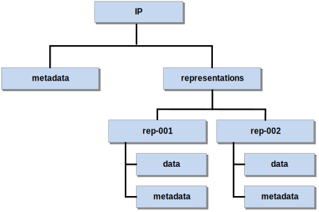
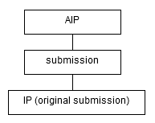
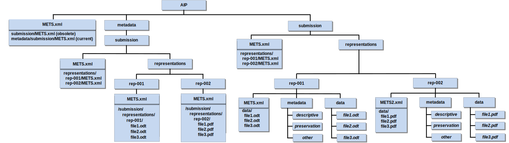
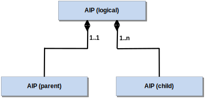
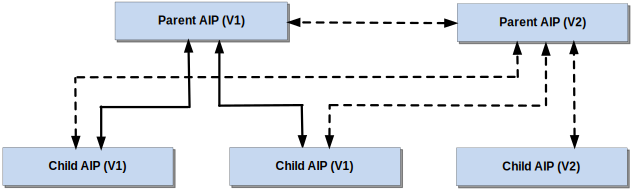
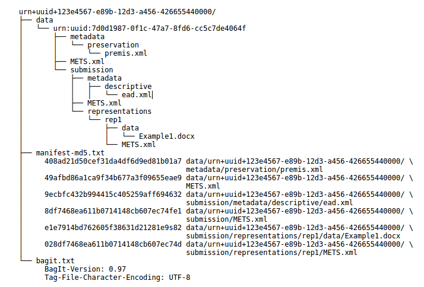

# Preface
## I. Aim of the specification
This specification is one of several related specifications. The single most important aim of all of these specifications is the provision of a common set of specifications for packaging digital information for archiving purposes. The specifications are based on common, international standards for transmitting, describing and preserving digital data. They have been produced to help data creators, software developers and digital archives to tackle the challenge of short-, medium- and long-term data management and reuse in a sustainable, authentic, cost-efficient, manageable and interoperable way.

The foundation upon which the specifications are built is the Reference model for an Open Archival Information System (OAIS) (OAIS Reference model) which has Information Packages as its basis. Familiarity with the core functional entities of OAIS is a prerequisite for understanding the specifications.
A visualisation of the current specification network can be seen here:

<a name="figi-dip"></a>


**Figure I:** Diagram showing E-ARK specification dependency hierarchy.

| Specification | Aim and Goals  |
|---------------|----------------|
| Common Specification for Information Packages | This document introduces the concept of a Common Specification for Information Packages (CSIP). Its three main purposes are to: <ul><li>Establish a common understanding of the requirements which need to be met in order to achieve interoperability of Information Packages.</li><li>Establish a common base for the development of more specific Information Package definitions and tools within the digital preservation community.</li><li>Propose the details of an XML-based implementation of the requirements using, to the largest possible extent, standards which are widely used in international digital preservation. </li></ul>Ultimately the goal of the Common Specification is to reach a level of interoperability between all Information Packages so that tools implementing the Common Specification can be adopted by institutions without the need for further modifications or adaptations. |
| E-ARK SIP | The main aims of this specification are to:<ul><li>Define a general structure for a Submission Information Package format suitable for a wide variety of archival scenarios, e.g. document and image collections, databases or geographical data.</li><li>Enhance interoperability between Producers and Archives.</li><li>Recommend best practices regarding metadata, content and structure of Submission Information Packages.</li></ul> |
| E-ARK AIP | The main aims of this specification are to:<ul><li>Define a generic structure of the AIP format suitable for a wide variety of data types, such as document and image collections, archival records, databases or geographical data.</li><li>Recommend a set of metadata related to the structural and the preservation aspects of the AIP as implemented by the reference implementation (earkweb).</li><li>Ensure the format is suitable to store large quantities of data.</li></ul> |
| E-ARK DIP | The main aims of this specification are to:<ul><li>Define a generic structure of the DIP format suitable for a wide variety of archival records, such as document and image collections, databases or geographical data.</li><li>Recommend a set of metadata related to the structural and access aspects of the DIP.</li></ul>  |
| Content Information Type Specifications | The main aim and goal of a Content Information Type Specification is to:<ul><li>Define, in technical terms, how data and metadata must be formatted and placed within a CSIP Information Package in order to achieve interoperability in exchanging specific Content Information.</li></ul>The number of possible Content Information Type Specifications is unlimited. For at list of existing Content Information Type Specifications see, and read more about  Content Information Type Specifications in the Common Specification for Information Packages |

## II Organisational support
This specification is maintained by the Digital Information LifeCycle Interoperability Standards Board (DILCIS Board, http://dilcis.eu/). The DILCIS Board was created to enhance and maintain the draft specifications developed in the European Archival Records and Knowledge Preservation Project (E-ARK project, http://eark-project.com/) which concluded in January 2017. The Board consists of eight members, but there is no restriction on the number of participants in the work. All Board documents and specifications are stored in GitHub (https://github.com/DILCISBoard) while published versions are made available on the Board webpage. Since 2018 the DILCIS Board has been responsible for the core specifications in the Connecting Europe Facility eArchiving Building Block https://ec.europa.eu/cefdigital/wiki/display/CEFDIGITAL/eArchiving.

## III Authors
A full list of contributors to this specification, as well as the revision history can be found in Appendix 1.

# Scope and purpose

To briefly recall the three types of information packages as defined by OAIS
[@OAIS2012], there is the Submission Information Package (SIP) which is used to
submit digital objects to a repository system; the Archival Information Package
(AIP) which allows the transmission of a package to the repository, and its
storage over the long-term; and the Dissemination Information Package (DIP)
which is used to disseminate digital objects to the requesting user.

In this context, the current document represents the specification of the E-ARK
Archival Information Package format (E-ARK AIP, in the following named shortly
AIP). It defines the specific requirements for archiving and storing information
packages for the long term and focuses on the structural peculiarities and
metadata requirements relating to the AIP. Considered in detail, the key
objectives of this format are to:

- define a generic structure of the AIP format in a way that it is suitable for
  a wide variety of data types, such as document and image collections, archival
records, databases or geographical data.
- recommend a set of metadata standards related to the structural and the
  preservation aspects of the AIP.
- ensure the format is suitable to store large quantities of data.
- mitigate the potential preservation risk of repository obsolescence by
  implementing a repository succession strategy.

# Relation to other documents

This specification document originates from the document "D4.4 Final version of
SIP-AIP conversion component (Part A: AIP specification)" [@e-ark-d4.4] created
in the E-ARK project (European Archival Records and Knowledge Preservation)
which ran from 2014 to 2017 and was funded by the European Commission as part of
the Seventh Framework Programme for Research.

The common requirements for all types of E-ARK information packages are defined
by the “Common Specification for Information Packages (CSIP) [see
@csip-2.0.0-DRAFT]”.

Further documents which are related to the AIP specification in a general sense
are listed in the CSIP (section 1.4 "Relation to other documents").

# Introduction

The AIP format specification defines a basic structure for storing information
packages which are transferred to an archive in form of submission information
packages (SIPs). The AIP format provides the means to keep a record of changes
that are being applied to an AIP due to metadata edits, digital preservation
measures (e.g. migration or adding emulation information), or submission
updates.[^1]

[^1]: A *submission update* is a re-submission of an SIP at a later point in
  time related to an AIP which contains a previous version of this SIP. Section
[5.2.1](#aipcontsubm) explains this concept more in detail.

The purpose of defining a standard format for the archival information package
is to pave the way for simplified repository migration. Given the increasing
amount of digital content archives need to safeguard nowadays, changing the
repository solution should be based on a standard exchange format. This is to
say that a data repository solution provider does not necessarily have to
implement this format as the internal storage format, but it should at least
allow exporting AIPs. By this way, the costly procedure of exporting data,
producing SIPs, and ingesting them again in the new repository can be
simplified. Data repository solution providers know what kind of existing data
they can expect if they were chosen to replace an existing repository solution.
An E-ARK compliant repository solution should be able to immediately analyse and
incorporate existing data in form of AIPs without the need of applying data
transformation or having to fulfil varying SIP creation requirements.

Generally, a great variety of repository systems are being developed by
different providers, and the way how the AIP is stored depends on specific
requirements which have been addressed according to the needs of their
respective customers. For this reason, the purpose of this AIP format is not to
impose a common storage format that all repository systems need to implement.
While it can be used as an archival storage format, it can also be seen as a
format that makes system migration easier.

# Preliminary definitions and remarks

## <a name="ip"></a>Information package (IP)

As already mentioned, the CSIP defines the requirements for concrete package format
specifications, such as the SIP, AIP, or DIP. In this sense, an
*information package* (IP) is an instance of a format that complies with the CSIP.

## <a name="reps"></a>Representations

The concept of "representations" is used according to the definition given in
the PREMIS digital preservation metadata standard:

> "The set of files, including structural metadata, needed for a complete and
> reasonable rendition of an Intellectual Entity. For example, a journal
> article may be complete in one PDF file; this single file constitutes the
> representation. Another journal article may consist of one SGML file and two
> image files; these three files constitute the representation. A third article
> may be represented by one TIFF image for each of 12 pages plus an XML file of
> structural metadata showing the order of the pages; these 13 files constitute
> the representation. [@premis3.0-2017]"

According to the CSIP, representations are a core concept for all types of IPs.
One specific requirement regarding representations in the AIP is that the AIP
format must be able, on the one hand, to include representations which are part
of the SIP, and, on the other hand, to manage representations which are created
during SIP to AIP conversion or as a result of any maintenance operation
applying changes to the AIP.

It should also be mentioned that representations can be derived from each other;
this is typically the case if digital objects making up a representation are
migrated to another format. However, a new representation, in our understanding,
does not have to be necessarily the result of a file format migration. It can
also consist of a set of instructions included as part of representation
metadata explaining how to create an emulation environment in order to render a
set of files.

## Logical and physical representation of the AIP

In line with OAIS, we call the logical container of the AIP the complete set of
digital objects and metadata representing the conceptual entity as a whole. The
conceptual entity must be distinguished from the physical representation of one
or possibly more physical containers which represent one conceptual entity.

From the point of view of preserving the integrity of the AIP, the ideal case is
that the logical AIP representing the intellectual entity is packaged as one
single physical container. This makes recovery easier because the information
required to interpret and render the contained representations is bundled
together. In reality, however, this is not always possible because the size of
the physical container can become very large, and this is the reason for
proposing the divided METS structure described more in detail in section
[5.1](#compdiv). The divided structure makes it easier to manage representations
or representation parts separately.

## <a name="structdiv"></a>Structural division of the AIP

One of the basic requirements formulated by the CSIP is the use of METS as the
metadata standard to describe the structure of an IP.

Special attention was given to the fact that it might not be possible to store
all representations of an intellectual entity in one physical container, or that
even a single representation might have to be divided so that it can be stored
on long-term storage media. For this reason, the AIP format describes means to
manage representations or representation parts separately.

This structure lays the groundwork for addressing the practical requirement of
distributing parts of the intellectual entity over a sequence of physical
containers representing a logical AIP. Even though this puts the integrity of
the AIP at risk - because in case of disaster recovery the physical container
does not represent the complete intellectual entity and dependencies to another
(lost) physical container can potentially make it impossible to interpret,
understand, or render the content - it is a necessary measure if the amount of
data exceeds the capacity limitation of long-term storage media.

## Authenticity of the original submission

The AIP format provides a structure for storing the original submission
separately from any data that is created during SIP-to-AIP conversion and during
the life-cycle of the AIP. This allows safeguarding the authenticity of the
original submission.

However, it is an implementation decision if the original submission is kept “as
is” or if the SIP data is adapted during SIP to AIP conversion. In line with
OAIS, the content of the original SIP does not have to be identical to the
version of the submitted data stored as part of the AIP:

> “An OAIS is not always required to retain the information submitted to it in
> precisely the same format as in the SIP. Indeed, preserving the original
> information exactly as submitted may not be desirable. [@OAIS2012, p. 4-52]”

The E-ARK AIP format prescribes a structure by defining a set of requirements
and core metadata together with recommendations on how to use the requirements
in order to allow changing the AIP while keeping seamless track of the AIP’s
history.

## Version of an AIP

While the AIP always describes the same unaltered conceptual entity, the way in
which this information is represented may change. Therefore the AIP format
describes the means to record the provenance from the time of the first
submission, and also during the whole life-cycle of the AIP.

For the purpose of the AIP format specification, the *AIP version* concept used
is as defined by OAIS:

> “AIP Version: An AIP whose Content Information or Preservation Description
> Information has undergone a Transformation on a source AIP and is a candidate
> to replace the source AIP. An AIP version is considered to be the result of a
> Digital Migration. [@OAIS2012, p. 1-9]”

A new version of an AIP contains one or more new representations which can be
either the result of a digital migration or information that enables the creation
of an emulation environment to render a representation. The result of this
operation is the creation of a new version of the AIP.

The result of a new version of the AIP is stored separately from the submission
as explained in detail in section [5.2.2](#aipreps).

Furthermore, the AIP format allows updating the AIP by adding a new version of
the submission. This allows supporting the AIP edition which is defined in OAIS
as follows:

> “AIP  Edition: An  AIP  whose  Content  Information  or Preservation
> Description  Information  has been upgraded or improved with the intent not to
> preserve information, but to increase or improve it. An AIP edition is not
> considered to be the result of a Migration. [@OAIS2012, p. 1-9]”

The result of an AIP Edition is stored as part of the submission as explained in
detail in section [5.2.1](#aipcontsubm).

## Cardinality of the SIP to AIP transformation

Regarding the transformation of SIPs to AIPs, in the OAIS it is stated that "one
or more SIPs are transformed into one or more Archival Information Packages (AIPs)
for preservation [@OAIS2012, p. 2-8]”.

The recommendation in this regard is to guarantee a one-to-one relationship
between the logical SIP and the logical AIP whereas the relation of the
corresponding physical packages of SIPs and AIPs can be any kind of many-to-many
mapping.

# AIP format specification

The following AIP format specification is defined as a set of requirements[^2]
which will be explained with the help of textual descriptions, figures, and
concrete examples. It is divided into two parts. On the one hand, there is the
structure and metadata specification which defines how the AIP is conceptually
organized by means of a folder hierarchy in a file system and a set of
metadata standards. And on the other hand, there is the physical container
specification which defines the bit-level manifestation of the transferable
entity.

[^2]: The requirements terminology is based upon RFC2119, "Key words for use in
RFCs to indicate requirement levels", RFC 2119, S. Bradner, March 1997.
Available at: http://www.ietf.org/rfc/rfc2119.txt

## <a name="csip"></a>Overview about the CSIP

In the following, we will briefly describe the structure of an IP as defined
by the CSIP. Against this background, the AIP format will be introduced as a
container format which allows managing the life-cycle of an E-ARK IP that
starts with the ingest of an SIP.

As already mentioned in section [4.1](#reps), the CSIP relies on the concept of
"representations". Figure [1](#fig1) gives an example of the structure of an IP
with two representations.

<a name="fig1"></a>


**Figure 1:**
Structure of an IP.

Furthermore, Figure [1](#fig1) shows that metadata can be stored either at the
representation level or at the package level. In the CSIP it is explained in more
detail where different types of metadata can be stored. In this context, it is
sufficient to mention that descriptive, technical, preservation, and rights
metadata can relate either to the IP as a whole or to individual representations.

### Representations in the AIP

As already mentioned, the structural requirements defined by the CSIP generally
apply to the AIP. However, the AIP `representations` folder contains
representations which are created as part of the AIP maintenance. If no
mainteance operation was performed, this folder is not present. For this reason,
the CSIP requirement which prescribes the presence of the `representations`
folder is overruled by the following AIP specific requirement.

<a name="aip-representations-optional"></a>**AIP-REPRESENTATIONS-OPTIONAL**: The
Archival Information Package (AIP) folder COULD include a folder named
representations. This requirement overrules requirement *CSIPSTR9* defined by
the CSIP. See also requirement *AIP-REPRESENTATIONS*.

### <a name="compdiv"></a>Compound vs. divided package structure

As mentioned, the ability to manage representations or representation parts
separately is required because the digital data submissions can become very
large. This is not only relevant for storing the AIP, it also concerns the SIP
which might need to be divided before the data is submitted to the repository.
And regarding the DIP, it requires the capability to reconstruct the DIP from an
AIP which is decomposed into multiple parts.

In the following, two approaches for describing the structure of the IP will be
described with a focus on requirements of the AIP format: the *compound*
structure is represented by one single structural metadata file, and the
*divided* structure has one structural metadata file that references those of
individual representations. An example will help to describe the two
alternatives.

If the *compound* METS structure is used, as shown in Figure [3](#fig3), a
single METS file contains all references to metadata and data files contained in
the IP.

<a name="fig3"></a>


**Figure 3:**
One METS file in the root of the package references all metadata and data files

Even though the number suffix of the folders `rep-001` and `rep-002` of the
example shown in Figure [3](#fig3) suggests an order of representations, there
are no requirements regarding the naming of folders containing the
representations.  The order of representations and the relations between them is
defined by the structural and preservation metadata. The `representations`
folder is mandatory, even for IPs which contain only one representation.

If the *divided* METS structure is used, as shown in Figure [4](#fig4), then a
separate METS file for each representation exists which are referenced by the
root METS file. The example shown in Figure [4](#fig4) has a METS file in the
IP’s root which points to the METS files `Representations/Rep-001/METS.xml` and
`Representations/Rep-002/METS.xml`.

<a name="fig4"></a>


**Figure 4:**
Root METS file references METS files of the different representations

The reason why this alternative was introduced is that it makes it easier to
manage representations independently from each other. This can be desired for
very large representations, in terms of file size or the amount of files (making
the root METS difficult to work with).

As a corollary of this division method we define, on the one hand, a
representation-based division as the separation of representations in different
folders under the `representations` folder as shown in the example of Figure
[4](#fig4). And, on the other hand, we define a size-based division as the
separation of representation parts. To illustrate this, Figure [5](#fig5) shows
an example where a set of files belongs to the same representation (here named
`binary`) and is referenced in two separate physical containers (here named {C1}
and {C2} respectively). A key requirement when using size-based division of a
representation is that there must not be any overlap in the structure of the
representations, and that each sub-folder path must be unique across the
containers where the representation parts together constitute a representation
entity. Note that for this reason a numerical suffix is added to the
representation METS files, to avoid overwriting representation METS files when
automatically merging the divided representation back into one single physical
representation.

<a name="aip-rep-div-name"></a>**AIP-REP-DIV-NAME**: If a representation is divided
into parts, the representation component MUST use the same name in the different
containers.

<a name="aip-rep-div-overlap"></a>**AIP-REP-DIV-OVERLAP**: If a representation is
divided into parts, any overlap MUST be avoided regarding the structure of the
representations and each sub-folder path MUST be unique across the
containers.

<a name="fig5"></a>


**Figure 5:**
Example of an IP.

For example, let us assume an IP with two representations, each of which
consists of a set of three files. In the first representation all data files
are in the Open Document Format (ODT) and in the second one - as a derivative
of the first representation - all files are in the Portable Document Format
(PDF).

## <a name="aipstruct"></a>AIP structure
Based on the brief overview about the CSIP given in the previous section, the
AIP format specifies a logical structure and guidelines
for using METS and PREMIS metadata to create AIPs.

The AIP format offers a structure for storing the complete SIP, and it allows
holding data and metadata which are created during SIP to AIP conversion and
data that are created during the lifecycle of the AIP.

It is important to note that the AIP format implements the CSIP differently
compared to the SIP and the DIP. The SIP and the DIP represent “snapshots in
time`, one capturing the state of an information package at submission time
(SIP), the other one capturing a specific form of delivery at the point in time
when the information package for access was created (DIP). The AIP, in contrast,
allows holding the original submission (snapshot of the IP at submission time),
the outcome of preservation actions in the course of the life-cycle separately,
and submission updates that occur after the AIP was created.

The main difference is that the AIP is an information package which can
contain one or several IPs, namely SIPs. The purpose of this meta-structure is
to allow keeping a record of changes to the AIP over time. This requires a
specific structure which is not required in the SIP and the DIP. The AIP must
therefore not be understood as an extension of the IP (as defined by the CSIP)
in the sense that it inherits general properties from the CSIP which are
complemented by AIP specific properties. This is the reason why the inherent
structure of the AIP is different to the one of the SIP and the DIP.

### <a name="aipcontsubm"></a>AIP container for submissions

The AIP format allows storing submissions; having the submission in its original
form can help to ensure authenticity of its representations. For this purpose,
the AIP format defines a `submission` folder in the root of the AIP which
contains the original submission as well as any submission updates added after
the AIP was created. The following obligatory requirement applies:

<a name="aip-submission-root"></a>**AIP-SUBMISSION-ROOT**: The root folder of
the AIP package COULD contain a `submission` folder which is a container for
the original submission and for any updates of SIPs which are submitted after
the AIP was created.

If submission updates are enabled for a repository, the submission folder can
contain sub-folders with a series of submissions, starting from the original
one and followed by the submission updates.

If the submission folder does not contain a METS file, it is assumed that
one or several submissions are contained in subfolders.

<a name="aip-submission-ip"></a>**AIP-SUBMISSION-IP**: The `submission` folder
MUST contain an IP or at least one or several IPs in sub-folders.

<a name="aip-submission-ips"></a>**AIP-SUBMISSION-IPS**: If the `submission`
folder contains one or several sub-folders, the sub-folders MUST contain IPs.

<a name="aip-submission-nomets"></a>**AIP-SUBMISSIONS-NOMETS**: If the
`submission` folder contains one or several IPs in sub-folders it MUST NOT
contain a METS file.

The naming scheme of these sub-folders can be freely defined. However, it should
reflect the order of original submission and updates. This means that the folder
names should allow alphanumerical ordering, for example, by using
zerofill-number suffixes or by deriving the folder name from an ISO 8601 date.

<a name="aip-submissions-order"></a>**AIP-SUBMISSIONS-ORDER**: The sub-folders
containing IPs SHOULD allow alphanumeric sorting, e.g. by using zero-fill
numbers or ISO 8601 date derived strings as part of the folder name.

Examples for submission folder names which allow alphanumerical sorting:

- Zero-fill number suffixes:
    + Submission-00001
    + Submission-00002
    + Submission-00003
- Date/time based strings:
    + 2017-12-25_ 081012
    + 2017-12-26_ 083401
    + 2017-12-27_ 090118
- Date string suffixes:
    + Submission-2017-12-25
    + Submission-2017-12-26
    + Submission-2017-12-27

Figure [6](#fig6) shows the variant where the `submission` folder contains an IP which
represents the original submission. Although this structure does not reflect the
version of the submission, the versioning layer can be introduced when the AIP
is updated. The IP contained in the submission folder must be moved to a version
folder in that case.

<a name="fig6"></a>

{ width=193px }

**Figure 6:**
The AIP's "submission" folder containing the IP of the original submission.

Figure [7](#fig7) shows an example of the alternative structure, where the submission
folder contains three sub-folders representing one original submission and two
updates which were created over the course of three days.

<a name="fig7"></a>


**Figure 7:**
The AIP containing submissions in subfolders to support submission updates.

For the sake of simplicity, only the first variant, i.e. where the `submission`
folder directly contains an IP, is present in the following sections about the
AIP structure.

### <a name="aipreps"></a>AIP representations

As described in section [5.1](#csip) in relation to an IP, one or several
representations can be part of an SIP. Additionally, the AIP must be able to
include further representations which are either added during SIP to AIP
conversion, or through measures which were taken as part of the repository
maintenance or for digital preservation purposes.

To illustrate this with the help of an example, Figure [8](#fig8) shows the
structure of an AIP where the original submission consists of two
representations which were part of the original submission. The
`submission` folder of the AIP contains the original submission “as
is”, which means that neither data nor metadata is changed.

<a name="fig8"></a>


**Figure 8:**
AIP representations.

Let us now assume that during SIP to AIP conversion an additional representation
is added to the AIP. Figure [9](#fig9) illustrates an example where an additional
`representations` folder exists as a sibling of the `submission` folder
which contains a new representation (rep-001.1) derived from one of the
representations contained in the original submission (rep-001).

<a name="fig9"></a>


**Figure 9:**
AIP representations.

This leads to the following requirement regarding representations which are
added during SIP to AIP conversion.

<a name="aip-representations"></a>**AIP-REPRESENTATIONS**: If a new
representation is added during ingest (SIP to AIP conversion) or created as an
AIP preservation measure (AIP to AIP conversion), the root folder of the AIP
MUST contain a `representations` folder. For this folder, the same
requirements as for the representations of an IP apply.

Note that the three-digit number suffix following the name `rep-` used in
the example of Figure [9](#fig9) indicates the order in time in which the
representation of the original submission was created. And the additional
number suffix after the dot indicates that the representation is a derivative
of the representation identified by the three-digit number before the dot, i.e.
`rep-001.1` is the first derivative of representation `rep-001`. This
is however for illustration purposes only; the naming of representations does
not have to follow such logic.

The AIP is an extension of the IP format; therefore it must follow the
basic structure of an IP. Figure [9](#fig9) shows that the IP components,
consisting of METS file, `Metadata` and `representations` folders,
are repeated on theAIP level. The extension of the AIP format is basically
given by the fact thatthe AIP is an IP which can contain another IP (here i.e.
a SIP) in the `submission` folder.

Note that the `representations` folder in the AIP root folder is optional.
It means that this folder must only exist in case representations other than
the ones originally submitted are added to the AIP.

The AIP is an IP, therefore the CSIP requirement *CSIPSTR4* applies and the
AIP's root MUST contain a METS file that either references all metadata and
data files or it references other METS files located in the corresponding
representation folders of the AIPs or of the original submission’s
`representations`.

The METS file which is located in the root folder of the information package is
called the *root METS* file.

As a concrete example let us assume a policy stating that PDF documents must
generally be converted to PDF/A. Taking the premise formulated in section
[4.4](#structdiv) into account that the original submission is not to be
changed, the additional representation is added in a `Representation`
folder in the root of the AIP as shown in figure [7](#fig7). Note that this
example uses a representation-based division of METS files.

Analogously to Figure [8](#fig8) there are also two representations in the
original submission shown in Figure [10](#fig10). The first representation
(`Rep-001`) consists of a set of files in the Open Document Format (ODT)
and the second one (`Rep-002`) is a derivative of the first set of files in
the Portable Document Format (PDF). As an example we assume that an
institutional policy prescribes that every PDF document must be converted to
PDF/A during SIP to AIP conversion. Therefore the second representation
(`Rep-002`) was converted to a set of PDF/A files and added to the AIP as
an additional representation (`Rep-002.1`).

<a name="fig10"></a>


**Figure 10:**
AIP using representation-based division of METS files.

The two representations of the original submission are located in the
`submission/representations` folder of the AIP and the METS file of the
submission references the corresponding representation METS files using a
relative path to be resolved within the SIP. The root level METS file of the
AIP references the METS file of the original submission
(`submission/METS.xml`) and the METS file of the new representation
(`representations/Rep-002.1/METS.xml`).

### Changing the metadata of the original submission

If the originally submitted SIP -- as a consequence of an implementation
decision -- is not supposed to change, then the AIP level metadata folder
can contain metadata that relates to representations contained in the original
submission. Then, there might be scenarios where the originally submitted
metadata needs to be updated.

As an example let us assume that we have to recalculate the checksum during SIP
to AIP conversion and that the checksum is recorded as an attribute of the METS
file element. As shown in Figure [11](#fig11), the AIP’s `Metadata` folder can --
additionally to the existing metadata category folders -- contain a
`submission` folder with metadata files (here `METS.xml`) that by definition
have priority over the ones contained in the original submission. This means
that in case metadata needs to be updated, they must be placed into the root
level metadata folder because metadata for the original submission is not
allowed to be changed.

<a name="fig11"></a>


**Figure 11:**
METS files in the AIP’s `Metadata/submission` folder have priority over
the ones contained in the original submission

<a name="aip-md-priority"></a>**AIP-MD-PRIORITY**: Let `<MDPath>` be a
sub-folder-path to a metadata file, then a metadata file under the
`AIP/metadata/submission` folder MUST have priority over a metadata file
under the `AIP/submission` folder so that `AIP/metadata/submission/<MDPath>`
has priority over `AIP/submission/<MDPath>`.

An example is shown in Figure [11](#fig11) where the METS file in the root of
the AIP references an obsolete METS file of the original submission and a
current METS file under `metadata/submission`, i.e. the metadata file
`AIP/metadata/submission/METS.xml` has priority over the metadata file
`AIP/submission/METS.xml`. In this way users have the possibility to consult both
the initial metadata and the updated metadata.

### <a name="parentchild"></a>Parent-Child relationship

As already pointed out, the divided METS structure was introduced to make the
separation of representations or representation parts easier and allow the
distribution of these components over a sequence of AIPs.

As shown in Figure [12](#fig12) The composition of a logical AIP can be
expressed by a parent-child relationship between AIPs. It is a bidirectional
relationship where each child-AIP bears the information about the parent-AIP
to which they belong and, vice versa, the parent-AIP references the child-AIPs.

<a name="fig12"></a>
{ width=278px }

**Figure 12:**
Parent-child relationship between AIPs

Even though this parent-child relationship could be used to create a
hierarchical graph of AIPs, the scope of this specification is limited to
a flat list of AIPs which are sub-ordinated to one parent-AIP.

Assuming that a new AIP (e.g. containing an additional representation) needs to
be added after parent- and child-AIPs have been stored, the recreation of the
whole logical AIP might be inefficient, especially if the AIPs are very large.
For this reason, existing child-AIPs remain unchanged in case a new version of
the parent-AIP is created. Only the new version of the parent-AIP has references
to all child-AIPs as illustrated in Figure [13](#fig13). As a consequence, in order to
find all siblings of a single child-AIP it is necessary to get the latest
version of the parent-AIP which implies the risk that the integrity of the
logical AIP is in danger if the latest version of the parent-AIP is lost.

<a name="fig13"></a>
{ width=382px }

**Figure 13:**
New version of a parent-AIP

The result of this process is a sequence of physical containers of child-AIPs
plus one additional parent-AIP. The relation of the AIPs is expressed by means
of structural metadata in the METS files.

## AIP metadata
The AIP format specifies the use of structural and preservation metadata. Any
type of additional metadata, such as descriptive metadata using Dublin Core or
EAD[^4], can be used.

[^4]: Encoded Archival Description, http://www.loc.gov/ead/

In the following, XML elements are either enclosed between angle brackets
(e.g. `<fileSpec>`) or addressed using XPath syntax (e.g. `/mets/metsHdr`). In the
latter case a leading slash selects a node from the XML document root and the
double slash (`//`) selects nodes in the document from the current node that
match the selection, no matter where they are. Also in line with the XPath
syntax, element attributes have a leading ’@’ character. For example
`//mets:file/@USE` denotes the `USE` attribute of a `<file>` element.

### <a name="structmd"></a>Structural metadata

Structural metadata is expressed by means of the METS standard. Some of the high
level functions which the standard fulfils in the context of the AIP are the
following.

- It provides an overview about the hierarchical structure of the AIP.
- It is an entry point for the AIP, i.e. the first entity to consult to know
what an AIP contains and what entities it references.
- It references or embeds any metadata files describing the package as a whole
as well as individual content files.
- It contains a complete list of digital objects contained in a package together
with basic information to ensure the integrity of the digital objects.
- It establishes links between digital objects and metadata entities (both
structural metadata and preservation metadata entities).
- It can hold information about different representations or representation
parts belonging to the same intellectual entity.

This section has a focus on METS, therefore, if no namespace prefix is given,
the element belongs to the METS default namespace.

#### <a name="metsid"></a>METS identifier

Each METS document must be assigned a persistent and (ideally globally) unique
identifier. Possible identifier schemes are amongst others: OCLC Purls[^5], CNRI
Handles[^6], DOI[^7]. Alternatively, it is possible to use a UUID as a locally
unique identifier.[^8]

[^5]: http://purl.org/docs/index.html
[^6]: http://www.handle.net
[^7]: https://www.doi.org
[^8]: Universally Unique Identifier according to RFC 4122, http://tools.ietf.org/html/rfc4122.html

Using this identifier, the system must be able to retrieve the corresponding
package from the repository.

According to the Common Specification, any ID element must start with a prefix
(also, the XML ID datatype is does not allow IDs ed to start with a number, so a
prefix solves this issue).

We recommended to use as a prefix an internationally recognized standard identifier
for the institution from which the SIP originates. This may lead to problems
with smaller institutions, which do not have any such internationally recognized
standard identifier. We propose in that case, to start the prefix with the
internationally recognized standard identifier of the institution, where the
AIP is created, augmented by an identifier for the institution from which the
SIP originates.

An alternative to this is to use a UUID:

    https://tools.ietf.org/html/rfc4122

The prefix `urn:uuid:` would indicate the identifier type. For example, if the
package identifier value is
`"123e4567-e89b-12d3-a456-426655440000"` this would be the value of the METS root
element’s `OBJID` attribute:

    /mets/@OBJID="urn:uuid:123e4567-e89b-12d3-a456-426655440000"

The `OBJID` attribute of the root METS is the persistent unique identifier of
the AIP.

#### Digital objects

<a name="aip-digital-objects"></a>**AIP-DIGITAL-OBJECTS**: Any file contained
in the AIP is a *digital objects* which MUST be described in a file section
(`<fileSec>`) of the METS document.

Listing 2 shows an example of a file section with one file.

```xml
<fileSec>
    <fileGroup @USE="Common Specification root">
        <file ID="uuid-77146c6c-c8c3-4406-80b5-b3b41901f9d0"
            ADMID="..." MIMETYPE="text/x-sql" SIZE="2862064"
            CHECKSUMTYPE="SHA-256" CHECKSUM="..."
            CREATED="2015-0501T01:00:00+01:00">
            <FLocat LOCTYPE="URL"
                xlink:href="./submission/data/content/file.ext"
                xlink:type="simple"/>
        </file>
    <fileGroup>
</fileSec>
```

**Listing 2:**
Example of a file in the `fileSec` as child of a `fileGroup` element (long attribute
values replaced by “...” for readability)

Table 2 lists the attributes of the `<file>` element with an example value. The
`/file/FLocat` element provides the link to the actual file.

|      Attribute      |   Description   |          Example Value             |
|---------------------|-----------------|------------------------------|
| //file/\@ID          | Identifier of a file wich is part of the AIPFile identifier; must be unique and start with the prefix “ID` | ID77146c6c-c8c3-4406-80b5-b3b41901f9d0 |
| //file/\@ADMID       | Used to link it to relevant administrative metadata sections that relate to the digital object described. Can be a white space separated list of identifiers. | ID4566af74-0f7b-11e5-a6c0-1697f925ec7b ID4566af74-0f7b-11e5-a6c0-1697f925ec7c |
| //file/\@CHECKSUMTYPE | Hash-sum calculator algorithm | SHA-256 |
| //file/\@CHECKSUM | Hash-sum | 977fb584d53cd64662dfba427f351908 \
13dfc58979f51a2703f8621b9e1bc274 |
| //file/\@CREATED | Date when the file entry was created. | 2014-05-01T01:00:00+01:00 |
| //file/\@SIZE | Size of the file in bytes. | 2498 |
| //file/\@MIMETYPE | Mime-type | application/pdf |

**Table 2:**
Attributes of the file element

The following rules apply for the URL attribute of the <FLocat> element:

<a name="aip-paths-protocol"></a>**AIP-PATHS-PROTOCOL**: The local file paths
COULD indicate the protocol part (`file://`), in this case the path must be a
valid URI according to RFC3986.[^9]

[^9]: https://tools.ietf.org/html/rfc3986

<a name="aip-paths-relative"></a>**AIP-PATHS-RELATIVE**: If the protocol part
is omitted, the path MUST be interpreted as a reference relative to the METS
document (e.g. `./file.txt` or `file.txt` referring to the file `file.txt` in
the current folder).

Additionally, the following requirement applies for compressed files:

<a name="aip-transform"></a>**AIP-TRANSFORM**: If a file is compressed, the
transformFile element (`//file/transformFile`) SHOULD indicate how the packages
have to be processed by means of the attributes ’TRANSFORMTYPE’,
’TRANSFORMALGORITHM’, and ’TRANSFORMORDER’.

```xml
<file ...>
    <FLocat xlink:href="../compressed.tar.gz" xlink:type="simple" LOCTYPE="URL"/>
    <transformFile TRANSFORMORDER="1"
        TRANSFORMTYPE="decompression" TRANSFORMALGORITHM="gzip"/>
    <transformFile TRANSFORMORDER="2"
        TRANSFORMTYPE="decompression" TRANSFORMALGORITHM="tar"/>
</file>
```

**Listing 3:**
Compressed file

#### Referenced Metadata

The use of embedded metadata by using the `<mdWrap>` element is discouraged.
Instead, it is recommended to reference metadata by using the `<mdRef>` element.

<a name="aip-mets-md-ref"></a>**AIP-METS-MD-REF**: External metadata files such
as EAD or PREMIS files MUST be referenced by means of the `<mdRef>` element.
Its `xlink:href` attribute value must be either a URL relative to the location
of the METS root or an absolute URL.

##### Descriptive metadata
The descriptive metadata section (`<dmdSec>`) references descriptive metadata
contained in the AIP. Multiple `<dmdSec>` elements are allowed so that descriptive
metadata file can be referenced separately within the METS object.

Descriptive metadata is referenced by means of the `<mdRef>` element as part of
the descriptive metadata element `<dmdSec>`. Listing 4 shows an example linking to
an EAD XML metadata file.

```xml
<dmdSec ID="uuid-550e8400-e29b-41d4-a716-44665544000a">
	<mdRef LOCTYPE="URL" MDTYPE="EAD" MIMETYPE="text/xml"
    	    CREATED="2015-04-26T12:00:00+01:00" xlink:type="simple"
    	    xlink:href="./metadata/EAD.xml"
    	    CHECKSUMTYPE="SHA-256" CHECKSUM="..." SIZE="2321"/>
</dmdSec>
```

**Listing 4:**
Linking to an EAD XML descriptive metadata file

##### Administrative Metadata

<a name="aip-mets-md-amdsec"></a>**AIP-METS-MD-AMDSEC**: The AIP METS MUST have
a single `<amdSec>` element which contains one or several `<digiprovMD>`
elements. The `<mdRef>` child of at least one of these elements must be of type
`PREMIS` (`@MDTYPE=”PREMIS”`) with the reference to a PREMIS file in the `Metadata`
folder of the AIP root.

Listing 5 shows an example with a link to a PREMIS.xml file:

```xml
<amdSec ID="...">
    <digiprovMD ID="..." @STATUS="CURRENT">
        <mdRef CHECKSUM="..." CHECKSUMTYPE="SHA-256"
            CREATED="..." LOCTYPE="URL" MDTYPE="PREMIS"
            MIMETYPE="text/xml" SIZE="1109"
            xlink:href=" metadata/preservation/premis.xml" xlink:type="simple"/>
    </digiprovMD>
</amdSec>
```

**Listing 5:**
Linking to an EAD XML descriptive metadata file

<a name="aip-premis-obsolete"></a>**AIP-PREMIS-OBSOLETE**: The `@STATUS`
attribute value of the `<digiprovMD>` element SHOULD be `SUPERSEDED` if
the PREMIS file is obsolete and only included in the AIP to ensure
traceability.

<a name="aip-premis-status"></a>**AIP-PREMIS-STATUS**: The `@STATUS` attribute
value of the `<digiprovMD>` element COULD be `CURRENT` to make explicit that
the PREMIS file is active.

#### Structural map

<a name="aip-structmap-label"></a>**AIP-STRUCTMAP-LABEL**: One `<structMap>`
with the LABEL attribute value “CSIP structMap” MUST
be present in the METS file.

Listing 6 shows a structural map with the LABEL attribute value “Common
Specification structural map”.

```xml
<structMap ID="uuid-f413c073-5b03-4499-830e-8ef724613bef" TYPE="physical" LABEL="CSIP structMap">
    <div>
        <div LABEL="submission">
        	...
    	</div>
    	<div LABEL="representations">
       <div LABEL="representations/rep-001">
          ...
       </div>
    	</div>
   </div>
</structMap>
```

**Listing 6:**
Obligatory CSIP structMap

##### Structural map of a divided METS structure

<a name="aip-divided-mets"></a>**AIP-DIVIDED-METS**: When an AIP uses the
divided METS structure, i.e. the different representations have their own
METS file, the mandatory `<structMap>` MUST organize those METS files
through `<mptr>` and `<fptr>` entries, for each representation. The `<mptr>`
node MUST reference the `/<representation>/METS.xml` and point at the
corresponding `<file>` entry in the `<fileSec>` using the `<fptr>` element.

```xml
<structMap ID="uuid-1465D250-0A24-4714-9555-5C1211722FB8" TYPE="PHYSICAL" LABEL="CSIP structMap">
   <div ID="uuid-638362BC-65D9-4DA7-9457-5156B3965A18" LABEL="uuid-4422c185-5407-4918-83b1-7abfa77de182">
     <div LABEL="representations/images_mig-1">
       <mptr xlink:href="./representations/images_mig-1/METS.xml" xlink:title="Mets file describing representation: images_mig-1 of AIP: urn:uuid:d7ef386d-275b-4a5d-9abf-48de9c390339." LOCTYPE="URL" ID="uuid-c063ebaf-e594-4996-9e2d-37bf91009155"/>
       <fptr FILEID="uuid-fb9c37e7-1c90-4849-a052-1875e67853d5"/>
     </div>
     <div LABEL="representations/docs_mig-1">
       <mptr xlink:href="./representations/docs_mig-1/METS.xml" xlink:title="Mets file describing representation: docs_mig-1 of AIP: urn:uuid:d7ef386d-275b-4a5d-9abf-48de9c390339." LOCTYPE="URL" ID="uuid-335f9e55-17b2-4cff-b62f-03fd6df4adbf"/>
       <fptr FILEID="uuid-3f2268cd-7da9-4ad8-909b-4f17730dacaf"/>
     </div>
   </div>
</structMap>
```

**Listing 7:**
Structural map referencing METS files of the different representations

#### Metadata representation of the AIP structure

#### Child AIP references parent AIP
The optional reference to a parent AIP is expressed by a structural map with the
LABEL attribute value `Parent`. Listing 8 shows an example where a UUID is used
as the package identifier and the `xlink:href` attribute has the UUID identifier
value of the referenced parent AIP as value. This identifier implicitly
references the METS file of the corresponding package. If other locator
types, such as URN, URL, PURL, HANDLE, or DOI are used, the `LOCTYPE` attribute
can be set correspondingly.

```xml
<structMap ID="uuid-35CB3341-D731-4AC3-9622-DB8901CD6736" TYPE="PHYSICAL" LABEL="parent AIP">
    <div ID="uuid-35CB3341-D731-4AC3-9622-DB8901CD6738" LABEL="AIP parent identifier">
      <mptr xlink:href="urn:uuid:3a487ce5-63cf-4000-9522-7288e208e2bc"
            xlink:title="Referencing the parent AIP of this AIP
                         (URN:UUID:3218729b-c93c-4daa-ad3c-acb92ab59cee)."
            LOCTYPE="OTHER" OTHERLOCTYPE="UUID"
            ID="uuid-755d4d5f-5c5d-4751-9652-fcf839c7c6f2"/>
    </div>
</structMap>
```

**Listing 8:**
Using a structMap to reference the parent AIP

#### Parent AIP references child AIPs
The parent AIP which is referenced by child AIPs must have a structural map
listing all child AIPs. Listing 9 shows the structural map of a parent AIP
listing four child AIPs.

```xml
<structMap TYPE="PHYSICAL" LABEL="child AIPs">
    <div LABEL="child AIPs">
        <div LABEL="child AIP">
            <mptr xlink:href="urn:uuid:cea73348-741d-4594-ab8f-0b9e652c1099"
                  xlink:title="Referencing a child AIP."
                  LOCTYPE="OTHER" OTHERLOCTYPE="UUID"
                  ID="uuid-d98e416f-55a7-4237-8d45-59c22d221669"/>
        </div>
        <div LABEL="child AIP">
            <mptr xlink:href="urn:uuid:cea73348-741d-4594-ab8f-0b9e652c1099"
                  xlink:title="Referencing a child AIP."
                  LOCTYPE="OTHER" OTHERLOCTYPE="UUID"
                  ID="uuid-70f8ec28-23f1-4364-9163-b3e99165b6e6"/>
        </div>
        <div LABEL="child AIP">
            <mptr xlink:href="urn:uuid:3218729b-c93c-4daa-ad3c-acb92ab59cee"
                  xlink:title="Referencing a child AIP."
                  LOCTYPE="OTHER" OTHERLOCTYPE="UUID"
                  ID="uuid-77373d7f-e241-481b-bf89-675335beb049"/>
        </div>
        <div LABEL="child AIP">
            <mptr xlink:href="urn:uuid:cea73348-741d-4594-ab8f-0b9e652c1099"
                  xlink:title="Referencing a child AIP."
                  LOCTYPE="OTHER" OTHERLOCTYPE="UUID"
                  ID="uuid-3f0cc05c-f27d-499d-a6fd-63bdfed13cb0"/>
        </div>
    </div>
</structMap>
```

**Listing 9:**
Using a structMap to reference the parent AIP

### Preservation metadata

As already mentioned, PREMIS [@premis3.0-2017] is used to describe technical
metadata of digital objects, rights metadata to define the rights status in
relation to specific agents or for specific objects, and to record events that
are relevant regarding the digital provenance of digital objects.

In the following sections, the PREMIS format and the way that it relates to the
METS elements is described in detail. **NOTE:** in the listings showing PREMIS
code parts, the prefix "premis" is omitted (default namespace is the PREMIS
namespace[^10]) while the "mets" prefix is explicitly added if a relation to the
METS file is explained.

[^10]: Namespace: http://www.loc.gov/premis/v3, namespace schema location: http://www.loc.gov/standards/premis/premis.xsd

#### Vocabulary

The definition of a vocabulary for PREMIS is an ongoing process, therefore
there is no exhaustive list of vocabularies that are to be used exclusively.

The basis of the preservation vocabulary is the preservation
schemes provided by the Library of Congress (LoC).[^11] Additionally, recent
contributions by the PREMIS Implementers Group (which are still “work in
progress”) are taken into consideration.[^12]

[^11]: http://id.loc.gov/vocabulary/preservation.html
[^12]: http://premisimplementers.pbworks.com/w/page/102413902/Preservation%20Events%20Controlled%20Vocabulary

#### PREMIS object

The PREMIS object contains technical information about a digital object.

##### Object identifier

<a name="aip-id-local"></a>**AIP-ID-LOCAL**: If an identifier of type `local` is
used, this identifier SHOULD be unique in the scope of the PREMIS document.

<a name="aip-id-other"></a>**AIP-ID-OTHER**: Other object identifiers of the
allowed types COULD be used additionally to the identifier of type `local`.

Listing 10 shows an example of an identifier of type `local`.

```xml
<objectIdentifier>
	<objectIdentifierType>local</objectIdentifierType>
	<objectIdentifierValue>fileId001</objectIdentifierValue>
</objectIdentifier>
```

**Listing 10:**
Object identifier

##### Checksums

<a name="aip-premis-checksums"></a>**AIP-PREMIS-CHECKSUMS**: Checksums COULD be
provided as a descendant of the `objectCharacteristics` element information in
form of a SHA-256 hashsum, a fixed size 256-bit value.

An example is shown in Listing 11.

```xml
<fixity>
	<messageDigestAlgorithm>SHA-256</messageDigestAlgorithm>
	<messageDigest>3b1d00f7871d9102001c77f...</messageDigest>
	<messageDigestOriginator>/usr/bin/sha256sum</messageDigestOriginator>
</fixity>
```

**Listing 11:**
Hashsum (value shortened)

##### File format

<a name="aip-premis-file-format"></a>**AIP-PREMIS-FILE-FORMAT**: The format
element COULD be provided either using the formatRegistry or the
formatDesignation element subelements, or both.

<a name="aip-premis-file-format-puid"></a>**AIP-PREMIS-FILE-FORMAT-PUID**:
Regarding the formatRegistry, the Persistent Unique Identifier (PUID)[^14]
based on the PRONOM technical registry[^15] COULD be used.

[^14]: http://www.nationalarchives.gov.uk/aboutapps/pronom/puid.htm
[^15]: http://www.nationalarchives.gov.uk/PRONOM

An example is shown in Listing 12.

```xml
<format>
    <formatDesignation>
        <formatName>XML</formatName>
        <formatVersion>1.0</formatVersion>
    </formatDesignation>
    <formatRegistry>
    	<formatRegistryName>PRONOM</formatRegistryName>
    	<formatRegistryKey>fmt/101</formatRegistryKey>
    	<formatRegistryRole>specification</formatRegistryRole>
    </formatRegistry>
</format>
```

**Listing 12:**
Optionally, the format version can be provided using the `formatDesignation` element.

##### Object characterisation

<a name="aip-premis-characterisation"></a>**AIP-PREMIS-CHARACTERISATION**: The
JHOVE[^16] technical characterisation result (XML format) COULD be embedded as
a descendant of the `objectCharacteristicsExtension` element. An example is
shown in Listing 13.

[^16]: http://sourceforge.net/projects/jhove/

```xml
<objectCharacteristicsExtension>
    <jhove>
      	...
    </jhove>
</objectCharacteristicsExtension>
```

**Listing 13:**
JHove digital object characterisation

##### Original name

<a name="aip-premis-original-name"></a>**AIP-PREMIS-ORIGINAL-NAME**: The
`originalName` element COULD be used to record the name of an original file.

An example is shown in Listing 14.

```xml
<originalName>originalfilename.ext</originalName>
```

**Listing 14:**
Original name

##### Storage

<a name="aip-premis-storage"></a>**AIP-PREMIS-STORAGE**: The storage element
COULD hold contain information about the physical location of the digital
object.

Ideally this is a resolvable URI, but it can also generally hold information
needed to retrieve the digital object from the storage system (e.g. access
control or for segmented AIPs).

An example is shown in Listing 15.

```xml
<storage>
    <contentLocation>
        <contentLocationType>URI</contentLocationType>
        <contentLocationValue>
          /path/to/file.txt
        </contentLocationValue>
    </contentLocation>
    <storageMedium>hard disk HD2253</storageMedium>
</storage>
```

**Listing 15:**
Storage description

##### Relationship

<a name="aip-premis-relationship"></a>**AIP-PREMIS-RELATIONSHIP**: The
`relationship` element SHOULD be used to describe relationships of the digital
object.

<a name="aip-premis-aip-included"></a>**AIP-PREMIS-AIP-INCLUDED**: If an AIP is
part of another AIP, then the element `relationshipSubType` MUST reference the
superordinated AIP.

An example of the latter case is shown in Listing 16.

```xml
<relationship>
    <relationshipType>structural</relationshipType>
    <relationshipSubType>is included in</relationshipSubType>
	<relatedObjectIdentification>
    	    <relatedObjectIdentifierType>repository</relatedObjectIdentifierType>
    	    <relatedObjectIdentifierValue>
               ID123e4567-e89b-12d3-a456-426655440000
        </relatedObjectIdentifierValue>
    </relatedObjectIdentification>
</relationship>
```

**Listing 16:**
Relationship

##### Linking rights statement

<a name="aip-premis-rights"></a>**AIP-PREMIS-RIGHTS**: The a
`linkingRightsStatementIdentifier` element COULD be used to describe rights
statement attached to the object.

For example, only files which have the "discovery right" are being indexed in
order to allow these files to be retrievable by the full-text search.

An example of the latter case is shown in Listing 17.

```xml
<linkingRightsStatementIdentifier>
    <linkingRightsStatementIdentifierType>
        filepath
    </linkingRightsStatementIdentifierType>
    <linkingRightsStatementIdentifierValue>
        metadata/file.xml
    </linkingRightsStatementIdentifierValue>
</linkingRightsStatementIdentifier>
```

**Listing 17:**
Rights statement

#### PREMIS event

##### Event identifier

<a name="aip-premis-event-id"></a>**AIP-PREMIS-EVENT-ID**: The `eventIdentifier`
SHOULD be used to identify events, such as preservation actions, which were applied.
An example is shown in Listing 18.

```xml
<eventIdentifier>
	<eventIdentifierType>local</eventIdentifierType>
	<eventIdentifierValue>PDF to PDF/A</eventIdentifierValue>
</eventIdentifier>
```

**Listing 18:**
Event identifier

##### Link to agent/object

<a name="aip-premis-event-agent"></a>**AIP-PREMIS-EVENT-AGENT**: If an event is desscribed, the agent which caused
the event (e.g. person, software, hardware, etc.) MUST be related to the event by means of the `linkingAgentIdentifier` element.

In the example shown in listing 20 the SIP to AIP conversion software is linked as agent with identifier value
’Sip2Aip’ and the corresponding object is linked by the local UUID value. An
example is shown in Listing 20.

```xml
<linkingAgentIdentifier>
    <linkingAgentIdentifierType>local</linkingAgentIdentifierType>
        <linkingAgentIdentifierValue>
            IngestSoftware
        </linkingAgentIdentifierValue>
    </linkingAgentIdentifier>
    <linkingObjectIdentifier>
    <linkingObjectIdentifierType>local</linkingObjectIdentifierType>
        <linkingObjectIdentifierValue>
            metadata/file.xml
        </linkingObjectIdentifierValue>
</linkingObjectIdentifier>
```

**Listing 20:**
Link to agent/object

##### Migration event type

<a name="aip-premis-event-type"></a>**AIP-PREMIS-EVENT-AGENT**: The event by which a
resource was created SHOULD to be recorded by means of the
`relatedEventIdentification` element.

An example is shown in Listing 21.

```xml
<event>
    <eventIdentifier>
        <eventIdentifierType>local</eventIdentifierType>
        <eventIdentifierValue>migration-001</eventIdentifierValue>
    </eventIdentifier>
    <eventType>MIGRATION</eventType>
    <eventDateTime>2015-09-01T01:00:00+01:00</eventDateTime>
    <eventOutcomeInformation>
        <eventOutcome>success</eventOutcome>
    </eventOutcomeInformation>
    <linkingAgentIdentifier>
        <linkingAgentIdentifierType>local</linkingAgentIdentifierType>
        <linkingAgentIdentifierValue>
            FileFormatConversion001
        </linkingAgentIdentifierValue>
    </linkingAgentIdentifier>
    <linkingObjectIdentifier>
        <linkingObjectIdentifierType>local</linkingObjectIdentifierType>
        <linkingObjectIdentifierValue>
            metadata/file.xml
        </linkingObjectIdentifierValue>
    </linkingObjectIdentifier>
    <relatedEventIdentification>
        <relatedEventIdentifierType>local</relatedEventIdentifierType>
        <relatedEventIdentifierValue>
            ingest-001
        </relatedEventIdentifierValue>
    </relatedEventIdentification>
</event>
```

**Listing 21:**
Migration event

The event shown in Listing 21 expresses the fact that the object
`metadata/file.xml` is the result of the migration event "migration-001" and the
event which created the source object is "ingest-001".

#### PREMIS agent

<a name="aip-premis-agent"></a>**AIP-PREMIS-AGENT**: Agents which are referenced in
events must be described by means of the `agent` element.

Listing 22 shows a software for indexing named `IndexingSoftware` which supports
full text search of the items contained in a package.
In this case, the "discovery right" is assigned to this agent.

```xml
<agent>
    <agentIdentifier>
        <agentIdentifierType>local</agentIdentifierType>
        <agentIdentifierValue>Indexer</agentIdentifierValue>
    </agentIdentifier>
    <agentName>IndexingSoftware</agentName>
    <agentType>Software</agentType>
    <linkingRightsStatementIdentifier>
        <linkingRightsStatementIdentifierType>
            local
        </linkingRightsStatementIdentifierType>
        <linkingRightsStatementIdentifierValue>
            discovery-right-001
        </linkingRightsStatementIdentifierValue>
    </linkingRightsStatementIdentifier>
</agent>
```

**Listing 22:**
Software as an agent

#### PREMIS rights

<a name="aip-premis-rights"></a>**AIP-PREMIS-RIGHTS**: Rights which are referenced
in rights statements MUST be described by means of the `rights` element.

The `rights` element holds information about the rights status of individual
digital objects or about agents. An example is shown in Listing 23.

```xml
<rights>
	<rightsStatement>
    	<rightsStatementIdentifier>
        	<rightsStatementIdentifierType>
            	local
        	</rightsStatementIdentifierType>
        	<rightsStatementIdentifierValue>
            	discovery-right-001
        	</rightsStatementIdentifierValue>
    	</rightsStatementIdentifier>
    	<rightsBasis>Statute</rightsBasis>
    	<rightsGranted>
        	<act>Discovery</act>
        	<restriction></restriction>
    	</rightsGranted>
	</rightsStatement>
</rights>
```

**Listing 23:**
Discovery right statement

## Physical Container Packaging

This part of the AIP format specification gives recommendations regarding the
creation of the physical packaging of the logical AIP into either one or
multiple transferable and storable entities.

### Naming of the packaged entity

According to the requirement defined in section [5.3.1](#metsid)
("METS identifier"), every AIP bears an identifier which must be recorded
in the root METS file of the AIP. By definition, this identifier is the
identifier of the AIP itself.

<a name="aip-container-id"></a>**AIP-CONTAINER-ID:**: The identifier of the AIP
-- defined by the attribute `OBJID` of the root METS file's root element SHOULD
be used to derive the beginning part of the file name of the physical storage
container.

The file name part which is derived from the AIP's identifier is called the
*AIP file name ID*.

<a name="aip-id-filename-mapping"></a>**AIP-ID-FILENAME-MAPPING**: A specified
policy SHOULD be defined which allows deriving a cross-platform, portable file
name part from the AIP's identifier and, vice versa, to infer the identifier
from the physical container's filename.

A first option to implement this requirement would be to limit the characters
used in the file name to the "Portable Filename Character Set"[^17] which
only allows the following character set for saving files:

[^17]: http://pubs.opengroup.org/onlinepubs/9699919799/basedefs/V1\_chap03.html#tag\_03\_282

* Uppercase A to Z
* Lowercase a to z
* Numbers 0 to 9
* Period (.)
* Underscore (\_)
* Hyphen (-)

If the identifier of the AIP had characters which do not fall into this
character set, then these would need to be mapped into specific ones of the
accepted character set.

One proposed way to achieve a bi-directional mapping between identifiers and file names
is the pairtree character mapping specification.[^18]

[^18]: https://tools.ietf.org/html/draft-kunze-pairtree-01 (see section 3: “Identifier string cleaning”)

For example, let us assume the identifier of the AIP was:

    "urn:uuid:123e4567-e89b-12d3-a456-426655440000"

Then this identifier string would be converted to the folder name because
“: -> +” is defined as a single-character to single-character conversion:

    "urn+uuid+123e4567-e89b-12d3-a456-426655440000"

The packaged entity should also bear this name, e.g. packaged using TAR the
name would be:

    "urn+uuid+123e4567-e89b-12d3-a456-426655440000.tar"

In this example, the AIP's physical container file name only consists of the
AIP file name ID.

<a name="aip-container-suffix"></a>**AIP-CONTAINER-SUFFIX**: Any suffix COULD be
added to the physical container file that bears additional information, such as
the version, date, sequence number, or the like.

For example, a version number could be added as a suffix to the AIP file name ID as
follows:

    "urn+uuid+123e4567-e89b-12d3-a456-426655440000_v00001.tar"

<a name="aip-container-part"></a>**AIP-CONTAINER-PART**: If a physical container
contains a part of a superordinate AIP, a suffix COULD be added to the AIP file
name ID.

For example, a number for the corresponding part could be added as a suffix to the
AIP file name ID as follows:

    "urn+uuid+123e4567-e89b-12d3-a456-426655440000_part00001.tar"

### Packaging

#### TAR packaging

TAR is an archive file format and also refers to the software `tar` which is
a software utility that can be used to bundle up files into one file for being
able to transfer archival packages.

<a name="aip-package-singlefolder"></a>**AIP-PACKAGE-SINGLEFOLDER**: The package
content SHOULD be contained in a single folder.

This means that if a TAR packaged AIP is unpackaged, the content is
extracted into a single folder which includes the AIP content.

As an example, let's assume a TAR file with the following name:

    "urn+uuid+123e4567-e89b-12d3-a456-426655440000.tar"

If it is extracted, a folder `urn:uuid:123e4567-e89b-12d3-a456-426655440000` is
created which includes the AIP content, as shown in Figure [14](#fig14).

<a name="fig14"></a>


**Figure 14:**
AIP content extracted from a TAR package.


<a name="aip-tarpackage-manifest"></a>**AIP-TARPACKAGE-MANIFEST**: In addition
to fixity information recorded in the METS file, the AIP COULD include a
manifest file (manifest.txt) listing files with MD5 and SHA-256 hashsum.

The manifest file is a text file containing a list of records separated by two
line breaks (two carriage return characters (hexadecimal 0D0D) or two times
carriage return/line feed (hexadecimal 0D0A0D0A). A record is a list of named
fields, the minimum fields being:

- Name := File path relative to the AIP root
- Size := Size in bytes
- SHA256 := SHA-256 Checksum
- MD5 := MD5 Checksum

An example is shown in Listing 24.

```xml
Name: METS.xml
Size: 12135
SHA256: d7dec534d2ba5f455391e2ed0cb89db89a2780e0531c83def79b0b0abcb38679
MD5: e94dd23e792bd7e49721a863ad8ed769
Name: metadata/PREMIS.xml
Size: 53719
SHA256: ef01bc59a21f6e99ad3d87b0d25b89d6e8b4915c63dadb8791d9490739fe26d4
MD5: 96b85205a9b4b0b5d3c88e2e51b0dc4c
```

**Listing 25:**
Manifest file

<a name="aip-package-uncompressed"></a>**AIP-PACKAGE-UNCOMPRESSED**: If TAR is
used as the packaging format, the content SHOULD be aggregated without
compression.

For example, to create a TAR archive without compression for the AIP folder
`"urn+uuid+123e4567-e89b-12d3-a456-426655440000"` using the `tar` utility:

    tar -cf "urn+uuid+123e4567-e89b-12d3-a456-426655440000.tar" "urn+uuid+123e4567-e89b-12d3-a456-426655440000"

#### BagIt

The BagIt[^19] format specifies a set of hierarchical file layout conventions
for storage and transfer of arbitrary digital content. It can be used for
packaging the AIP.

[^19]: https://tools.ietf.org/html/rfc8493

<a name="aip-package-bagit"></a>**AIP-PACKAGE-BAGIT**: As defined by the BagIt
specification, the `bagit.txt` file in the root folder MUST contain the BagIt
version and tag file character encoding.

    BagIt-Version: 0.97
    Tag-File-Character-Encoding: UTF-8

<a name="aip-package-bagit-profile"></a>**AIP-PACKAGE-BAGIT-PROFILE**: A
`bagit-info.txt` MUST be available and valid according to the E-ARK BagIt
profile (corresponding to the version of this specification).[^20]

[^20]:
https://github.com/DILCISBoard/E-ARK-AIP/blob/{version-tag}/profiles/bagit/e-ark-bag-profile.json

Example of a `bagit-info` file:

    BagIt-Profile: https://github.com/DILCISBoard/E-ARK-AIP/blob/{version-tag}/profiles/bagit/e-ark-bag-profile.json
    Source-Organization: Example Organisation
    Organization-Address: {Street}, {City}, {Country}
    External-Identifier: urn:uuid:123e4567-e89b-12d3-a456-426655440000
    External-Description: Example container.
    Bagging-Date: 2018-12-18
    Bag-Size: 2.7 MB
    Payload-Oxum: 2791644.35
    E-ARK-Package-Type: AIP
    E-ARK-Specification-Version: 1.1

<a name="aip-package-bagit"></a>**AIP-PACKAGE-BAGIT**: The containing folder of
the AIP SHOULD be located in the `data` folder as shown Figure [15](#fig15).

<a name="fig15"></a> 

**Figure 15:** AIP in the `data` folder of a BagIt container.

<a name="aip-package-bagit-fetch"></a>**AIP-PACKAGE-BAGIT-FETCH**: If the AIP is
a parent-AIP with the content of the logical AIP distributed over multiple
child-AIPs, then the `fetch.txt` file[^21] SHOULD contain a list of URLs
referencing the child-AIP packages.

<a name="aip-package-bagit-fetch-manifest"></a>
**AIP-PACKAGE-BAGIT-FETCH-MANIFEST**: If a `fetch.txt` file with a list of
child-AIPs is used, then every child-AIP file listed in the fetch file SHOULD be
listed in every payload manifest.

[^21]: https://tools.ietf.org/id/draft-kunze-bagit-08.html#rfc.section.2.2.3


# Appendices

## Appendix A - METS referencing representation METS files

```xml
<fileSec>
  <fileGrp USE="Common Specification root" ID="uuid-0d4f09a8-0734-49fb-9bea-dbf6a3f5a444">
    <file MIMETYPE="application/xml" USE="Datafile" CHECKSUMTYPE="SHA-256" CREATED="2016-12-14T09:15:24" CHECKSUM="8d3f057ac0e45ef173f9ecbfc432b994415c405259aff694632925faf108f541" ID="uuid-3af3e474-991a-4aad-b453-ed3f91d54280" SIZE="2855">
      <FLocat xlink:href="./representations/images_mig-1/METS.xml" xlink:type="simple" LOCTYPE="URL"/>
    </file>
    <file MIMETYPE="application/xml" USE="Datafile" CHECKSUMTYPE="SHA-256" CREATED="2016-12-14T09:15:24" CHECKSUM="81e028df7468ea611b0714148cb607ec74fe1e7914bd762605f38631d21281e9" ID="uuid-e1df6f8b-8cc0-442d-bc45-e61724c63372" SIZE="2873">
      <FLocat xlink:href="./representations/docs_mig-1/METS.xml" xlink:type="simple" LOCTYPE="URL"/>
    </file>
  </fileGrp>
</fileSec>
<structMap TYPE="physical" LABEL="CSIP structMap">
  <div LABEL="urn:uuid:7ff70669-73a0-4551-ad5b-12ed9b229e38">
    <div LABEL="submission">
      <!-- removed to improve readability -->
    </div>
    <div LABEL="metadata">
      <!-- removed to improve readability -->
    </div>
    <div LABEL="schemas">
      <!-- removed to improve readability -->
    </div>
    <div LABEL="representations"/>
    <div LABEL="representations/images_mig-1">
      <mptr xlink:href="./representations/images_mig-1/METS.xml" xlink:title="Mets file describing representation: images_mig-1 of AIP: urn:uuid:7ff70669-73a0-4551-ad5b-12ed9b229e38." LOCTYPE="URL" ID="uuid-0799bb22-b3b1-4661-b32d-5c2dae0341f9"/>
      <fptr FILEID="uuid-3af3e474-991a-4aad-b453-ed3f91d54280"/>
    </div>
    <div LABEL="representations/docs_mig-1">
      <mptr xlink:href="./representations/docs_mig-1/METS.xml" xlink:title="Mets file describing representation: docs_mig-1 of AIP: urn:uuid:7ff70669-73a0-4551-ad5b-12ed9b229e38." LOCTYPE="URL" ID="uuid-cc2c70c5-9712-4697-834c-5d5acad47f49"/>
      <fptr FILEID="uuid-e1df6f8b-8cc0-442d-bc45-e61724c63372"/>
    </div>
  </div>
</structMap>
```

## Appendix B – METS describing a representation

```xml
<mets xmlns:ext="ExtensionMETS" xmlns:xsi="http://www.w3.org/2001/XMLSchema-instance" xmlns:xlink="http://www.w3.org/1999/xlink" xmlns="http://www.loc.gov/METS/" PROFILE="http://www.ra.ee/METS/v01/IP.xml" TYPE="AIP" OBJID="urn:uuid:docs_mig-1" LABEL="METS file describing the AIP matching the OBJID." xsi:schemaLocation="http://www.loc.gov/METS/ ../../schemas/mets_1_11.xsd http://www.w3.org/1999/xlink ../../schemas/xlink.xsd">
  <metsHdr RECORDSTATUS="NEW" CREATEDATE="2016-12-14T09:15:24">
    <agent TYPE="OTHER" ROLE="CREATOR" OTHERTYPE="SOFTWARE">
      <name>E-ARK earkweb</name>
      <note>VERSION=0.0.1</note>
    </agent>
    <metsDocumentID>METS.xml</metsDocumentID>
  </metsHdr>
  <amdSec ID="uuid-facb861c-5f25-43f7-a1a4-86dfa345a119">
    <digiprovMD ID="uuid-c4113098-6eb5-43f5-9618-6f33ef442400">
      <mdRef MIMETYPE="application/xml" xlink:href="./metadata/preservation/premis.xml" LOCTYPE="URL" CREATED="2016-12-14T09:15:24" CHECKSUM="d9e3bdc2c2e1d1a07cd88585dfddad62cdf40ca060e09456efc68bd2dc88e3a9" xlink:type="simple" ID="uuid-2c990270-d140-4d92-8bca-629e21926535" MDTYPE="PREMIS" CHECKSUMTYPE="SHA-256"/>
    </digiprovMD>
  </amdSec>
  <fileSec>
    <fileGrp USE="Common Specification representation urn:uuid:docs_mig-1" ID="uuid-cee0bbc3-ac88-4f21-834e-2c06104141ac">
      <file MIMETYPE="application/pdf" USE="Datafile" CHECKSUMTYPE="SHA-256" CREATED="2016-12-14T09:15:05" CHECKSUM="d50fe727b6bed7b04569671a46d4d8a56b93c295afb69703b14c0544286ff86c" ID="uuid-cf9818bb-567b-44ee-88d8-60a1420feae3" SIZE="2530049">
        <FLocat xlink:href="./data/Suleiman the Magnificent.pdf" xlink:type="simple" LOCTYPE="URL"/>
      </file>
      <file MIMETYPE="application/pdf" USE="Datafile" CHECKSUMTYPE="SHA-256" CREATED="2016-12-14T09:15:12" CHECKSUM="3824fb493235e94bcca3baf33c93a9e4f62d4af387ce055560f01c274ef63da9" ID="uuid-3b0e4dcb-727a-44d1-af24-d35676b02bed" SIZE="7603618">
        <FLocat xlink:href="./data/Charlemagne.pdf" xlink:type="simple" LOCTYPE="URL"/>
      </file>
    </fileGrp>
  </fileSec>
  <structMap TYPE="physical" LABEL="CSIP structMap">
    <div LABEL="docs_mig-1">
      <div LABEL="metadata">
        <fptr FILEID="uuid-2c990270-d140-4d92-8bca-629e21926535"/>
      </div>
      <div LABEL="data">
        <fptr FILEID="uuid-cf9818bb-567b-44ee-88d8-60a1420feae3"/>
        <fptr FILEID="uuid-3b0e4dcb-727a-44d1-af24-d35676b02bed"/>
      </div>
    </div>
  </structMap>
  <structMap TYPE="logical" LABEL="Simple AIP structuring">
    <div LABEL="Package structure">
      <div LABEL="metadata files">
        <fptr FILEID="uuid-2c990270-d140-4d92-8bca-629e21926535"/>
      </div>
      <div LABEL="schema files"/>
      <div LABEL="content files">
        <fptr FILEID="uuid-cf9818bb-567b-44ee-88d8-60a1420feae3"/>
        <fptr FILEID="uuid-3b0e4dcb-727a-44d1-af24-d35676b02bed"/>
      </div>
    </div>
  </structMap>
</mets>
```

## Appendix C - PREMIS.xml describing events on package level

```xml
<premis xmlns="info:lc/xmlns/premis-v2" xmlns:xsi="http://www.w3.org/2001/XMLSchema-instance" version="2.0" xsi:schemaLocation="info:lc/xmlns/premis-v2 ../../schemas/premis-v2-2.xsd">
  <object xmlID="uuid-187f239d-c080-4a7f-936d-b35cec4e8ef7" xsi:type="representation">
    <objectIdentifier>
      <objectIdentifierType>repository</objectIdentifierType>
      <objectIdentifierValue>urn:uuid:7ff70669-73a0-4551-ad5b-12ed9b229e38</objectIdentifierValue>
    </objectIdentifier>
  </object>
  <event>
    <eventIdentifier>
      <eventIdentifierType>local</eventIdentifierType>
      <eventIdentifierValue>IDc5d159d7-2df0-4efe-b07b-559fac4bdc27</eventIdentifierValue>
    </eventIdentifier>
    <eventType>SIP Delivery Validation</eventType>
    <eventDateTime>2016-12-14T09:14:04</eventDateTime>
    <eventOutcomeInformation>
      <eventOutcome>success</eventOutcome>
    </eventOutcomeInformation>
    <linkingAgentIdentifier>
      <linkingAgentIdentifierType>software</linkingAgentIdentifierType>
      <linkingAgentIdentifierValue>E-ARK Web 0.9.4 (task: SIPDeliveryValidation)</linkingAgentIdentifierValue>
    </linkingAgentIdentifier>
    <linkingObjectIdentifier>
      <linkingObjectIdentifierType>repository</linkingObjectIdentifierType>
      <linkingObjectIdentifierValue>urn:uuid:7ff70669-73a0-4551-ad5b-12ed9b229e38</linkingObjectIdentifierValue>
    </linkingObjectIdentifier>
  </event>
  <agent>
    <agentIdentifier>
      <agentIdentifierType>LOCAL</agentIdentifierType>
      <agentIdentifierValue>E-ARK Web 0.9.4</agentIdentifierValue>
    </agentIdentifier>
    <agentName>E-ARK Web</agentName>
    <agentType>Software</agentType>
  </agent>
</premis>
```

## Appendix D - PREMIS.xml describing migration events (representation level)

```xml
<premis xmlns="info:lc/xmlns/premis-v2" xmlns:xsi="http://www.w3.org/2001/XMLSchema-instance" version="2.0" xsi:schemaLocation="info:lc/xmlns/premis-v2 ../../schemas/premis-v2-2.xsd">
  <object xmlID="uuid-983381f2-edc7-4264-aaf8-10a33dc7a811" xsi:type="representation">
    <objectIdentifier>
      <objectIdentifierType>repository</objectIdentifierType>
      <objectIdentifierValue>ID983381f2-edc7-4264-aaf8-10a33dc7a811</objectIdentifierValue>
    </objectIdentifier>
  </object>
  <object xmlID="uuid-37b54f97-bef3-4018-abd0-dfd71216fa5f" xsi:type="file">
    <objectIdentifier>
      <objectIdentifierType>filepath</objectIdentifierType>
      <objectIdentifierValue>./data/bluemarble.tiff</objectIdentifierValue>
    </objectIdentifier>
    <objectCharacteristics>
      <compositionLevel>0</compositionLevel>
      <fixity>
        <messageDigestAlgorithm>SHA-256</messageDigestAlgorithm>
        <messageDigest>773a144dac9ec7844939ce52619b7580d1c7642c7257947d86eaa5f1ffbcb7a0</messageDigest>
        <messageDigestOriginator>hashlib</messageDigestOriginator>
      </fixity>
      <size>1746308</size>
      <format>
        <formatRegistry>
          <formatRegistryName>PRONOM</formatRegistryName>
          <formatRegistryKey>fmt/353</formatRegistryKey>
          <formatRegistryRole>identification</formatRegistryRole>
        </formatRegistry>
      </format>
    </objectCharacteristics>
    <relationship>
      <relationshipType>derivation</relationshipType>
      <relationshipSubType>has source</relationshipSubType>
      <relatedObjectIdentification>
        <relatedObjectIdentifierType>local</relatedObjectIdentifierType>
        <relatedObjectIdentifierValue>../../submission/representations/images/data/bluemarble.gif</relatedObjectIdentifierValue>
        <relatedObjectSequence>0</relatedObjectSequence>
      </relatedObjectIdentification>
      <relatedEventIdentification>
        <relatedEventIdentifierType>local</relatedEventIdentifierType>
        <relatedEventIdentifierValue>ID27c87d0a-0abd-44e4-bfde-05fdaa34e620</relatedEventIdentifierValue>
        <relatedEventSequence>1</relatedEventSequence>
      </relatedEventIdentification>
    </relationship>
  </object>
  <event>
    <eventIdentifier>
      <eventIdentifierType>local</eventIdentifierType>
      <eventIdentifierValue>ID27c87d0a-0abd-44e4-bfde-05fdaa34e620</eventIdentifierValue>
    </eventIdentifier>
    <eventType>migration</eventType>
    <eventDateTime>2016-12-14T09:15:01</eventDateTime>
    <eventOutcomeInformation>
      <eventOutcome>success</eventOutcome>
    </eventOutcomeInformation>
    <linkingAgentIdentifier>
      <linkingAgentIdentifierType>software</linkingAgentIdentifierType>
      <linkingAgentIdentifierValue>Version: ImageMagick 6.7.7-10 2016-06-01 Q16 http://www.imagemagick.orgCopyright: Copyright (C) 1999-2012 ImageMagick Studio LLCFeatures: OpenMP</linkingAgentIdentifierValue>
    </linkingAgentIdentifier>
    <linkingObjectIdentifier>
      <linkingObjectIdentifierType>local</linkingObjectIdentifierType>
```
