Archival Information Package (AIP)
==================================

version 1.0

January 27th 2017

Executive Summary
-----------------

This E-ARK AIP format specification defines the requirements for building Archival Information Packages (AIPs) containing the information to be stored by an archive for the long term. This format specification is based on the E-ARK AIP format specification developed in E-ARK project, namely is based on E-ARK deliverable, D4.4 “Final version of SIP-AIP conversion component”.1 It relates to part A of this deliverable which is the AIP format specification. A reference implementation of this specification is also described in this deliverable as part B which documents the implementation of the SIP-AIP conversion component implemented in the integrated platform2 as part of the earkweb component.3

TABLE OF CONTENTS
------------------
1	Scope of this document	5
2	Relation to other documents	5
3	Introduction	6
4	Preliminary definitions and remarks	7
4.1	Representations	7
4.2	Logical and physical representation of the AIP	8
4.3	Structural division of the AIP	8
4.4	Authenticity of the original submission	9
4.5	Version of an AIP	9
4.6	Cardinality of the SIP to AIP transformation	10
5	AIP format specification	11
5.1	Common Specification for Information Packages	11
5.1.1	Common Specification for IPs structure	11
5.2	E-ARK AIP structure	16
5.2.1	AIP container for submissions	16
5.2.2	AIP representations	19
5.2.3	Changing the metadata of the original submission	21
5.2.4	Parent-Child relationship	22
5.2.5	Representation Information in the E-ARK AIP	23
5.3	E-ARK AIP metadata	26
5.3.1	Structural metadata	26
5.3.2	Preservation metadata	33
E-ARK AIP Physical Container Package	43
5.3.3	Package manifest	43
6	Appendices	45
6.1	Appendix A - METS.xml referencing representation METS.xml files	45
6.2	Appendix B – METS.xml describing a representation	46
6.3	Appendix C - PREMIS.xml describing events on package level	48
6.4	Appendix D - PREMIS.xml describing migration events (representation level)	48
1	Scope of this document	5
2	Relation to other documents	5
3	Introduction	6
4	Preliminary definitions and remarks	7
4.1	Representations	7
4.2	Logical and physical representation of the AIP	7
4.3	Structural division of the AIP	8
4.4	Authenticity of the original submission	8
4.5	Version of an AIP	9
4.6	Cardinality of the SIP to AIP transformation	10
5	AIP format specification	10
5.1	E-ARK IP structure	11
5.1.1	General E-ARK IP structure	11
5.2	E-ARK AIP structure	15
5.2.1	AIP container for submissions	16
5.2.2	AIP representations	18
5.2.3	Changing the metadata of the original submission	21
5.2.4	Parent-Child relationship	22
5.2.5	Representation Information in the E-ARK AIP	23
5.3	E-ARK AIP metadata	25
5.3.1	Structural metadata	25
5.3.2	Preservation metadata	33
5.4	E-ARK AIP Physical Container Package	43
5.4.1	Package manifest	43
6	Appendices	45
6.1	Appendix A - METS.xml referencing representation METS.xml files	45
6.2	Appendix B – METS.xml describing a representation	46
6.3	Appendix C - PREMIS.xml describing events on package level	48
6.4	Appendix D - PREMIS.xml describing migration events (representation level)	48

### List of Figures

- [Figure 1: General E-ARK IP structure](#fig1)
- [Figure 2: Minimum E-ARK IP structure requirements](#fig2)
- [Figure 3: One METS.xml file in the root of the IP references all metadata and data files](#fig3)
- [Figure 4: Root METS.xml file references METS files of the different representations](#fig4)
- [Figure 5 Example of an E-ARK IP](#fig5)
- [Figure 6: The AIP's "submission" folder contains the IP of the original submission](#fig6)
- [Figure 7: The AIP contains submissions in subfolders to support submission updates](#fig7)
- [Figure 8: AIP representations](#fig8)
- [Figure 9: AIP representations](#fig9)
- [Figure 10: AIP using representation-based division of METS.xml files](#fig10)
- [Figure 11: METS.xml files in the AIP’s “Metadata/submission” directory have priority over the ones contained in the original submission](#fig11)
- [Figure 12: Parent-child relationship between AIPs](#fig12)
- [Figure 13: New version of a parent-AIP](#fig13)

### List of Tables

Table 1: New version of a parent-AIP	28
Table 2: Attributes of the file element	29

### Code Listings

Listing 1: METS root element example with namespace and namespace location definitions	29
Listing 2: Example of a file in the fileSec as child of a fileGroup element (long attribute values replaced by “...” for better readability)	29
Listing 3: Compressed file	31
Listing 4: Linking to an EAD XML descriptive metadata file	31
Listing 5: Linking to an EAD XML descriptive metadata file	32
Listing 7: Obligatory Common Specification structural map	32
Listing 6: Structural map referencing METS.xml files of the different representations	33
Listing 8: Using a structMap to reference the parent AIP	34
Listing 9: Using a structMap to reference the parent AIP	34
Listing 10: Object identifier	38
Listing 11: Hashsum (value shortened)	38
Listing 12: Optionally, the format version can be provided using the formatDesignation element.	39
Listing 13: JHove digital object characterisation	39
Listing 14: Original name	39
Listing 15: Storage description	40
Listing 16: Relationship	40
Listing 17: Rights statement	41
Listing 18: Event identifier	41
Listing 19: Event date/time	41
Listing 20: Link to agent/object	42
Listing 21: Migration event	43
Listing 22: Software as an agent	43
Listing 23: Discovery right statement	44
Listing 24: Manifest file	45


1 Scope of this document
------------------------

To briefly recall the three types of information packages as defined by OAIS4,
there is the Submission Information Package (SIP) which is used to submit
digital objects to a repository system; the Archival Information Package (AIP)
which allows the transmission of a package to the repository, and its storage
over the long-term; and the Dissemination Information Package (DIP) which is
used to disseminate digital objects to the requesting user.

The current document constitutes a specification of the E-ARK Archival
Information Package (AIP) format specification. It is important to note that
there is a common structure of information packages shared between the different
types of information packages which is defined by the a document called
“Common Specification for Information Packages”. The current document references
this Common Specification and focuses on the structural peculiarities of the AIP
format and the implementation as part of the reference implementation E-ARK Web
(in short: earkweb).

Key objectives of this document are:

- To define a generic structure of the AIP format in a way that it is suitable
for a wide variety of data types, such as document and image collections,
archival records, databases or geographical data.
- To recommend a set of metadata related to the structural and the preservation
aspects of the AIP as implemented by the reference implementation (earkweb).
- To ensure the format is also suitable to store large quantities of data.

To briefly recall, there are three types of information packages as defined by
OAIS. There is the Submission Information Package (SIP) which is used to submit
digital objects to a repository system; the Archival Information Package (AIP)
which allows the transmission of a package to the repository, and its storage
over the long-term; and the Dissemination Information Package (DIP) which is
used to disseminate digital objects to the requesting user.

2 Relation to other documents
-----------------------------
This DAS Board AIP format specification is an adapted and improved version of
the format specification for Archival Information Packages (AIPs) developed in
E-ARK project, namely deliverable, D4.4 “Final version of SIP-AIP conversion
component”.

More concretely, it relates to part A of this deliverable which is the AIP
format specification. A reference implementation of this specification is also
described in this deliverable as part B which documents the implementation of
the SIP-AIP conversion component implemented in the integrated platform as part
of the earkweb component.

As already mentioned in section 1, the current document relates to the
“Common Specification for Information Packages”.

The fundamental document to understand the purpose of the AIP format is the
Reference Model for an Open Archival Information System (OAIS).

3 Introduction
--------------
The E-ARK AIP format specification defines a basic structure for how to store
submitted information packages (SIPs) and also how to store changes over time
due to metadata edits, digital preservation measures (e.g. migration or adding
emulation information), or submission updates. Compliance with the AIP format
defined by this specification means that an AIP makes this structure explicit
and that the structural components can be identified correctly.

The purpose of defining a standard format for the archival information package
is to pave the way for simplified repository migration. Given the increasing
amount of digital content archives need to safeguard nowadays, changing the
repository solution should be based on a standard exchange format. This is to
say that a data repository solution provider does not necessarily have to
implement this E-ARK AIP format as the internal storage format, but it should at
least allow exporting E-ARK AIPs. By this way, the costly procedure of exporting
data, producing SIPs, and ingesting them again in the new repository can be
simplified. Data repository solution providers know what kind of existing data
they can expect if they were chosen to replace an existing repository solution.
An E-ARK compliant repository solution should be able to immediately analyse and
incorporate existing data in form of E-ARK AIPs without the need of applying
data transformation or having to fulfil varying SIP creation requirements.

Repository systems are not expected to implement this AIP format, however, they
are expected to be able to generate it it in a simple way for a set of AIPs.

On the one hand, the AIP format specification consists of an obligatory set of
structural requirements which will be explained more precisely in section 5.
At this point, it is important to note that the structure of the AIP could be,
in principle, expressed in terms of structural metadata only (e.g. by use of an
E-ARK specific structMap in a METS document). However, the E-ARK
implementations, which make use of AIPs, require the structure of the AIP to be
implemented as a file system folder hierarchy, to make it clear for both humans
and tools where to find what. This means that the implementation of the
structure of the AIP format as described in section 5 is a necessary condition
to make use of the E-ARK reference implementation of earkweb.

On the other hand, the compliance rules regarding implementation of structural
and preservation metadata are defined by the Common Specification. Section 5 of
the AIP format specification contains the documentation of the implementation of
structural and preservation metadata in the E-ARK reference implementation of
earkweb.19

4 Preliminary definitions and remarks
-------------------------------------

### 4.1 Representations

The concept of “representations” is crucial in the context of E-ARK and it is
generally used according to the definition given in the context of the PREMIS
digital preservation metadata standard:

> "The set of files, including structural metadata, needed for a complete and reasonable rendition of an Intellectual Entity. For example, a journal article may be complete in one PDF file; this single file constitutes the representation. Another journal article may consist of one SGML file and two image files; these three files constitute the representation. A third article may be represented by one TIFF image for each of 12 pages plus an XML file of structural metadata showing the order of the pages; these 13 files constitute the representation."

Representations are a core concept of the E-ARK Information Package (IP)
according to the Common Specification. The peculiarity in the context of the AIP
is that, on the one hand, representations are included in the SIP and need to be
stored as part of the submission, and, on the other hand, representations can be
created during SIP to AIP conversions or as a result of repository maintenance
operations.

It should also be mentioned that representations can be derived from each other;
this is typically the case if digital objects making up a representation that
are migrated to another format, being and the derived representation consists of
the set of digital objects in another the new format. However, a new
representation is, can be in our understanding, not only necessarily the result
of a file format migration, but can also be the a set of instructions presented
as part of representation metadata on how to create an emulation environment in
order to render a set of files.

### 4.2 Logical and physical representation of the AIP

In line with OAIS, we call the logical container of the AIP the complete set of
digital objects and metadata representing the conceptual entity as a whole. The
conceptual entity must be distinguished from the physical representation of one
or possibly more physical containers which represent one conceptual entity.

From the point of view of preserving the integrity of the AIP, the ideal case is
that the logical AIP representing the intellectual entity is packaged as one
single physical container. This way recovery is much easier because the physical
container has all the information required to interpret and render the contained
representations. In reality, however, this is not always possible because the
size of the physical container can become very large, and this is the reason for
proposing the divided METS structure described in section 5.1.1.2. The divided
structure makes it easier to manage representations or representation parts
separately. For In both cases, the representation-based and the size-based
splitting, described in section 5.1.1.3, the purpose is to store each of the
constituent parts as one physical container.

### 4.3 Structural division of the AIP

One of the basic requirements prescribed by the Common Specification is to use
METS as the metadata standard to describe the structure of the AIP – in line
with the decision related to the other package types, namely the SIP and the
DIP.

E-ARK paid special attention to the situation that it might not be possible to
store all representations of an intellectual entity in one physical container,
or that even a single representation might have to be divided so that it can be
stored on long-term storage media. In order to make it easier to manage
representations or representation parts separately, E-ARK proposes a “divided”
METS structure using a METS.xml file in the root directory of the AIP which
references METS.xml files of the individual representations. This structure lays
the groundwork for addressing the practical requirement of distributing parts of
the intellectual entity over a sequence of physical containers representing a
logical AIP. Even though this puts the integrity of the AIP at risk - because in
case of disaster recovery the physical container does not represent the complete
intellectual entity and dependencies to another (lost) physical container can
potentially make it impossible to interpret, understand, or render the content -
it is a necessary measure if the amount of data exceeds the capacity limitation
of long-term storage media.

On the other hand, there might be the need to put a constraint on the size of
the physical containers of the AIPs to allow storing them on long-term storage
media more easily. In this case, E-ARK proposes a “compound” structure using a
single METS.xml file that contains all references to the data and metadata of
the package.

### 4.4 Authenticity of the original submission

The AIP format provides a structure for storing the original submission
separately from any data that is created during SIP to -AIP conversion and
during the life-cycle of the AIP. This allows safeguarding the authenticity of
the original submission.

However, it is an implementation decision if the original submission is kept
“as is” or if the SIP data is adapted during SIP to AIP conversion. In line with
OAIS, the content of the original SIP does not have to be identical to the
version of the submitted data stored as part of the AIP:

> “An OAIS is not always required to retain the information submitted to it in
> precisely the same format as in the SIP. Indeed, preserving the original
> information exactly as submitted may not be desirable.”

The E-ARK AIPE-ARK AIP format prescribes a structure by defining a set of
requirements and core metadata together with recommendations on how to use the
requirements in order to allow changing the AIP while keeping seamless track of
the AIP’s history.

### 4.5 Version of an AIP

While the AIP always describes the same unaltered conceptual entity, the way in
which this information is represented may change. Therefore the E-ARK AIP format
describes the means to record the provenance from the time of the first
submission, and also during the life-cycle of the AIP.

For the purpose of the AIP format specification, the “AIP version” concept used
in E-ARK is as defined by OAIS:

> “AIP Version: An AIP whose Content Information or Preservation Description
> Information has undergone a Transformation on a source AIP and is a candidate
> to replace the source AIP. An AIP version is considered to be the result of a
> Digital Migration.”

A new version of an AIP contains one or more new representations which according
to the E-ARK understanding can be either the result of a digital migration or
information that enables the creation of an emulation environment to render a
representation. The result of this operation is the creation of a new version of
the AIP.

The result of a new version of the AIP is stored separately from the submission
as explained in detail in section 5.2.2.

Furthermore, the E-ARK AIPE-ARK AIP format allows updating the AIP by adding a
new version of the submission. This allows supporting the AIP edition which is
defined in OAIS as follows:

> “AIP  Edition: An  AIP  whose  Content  Information  or Preservation
> Description  Information  has been upgraded or improved with the intent not to
> preserve information, but to increase or improve it. An AIP edition is not
> considered to be the result of a Migration.”

The result of an AIP Edition is stored as part of the submission as explained in detail in section 5.2.1.

### 4.6 Cardinality of the SIP to AIP transformation

While

> “within the OAIS one or more SIPs are transformed into one or more Archival
> Information Packages (AIPs) for preservation”

the earkweb reference implementation only supports converting one single SIP
into one single AIP. Note that according to the Common Specification there is no
restriction regarding the cardinality of SIP to AIP transformations.

Also in the special case that one intellectual entity is divided into a series
of SIPs, the SIP to AIP conversion is by definition a one-to-one mapping.
However, the AIP format allows defining that these AIPs belong together so that
it is possible to aggregate the parts in order to reconstruct the intellectual
entity.

5 AIP format specification
---------------------------
The purpose of the AIP format is to provide a logical and physical container for
E-ARK Information Packages (IP) which is adequate for preserving digital objects
over a long time period while keeping track of any changes by recording the
provenance of the IP.

The E-ARK AIP format will be explained with the help of textual descriptions,
figures, and examples. The actual AIP format specification is defined as a set
of requirements.

The AIP format specification is divided into two parts. On the one hand, there
is the structure and metadata specification which defines how the AIP is
conceptually organized by means of a directory hierarchy in a file system and a
set of metadata standards. And on the other hand, there is the physical
container specification which defines the bit-level manifestation of the
transferable entity. Both parts of the specification can be regarded as
independent from each other which means that either can be used with another
counterpart.

Before dealing with the actual AIP format we will describe the E-ARK IP (i.e. an
information package which complies with the Common Specification) structure
because the AIP format is basically a container which allows managing the
life-cycle of an E-ARK IP starting with the ingest of an SIP.

### 5.1 E-ARK IPCommon Specification for Information Packages structure

In this section we briefly briefly describe the structure of IPs which comply
with the the E-ARK Common Specification for Information Packages, which is
defined by common a set of rules applicable for all the information package
types (SIP, AIP, and DIP) specified by the Common Specification, with a focus on
the parts that are relevant for the AIP.

#### 5.1.1 General E-ARK IPCommon Specification for IPs structure

As already mentioned in section 2.1, the E-ARK IP Common Specification for IP
format relies on the concept of “representations”. Given an example of two
distinguishable representations, Figure 1 shows the general structure of an
E-ARK IP Common Specification for IPs according to which the metadata (folder
“metadata”) and the data (folder “data”) are strictly separated. It also shows
that in this example the two data folders are separated into two different
branches. These two branches separate different “representations” of the same
intellectual entity.

<a name="fig1"></a>
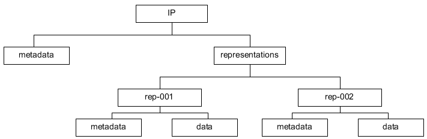

**Figure 1:** Structure of an IP compliant with the E-ARK Common Specification for
IPs structure

Furthermore, Figure 1 shows that metadata can be stored either at the
representation level or at the IP level. In section 5.2 it will be explained in
more detail where different types of metadata can be stored. For now, it is
sufficient to mention that descriptive, technical, preservation, and rights
metadata can relate either to the IP as a whole or to individual
representations.

Based on these assumptions, the following requirements for the general IP
structure need to be taken into account in the context of the AIP format:

**Requirement 1**
An IP MUST contain a “representations” directory.

**Requirement 2.**
Representations MUST be stored in distinct subdirectories of the
“representations” directory. The names of these subdirectories can be chosen
freely.

**Requirement 3.**
An IP MUST contain a “metadata” directory.

**Requirement 4.**
The “Metadata” directory SHOULD be divided into “descriptive”, “preservation”,
and “other” subdirectories for storing the corresponding category of metadata.

**Requirement 5.**
The root directory of the package MUST contain a METS.xml file which is created
according to the rules defined in section 5.3.1.

Following these requirements, the minimal obligatory structure of an IP
compliant with the  E-ARK Common Specification for IPs is essentially as shown
in Figure 2.31

<a name="fig2"></a>
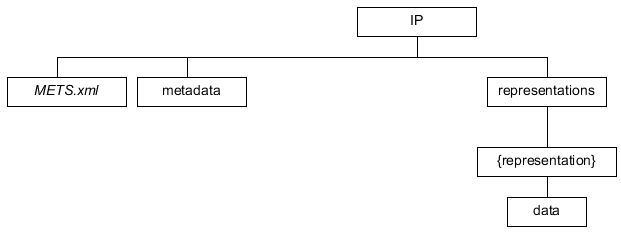

**Figure 2:** Requirements regarding the structure of IPs compliant with the
Common Specification for IPs

The use of other components of the IP format depends on institutional
preferences related to the use of structural metadata, and generally the type
and amount of content that needs to be archived using this structure.

In the following section we will use a concrete example to describe the two
alternatives of using either a compound or a divided METS structure in more
detail.

Let us assume that we have an IP with two representations, each of which
consists of a set of three files. In the first representation all data files are
in the Open Document Format (ODT) and in the second one - as a derivative of the
first representation - all files are in the Portable Document Format (PDF).

##### 5.1.1.1 Compound METS structure
The first option, as shown in Figure 3, is to have a single METS.xml file that
contains all references to metadata and data files available of the IP which is
called “compound” or “simple” METS structure.

<a name="fig3"></a>
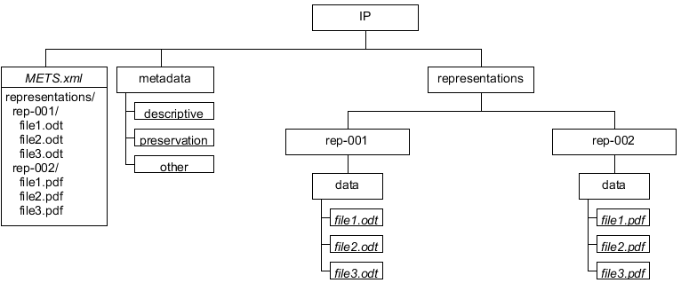

**Figure 3:** One METS.xml file in the root of the IP
references all metadata and data files

Even though the number suffix of the directories “rep-001” and “rep-002” of the
example shown in Figure 3 suggests an order of representations, there are no
requirements regarding the naming of directories containing the representations.
The order of representations and the relations between them is defined by the
structural and preservation metadata. The “representations” directory is
mandatory, even for IPs which contain only one representation (Requirement 1.).

##### 5.1.1.2 Divided METS structure
The second option, called “divided” METS structure, as shown in Figure 4, is to
have separate METS.xml files for each representation and the METS.xml in the
IP’s root directory points to the METS.xml files for each of the
representations. More concretely, the example shown in Figure 4 has a METS.xml
file in the IP’s root which points to the METS.xml files
“Representations/Rep-001/METS.xml” and “Representations/Rep-002/METS.xml”.
Sections 5.3.1.6 and 5.3.1.7 provide more details about how the referencing of
METS.xml files must be implemented if this alternative is chosen.

<a name="fig4"></a>
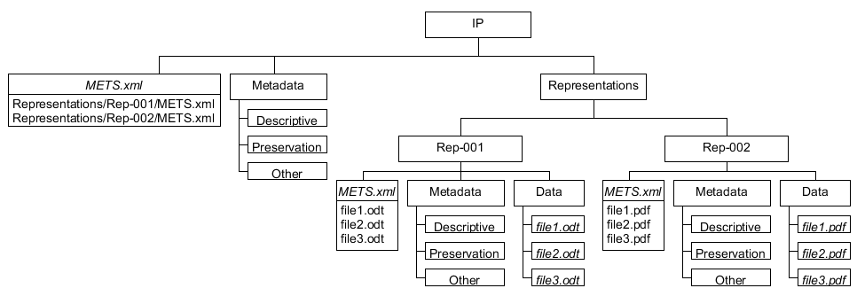

**Figure 4:** Root METS.xml file references METS files
of the different representations

The reason why this alternative was introduced is that it makes it easier to
manage representations independently from each other. This can be desired for
very large representations, in terms of file size (e.g. a binary database and
the database in a vendor independent XML format as two separate representations)
or the amount of files (making the root METS difficult to work with).

##### 5.1.1.3 Representation-based vs. size-based division
As a corollary of this division method we define, on the one hand, a
representation-based division as the separation of representations in different
directories under the “representations” folder as shown in the example of
Figure 4. And, on the other hand, we define a size-based division as the
separation of representation parts. To illustrate this, Figure 5 shows an
example where a set of files belongs to the same representation (here named
“binary”) and is referenced in two separate physical containers (here named {C1}
and {C2} respectively). A key requirement when using size-based division of a
representation is that there must not be any overlap in the structure of the
representations, and that each sub-directory path must be unique across the
containers where the representation parts together constitute a representation
entity. Note that for this reason a numerical suffix is added to the
representation METS.xml files, to avoid overwriting representation METS.xml
files when automatically merging the divided representation back into one single
physical representation.

**Requirement 6.**  If a representation is divided into parts, the
representation component MUST use the same name in the different containers.

**Requirement 7.**  If a representation is divided into parts, there MUST not be
any overlap in the structure of the representations and each sub-directory path
MUST be unique across the containers

It must be noted that this size-based division method assumes that the
separation into parts is based on criteria determined by the archivist.

<a name="fig5"></a>
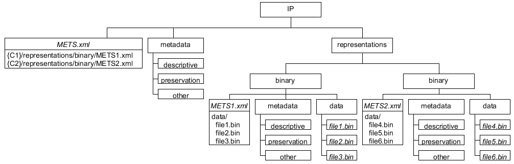

Figure 5 Example of an IP compliant with the Common Specification for IPs E-ARK IP

##### 5.1.1.4 Requirements
There is the basic requirement that the root of an IP contains a METS.xml file,
but it can be freely chosen if this METS.xml file is broken down into METS.xml
parts for the different representations.

**Requirement 8.**  The package root of the package MUST contain a METS.xml file
that either references metadata or and data files or references other METS.xml
files located in the corresponding representation folders under the
“representations” directory.

As already stated, only the “data” directory is obligatory for each
representation. Additionally, there can be other directories at the
representation level which are specified by the following requirements:

**Requirement 9.**  Each representation MUST contain a “data” directory. The
structure within this directory can be freely chosen.

**Requirement 10.**  A representation CAN COULD contain a “metadata” directory.

**Requirement 11.**  If a representation directory contains a “metadata”
directory, it SHOULD be divided into “descriptive”, “preservation”, and “other”
subdirectories for storing the corresponding category of metadata.

**Requirement 12.**  The representation directory CAN COULD contain a
“documentation” directory to store additional documents that explain the content
available in the “data” directory.

**Requirement 13.**  The representation directory CAN COULD contain a “schemas”
directory to store additional XML Schema files that are needed to validate XML
documents contained in a representation.

### 5.2 E-ARK AIPE-ARK AIP structure
Based on the E-ARK IP Common Specification for IPs format described in the
previous section, the AIP format specifies a logical structure and guidelines
for using METS and PREMIS metadata to create E-ARK AIPE-ARK AIPs.

The AIP format offers a structure for storing the complete SIP, and it allows
holding data and metadata which are created during SIP to AIP conversion and
data that are created during the lifecycle of the AIP.

It is important to note that the AIP format implements the Common Specification
for E-ARK information packages differently compared to the SIP and the DIP. The
SIP and the DIP represent “snapshots in time”, one capturing the state of an
information package at submission time (SIP), the other one capturing a specific
form of delivery at the point in time when the information package for access
was created (DIP). The AIP, in contrast, allows holding the original submission
(snapshot of the IP at submission time), the outcome of preservation actions in
the course of the life-cycle separately, and submission updates that occur after
the AIP was created.

The main difference is that the AIP is an information package which can contain
one or several E-ARK compliant IPs, namely SIPs. The purpose of this
meta-structure is to allow applying changes to the AIP over time. This requires
a specific structure which is not required in the SIP and the DIP. The AIP must
therefore not be understood as an "extension" of the IP (as defined by the
Common Specification) in the sense that it inherits general properties from the
E-ARK Common Specification for IPs which are complemented by AIP specific
properties. This is the reason why the inherent structure of the AIP is
different to the one of the SIP and the DIP.

#### 5.2.1 AIP container for submissions
The AIP format allows storing submissions; having the submission in its original
form can help to ensure authenticity of its representations. For this purpose,
the AIP format defines a “submission” folder in the root of the AIP which
contains the original submission as well as any submission updates added after
the AIP was created. The following obligatory requirement applies:

**Requirement 14.**
The root directory of the AIP package COULD contain a
“submission” directory which is a container for of the original submission and
of updates of SIPs which are submitted after the AIP was created.

The submission folder is a container for submissions. It can contain the
original submission, i.e. an information package which must be compliant with
the E-ARK IP Common Specification for IPs. Or, in case updating submissions is
allowed after the AIP was created, the submission folder can contain sub-folders
which represent a series of original submission and submission updates.

If the submission folder does not contain a METS.xml file, it is assumed that
one or several submissions are contained in subfolders.

**Requirement 15.**
The “submission” folder MUST contain the submitted IP directly or one or several
E-ARK IPIPs compliant with the Common Specification for IPss in sub-folders.

This means that any sub-folders must contain IPs.

**Requirement 16.**  If the “submission” folder contains one or several
sub-folders, the sub-folders MUST contain IPs.

The naming scheme of these sub-folders can be freely defined. However, it should
reflect the order of original submission and updates. This means that the folder
names should allow alphanumerical ordering, for example, by using
zerofill-number suffixes or by deriving the folder name from an ISO 8601 date.

**Requirement 17.** Instead of an IP, the “submission” folder COULD contain one
or several sub-folders where each of the sub-folders contains an IP (a
submission). It is not allowed in this case that the submission folder contains
a METS.xml file. The sub-folders containing IPs SHOULD allow alphanumeric
sorting, e.g. by using zero-fill numbers or ISO 8601 date derived strings as
part of the folder name.

Examples for submission folder names which allow alphanumerical sorting:

- Zero-fill number suffixes:
 + Submission-00001
 + Submission-00002
 + Submission-00003
- Date/time based strings:
 + 2017-12-25_ 081012
 + 2017-12-26_ 083401
 + 2017-12-27_ 090118
- Date string suffixes:
 + Submission-2017-12-25
 + Submission-2017-12-26
 + Submission-2017-12-27

Figure 6 shows the variant where the “submission” folder contains an IP which
represents the original submission. Although this structure does not reflect the
version of the submission, the versioning layer can be introduced when the AIP
is updated. The IP contained in the submission folder must be moved to a version
folder in that case.

<a name="fig6"></a>


**Figure 6:** The AIP's "submission" folder contains the IP of the original
submission

Figure 7 shows an example of the alternative structure, where the submission
folder contains three sub-folders representing one original submission and two
updates which were created over the course of three days.

<a name="fig7"></a>
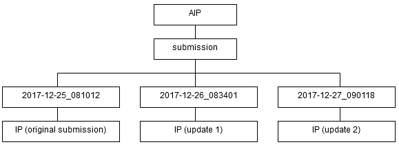

**Figure 7:** The AIP contains submissions in subfolders to support submission
updates

For the sake of simplicity, only the first variant, i.e. where the “submission”
folder directly contains an IP, is present in the following sections about the
AIP structure.

#### 5.2.2 AIP representations
As described in section 5.1 in relation to an IP, one or several representations
can be part of an SIP which is submitted to the repository. Additionally, the
AIP must be able to include further representations which are either added
during SIP to AIP conversion, or through measures which were taken as part of
the repository maintenance or for digital preservation.

To illustrate this with the help of an example, Figure 8 shows the structure of
an AIP where the original submission consists of two representations which were
part of the original submission. The “submission” directory of the AIP contains
the original submission “as is”, which means that neither data nor metadata is
changed.

<a name="fig8"></a>
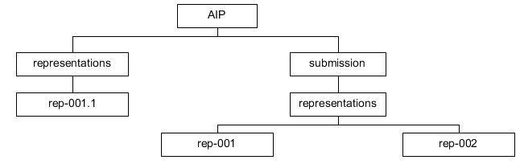

**Figure 8:** AIP representations

Let us now assume that during SIP to AIP conversion an additional representation
is added to the AIP. Figure 9 illustrates an example where an additional
“representations” directory exists as a sibling of the “submission” directory
which contains a new representation (rep-001.1) derived from one of the
representations contained in the original submission (rep-001).

<a name="fig9"></a>
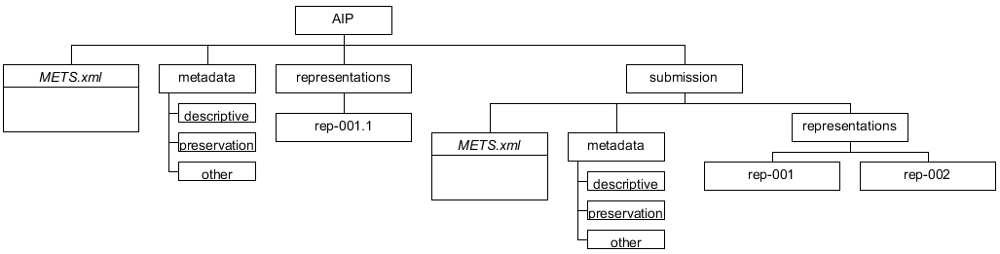

**Figure 9:** AIP representations

This leads to the following requirement regarding representations which are
added during SIP to AIP conversion.

**Requirement 18.**  If a new representation is added during ingest (SIP to AIP
conversion) or created as an AIP preservation measure (AIP to AIP conversion),
the root directory of the AIP MUST contain a “representations” directory.
For this directory, the same requirements as for the representations of an IP
apply, namely requirements 9 to 13.

Note that the three-digit number suffix following the name “rep-” used in the
example of Figure 9 indicates the order in time in which the representation of
the original submission was created. And the additional number suffix after the
dot indicates that the representation is a derivative of the representation
identified by the three-digit number before the dot, i.e. “rep-001.1” is the
first derivative of representation “rep-001”. This is however for illustration
purposes only; the naming of representations does not have to follow such logic.

The AIP is an extension of the IP format; therefore it must follow the basic
structure of an IP. Figure 9 shows that the IP components, consisting of
METS.xml file, “Metadata” and “representations” directories, are repeated on the
AIP level. The extension of the AIP format is basically given by the fact that
the AIP is an IP which can contain another IP (here i.e. a SIP) in the
“submission” directory.

Note that the “representations” directory in the AIP root directory is optional.
It means that this directory must only exist in case representations other than
the ones originally submitted are added to the AIP.

**Requirement 19.**  The AIP is an IP, therefore requirement 8 applies and the
AIP root MUST contain a METS.xml file that either references all metadata and
data files or it references other METS.xml files located in the corresponding
representation directories of the AIPs or of the original submission’s
“representations”.

As a concrete example let us assume a policy stating that PDF documents must
generally be converted to PDF/A.3. Taking the premise formulated in section 4.4
into account that the original submission is not to be changed, the additional
representation is added in a “Representation” directory in the root of the AIP
as shown in figure 7. Note that this example uses a representation-based
division of METS.xml files.

Analogously to Figure 8 there are also two representations in the original
submission shown in Figure 10. The first representation (“Rep-001”) consists of
a set of files in the Open Document Format (ODT) and the second one (“Rep-002”)
is a derivative of the first set of files in the Portable Document Format (PDF).
As an example we assume that an institutional policy prescribes that every PDF
document must be converted to PDF/A during SIP to AIP conversion.
Therefore the second representation (“Rep-002”) was converted to a set of PDF/A
files and added to the AIP as an additional representation (“Rep-002.1”).

<a name="fig10"></a>
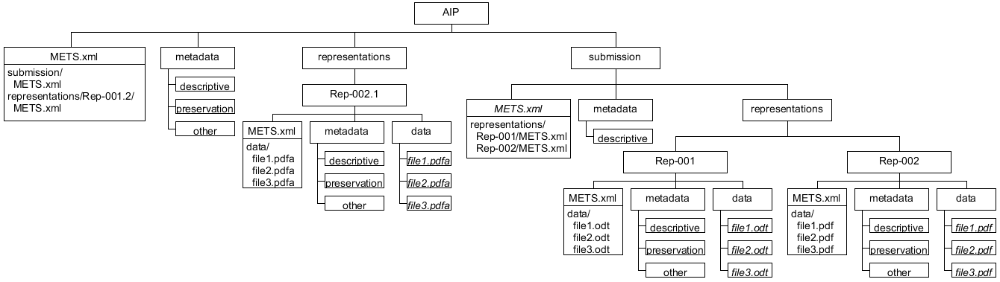

**Figure 10:** AIP using representation-based division of METS.xml files

The two representations of the original submission are located in the
“submission/representations” directory of the AIP and the METS.xml file of the
submission references the corresponding representation METS.xml files using a
relative path to be resolved within the SIP. The root level METS.xml file of the
AIP references the METS.xml file of the original submission
(submission/METS.xml) and the METS.xml file of the new representation
(representations/Rep-002.1/METS.xml).

#### 5.2.3 Changing the metadata of the original submission
If the originally submitted SIP as a consequence of an implementation decision
is not supposed to change, then the AIP level metadata directory can contain
metadata that relates to representations contained in the original submission.
Then, there might be scenarios where the originally submitted metadata needs to
be updated.

As an example let us assume that we have to recalculate the checksum during SIP
to AIP conversion and that the checksum is recorded as an attribute of the METS
file element. As shown in Figure 11, the AIP’s “Metadata” directory can -
additionally to the existing metadata category directories - contain a
“submission” directory with metadata files (here METS.xml) that by definition
have priority over the ones contained in the original submission. This means
that in case metadata needs to be updated, they must be placed into the root
level metadata directory because metadata for the original submission is not
allowed to be changed.

<a name="fig11"></a>
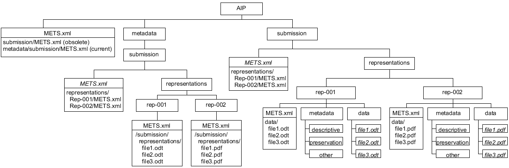

**Figure 11:** METS.xml files in the AIP’s “Metadata/submission” directory have
priority over the ones contained in the original submission

**Requirement 20.**  Let <MDPath> be a sub-directory-path to a metadata file,
then a metadata file under the “AIP/metadata/submission” directory MUST have
priority over a metadata file under the “AIP/submission” directory so that
AIP/metadata/submission/<MDPath> has priority over AIP/submission/<MDPath>.

An example is shown in Figure 11 where the METS.xml file in the root of the AIP
references an obsolete METS.xml file of the original submission and a current
METS.xml file under “metadata/submission”, i.e. the metadata file
AIP/metadata/submission/METS.xml has priority over the metadata file
AIP/submission/METS.xml. In this way users have the possibility to consult both
the initial metadata and the updated metadata.

#### 5.2.4 Parent-Child relationship
As already pointed out, the divided METS structure was introduced to make the
separation of representations or representation parts easier and allow the
distribution of these components over a sequence of AIPs.

E-ARK allows the composition of a logical AIP to be expressed by a parent-child
relationship between AIPs. It is a bidirectional relationship where each
child-AIP bears the information about the parent-AIP to which they belong and,
vice versa, the parent-AIP references the child-AIPs.

<a name="fig12"></a>
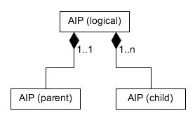

**Figure 12:** Parent-child relationship between AIPs

Even though this parent-child relationship could be used to create a
hierarchical graph of AIPs, E-ARK only uses this method to aggregate
representations or representation parts of the logical AIP.

Assuming that a new AIP (e.g. containing an additional representation) needs to
be added after parent- and child-AIPs have been stored, the recreation of the
whole logical AIP might be inefficient, especially if the AIPs are very large.
For this reason, existing child-AIPs remain unchanged in case a new version of
the parent-AIP is created. Only the new version of the parent-AIP has references
to all child-AIPs as illustrated in Figure 13. As a consequence, in order to
find all siblings of a single child-AIP it is necessary to get the latest
version of the parent-AIP which implies the risk that the integrity of the
logical AIP is in danger if the latest version of the parent-AIP is lost.

<a name="fig13"></a>
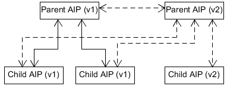

**Figure 13:** New version of a parent-AIP

The result of this process is a sequence of physical containers of child-AIPs
plus one additional parent-AIP. The relation of the AIPs is expressed by means
of structural metadata in the METS.xml files as described in the sections
5.3.1.6 and 5.3.1.7.

#### 5.2.5 Representation Information in the E-ARK AIPE-ARK AIP
Representation Information (RI) is a key concept in digital preservation and is
defined by OAIS as follows:

> “Representation Information: The information that maps a Data Object into more
> meaningful concepts. An example is the ASCII definition that describes how a
> sequence of bits (i.e., a Data Object) is mapped into a symbol.”

The RI is required to preserve data in a way that makes it possible to get
meaningful information which a person or system is able to understand.

##### 5.2.5.1 Types of Representation Information
Representation Information can be subdivided into three classes:

- **Structural Information:** describes the format and data structure concepts
to be applied to the bitstream, which result in more meaningful values like
characters or number of pixels.

- **Semantic Information:** this is needed on top of the structure information.
If the digital object is interpreted by the structure information as a sequence
of text characters, the semantic information should include details of which
language is being expressed.
- **Other Representation Information:** includes information about relevant
software, hardware and storage media, encryption or compression algorithms, and
printed documentation.

The RI does not necessarily have to be documentation. It can also be executable
software, such as a PDF viewer, or be expressed as meta data.

##### 5.2.5.2 Representation networks
The RI may contain references to other RI components. And as the RI is in itself
an Information Object, with its own Data Object and related Representation
Information, a whole network of RI may be built up, which is called a
Representation network.

##### 5.2.5.3 Limitations of the Representation Information of the E-ARK AIPE-ARK AIP
The following figure, taken from the OAIS document, depicts which components are
considered relevant in the context of an AIP definition. Aligning the following
definition with the components currently present on the E-ARK AIPE-ARK AIP we
can easily detect that Representation Information is actually missing from the
specification.

<a name="figsup"></a>
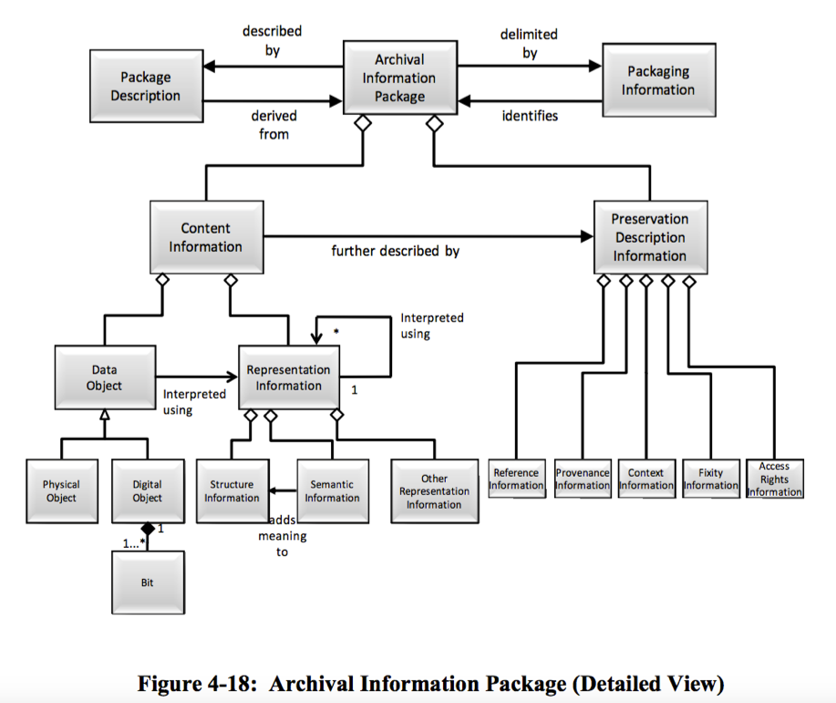

The AIP Common Specification foresees the “documentation” folder will hold
specific information (other than metadata) about the content of the IP. This
folder fulfils the requirements of the transfer of archival material from the
producer to the archive.

However, in order to allow RI to be reusable, it is required that a specific RI
actually be used for thousands of objects in a repository. For example, the
description of what a PDF file is and how we can interpret it can be defined
once, and linked to thousands of PDF files in the repository can link to this
single description. This RI could be either references to the actual PDF
specification, links to external PDF viewers, the actual binaries of those
viewers or even source-code in various programming languages.

Moreover, the RI may itself contain data, e.g. the visualization software, that
needs to be updated over time. Having this unit of information stored physically
inside the AIP means redundantly storing the same information many times.

##### 5.2.5.4 Representation Information in the E-ARK AIPE-ARK AIP
The proposed approach to include representation information in the E-ARK AIP is
to use a relationship model that enables the creation of links between an AIP
and one or more “Representation Information packages”. These “Representation
Information packages” follow the same structure of the current E-ARK AIP,
meaning that they are composed of a metadata folder, representation folders, and
all the other components that currently constitute the E-ARK AIP. It is
recommended that this particular type of AIP follows a different naming scheme
so that it is easy to distinguish this package type with the regular AIPs.

In this way it is possible to build an entire Representation Information network
that follows the E-ARK AIPE-ARK AIP specification.

The relationship between these RI AIPs and regular AIPs is defined in the same
way as the parent-child relationship between AIPs which is explained in section
5.2.4. It is recommended to implement this as a specific structMap as part of
the METS structural metadata to define the relationships with RI AIPs. This
structMap has the LABEL attribute “Representation Information”.

### 5.3 E-ARK AIPE-ARK AIP metadata
The AIP format specifies the use of structural and preservation metadata. Any
type of additional metadata, such as descriptive metadata using Dublin Core or
EAD, can be used.

In the following, XML elements are either enclosed between angle brackets
(e.g. <fileSpec>) or addressed using XPath syntax (e.g. /mets/metsHdr). In the
latter case a leading slash selects a node from the XML document root and the
double slash (’//’) selects nodes in the document from the current node that
match the selection, no matter where they are. Also in line with the XPath
syntax, element attributes have a leading ’@’ character. For example
//mets:file/@USE denotes the ’USE’ attribute of a <file> element.

#### 5.3.1 Structural metadata
Structural metadata is expressed by means of the METS standard. Some of the high
level functions which the standard fulfils in the context of the AIP are the
following.

- It provides an overview about the hierarchical structure of the AIP.
- It is an entry point for the AIP, i.e. the first entity to consult to know
what an AIP contains and what entities it references.
- It references or embeds any metadata files describing the package as a whole
as well as individual content files.
- It contains a complete list of digital objects contained in a package together
with basic information to ensure the integrity of the digital objects.
- It establishes links between digital objects and metadata entities (both
structural metadata and preservation metadata entities).
- It can hold information about different representations or representation
parts belonging to the same intellectual entity.

This section has a focus on METS, therefore, if no namespace prefix is given,
the element belongs to the METS default namespace.

##### 5.3.1.1 METS root element
###### 5.3.1.1.1 METS identifier
Each METS document must be assigned a persistent and (ideally globally) unique
identifier. Possible identifier schemes are amongst others: OCLC Purls35, CNRI
Handles36, DOI37. Alternatively, it is possible to use a UUID as a locally
unique identifier.38.

Using this identifier, the system must be able to retrieve the corresponding
package from the repository.

According to the Common Specification, any ID element must start with a prefix
(also, the XML ID datatype is does not allow IDs ed to start with a number, so a
prefix solves this issue). We recommended to use
> "as a prefix an internationally recognized standard identifier for the
> institution from which the SIP originates. This may lead to problems with
> smaller institutions, which do not have any such internationally recognized
> standard identifier. We propose in that case, to start the prefix with the
> internationally recognized standard identifier of the institution, where the
> AIP is created, augmented by an identifier for the institution from which the
> SIP originates."39

In the in the context of the implementation as part of the E-ARK Integrated
Platform, a UUID is used as identifier of an intellectual entity. The prefix
“urn:uuid:” is used to state that the identifier can be used to locate physical
packages as well. For example, if the package identifier value is
"123e4567-e89b-12d3-a456-426655440000" this would be the value of the METS root
element’s ‘OBJID’ attribute:
/mets/@OBJID="urn:uuid:123e4567-e89b-12d3-a456-426655440000"

###### 5.3.1.1.2 Namespace and namespace schema definitions
**Requirement 21.** The METS document MUST use at least the namespace and
namespace schema definitions defined in table 1.

Table 1: Attributes of the METS root element

|      Attribute      |   Description   |            Value             |
|---------------------|-----------------|------------------------------|
| //mets/@xmlns       | METS-Namespace  | http://www.loc.gov/METS/     |
| //mets/@xmlns:xlink | Xlink-Namespace | http://www.w3.org/1999/xlink |
| //mets/@xmlns:xsi   | Schema-Instance | http://www.w3.org/2001/XMLSchema-instance |
| //mets/@xsi:schemaLocation | Schema-Location | http://www.loc.gov/METS/ <br/> http://www.loc.gov/standards/mets/mets.xsd <br/> http://www.w3.org/1999/xlinkschemas/xlink.xsd |

An example of a root element with namespace and namespace location definitions
is shown in Listing 1.

Listing 1: METS root element example with namespace and namespace location
definitions
```xml
<mets xmlns:mets="http://www.loc.gov/METS/"
      xmlns:xlink="http://www.w3.org/1999/xlink"
      xmlns:xsi="http://www.w3.org/2001/XMLSchema-instance"
      xsi:schemaLocation="http://www.loc.gov/METS/ http://www.loc.gov/standards/mets/mets.xsd http://www.w3.org/1999/xlinkschemas/xlink.xsd">...</mets>
```

##### 5.3.1.2 Digital objects
Digital objects are described in a file section (<fileSec>) of the METS
document. Listing 2 shows an example of a file section with one file.

Listing 2: Example of a file in the fileSec as child of a fileGroup element
(long attribute values replaced by “...” for better readability)

```xml
<fileSec>
    <fileGroup @USE="Common Specification root">
        <file ID="ID77146c6c-c8c3-4406-80b5-b3b41901f9d0"
            ADMID="..." MIMETYPE="text/x-sql" SIZE="2862064"
            CHECKSUMTYPE="SHA-256" CHECKSUM="..."
            CREATED="2015-0501T01:00:00+01:00">
            <FLocat LOCTYPE="URL"
                xlink:href="./submission/data/content/file.ext"
                xlink:type="simple"/>
        </file>
    <fileGroup>
</fileSec>
```

Table 2 lists the attributes of the <file> element with an example value. The
/file/FLocat element provides the link to the actual file.

Table 2: Attributes of the file element

|      Attribute      |   Description   |            Value             |
|---------------------|-----------------|------------------------------|
| //file/@ID          | Identifier of a file wich is part of the AIPFile identifier; must be unique and start with the prefix “ID” | ID77146c6c-c8c3-4406-80b5-b3b41901f9d0 |
| //file/@ADMID       | Used to link it to relevant administrative metadata sections that relate to the digital object described. Can be a white space separated list of identifiers. | ID4566af74-0f7b-11e5-a6c0-1697f925ec7b ID4566af74-0f7b-11e5-a6c0-1697f925ec7c |
| //file/@CHECKSUMTYPE | Hash-sum calculator algorithm | SHA-256 |
| //file/@CHECKSUM | Hash-sum | 977fb584d53cd64662dfba427f35190813dfc58979f51a2703f8621b9e1bc274 |
| //file/@CREATED | Date when the file entry was created. | 2014-05-01T01:00:00+01:00 |
| //file/@SIZE | Size of the file in bytes. | 2498 |
| //file/@MIMETYPE | Mime-type | application/pdf |

Table 2 lists the attributes of the file element with an example value. The
/file/FLocat element provides the link to the actual file.

The following rules apply for the URL attribute of the <FLocat> element:

**Requirement 22.**
The local file paths CAN indicate the protocol part (“file://”), in this case
the path must be a valid URI according to RFC3986.40

**Requirement 23.**
If the protocol part is omitted, the path MUST be interpreted as a reference
relative to the METS document (e.g. “./file.txt” or “file.txt” referring to the
file “file.txt” in the current folder).

Additionally, the following requirement applies for compressed files:

**Requirement 24.**
If a file is compressed, the transformFile element (//file/transformFile) SHOULD
indicate how the packages have to be processed by means of the attributes
’TRANSFORMTYPE’, ’TRANSFORMALGORITHM’, and ’TRANSFORMORDER’.

Listing 3: Compressed file
```xml
<file ...>
    <FLocat xlink:href="../compressed.tar.gz" xlink:type="simple" LOCTYPE="URL"/>
    <transformFile TRANSFORMORDER="1"
        TRANSFORMTYPE="decompression" TRANSFORMALGORITHM="gzip"/>
    <transformFile TRANSFORMORDER="2"
        TRANSFORMTYPE="decompression" TRANSFORMALGORITHM="tar"/>
</file>
```

##### 5.3.1.3 Referenced Metadata
Generally, the use of embedded metadata by using the <mdWrap> element is allowed
by E-ARK. However, using the <mdRef> element is recommended due to scalability
concerns.

**Requirement 25.**
External metadata files such as EAD41 or PREMIS files MUST be referenced by
means of the <mdRef> element. Its "xlink:href" attribute value must be either a
URL relative to the location of the METS root or an absolute URL.

###### 5.3.1.3.1 Descriptive metadata
The descriptive metadata section (<dmdSec>) references descriptive metadata
contained in the AIP. Multiple <dmdSec> elements are allowed so that descriptive
metadata file can be referenced separately within the METS object.

Descriptive metadata is referenced by means of the <mdRef> element as part of
the descriptive metadata element <dmdSec>. Listing 4 shows an example linking to
an EAD XML metadata file.

Listing 4: Linking to an EAD XML descriptive metadata file
```xml
<dmdSec ID="ID550e8400-e29b-41d4-a716-44665544000a">
	<mdRef LOCTYPE="URL" MDTYPE="EAD" MIMETYPE="text/xml"
    	    CREATED="2015-04-26T12:00:00+01:00" xlink:type="simple"
    	    xlink:href="./metadata/EAD.xml"
    	    CHECKSUMTYPE="SHA-256" CHECKSUM="..." SIZE="2321"/>
</dmdSec>
```

###### 5.3.1.3.2 Administrative Metadata
**Requirement 26.**
The AIP METS must have a single <amdSec> element which contains one or several
<digiprovMD> elements. The <mdRef> child of at least one of these elements must
be of type “PREMIS” (@MDTYPE=”PREMIS”) with the reference to a PREMIS file in
the “Metadata” directory of the AIP root.

Listing 5 shows an example with a link to a PREMIS.xml file:

Listing 5: Linking to an EAD XML descriptive metadata file
```xml
<amdSec ID="...">
    <digiprovMD ID="..." @STATUS="CURRENT">
        <mdRef CHECKSUM="..." CHECKSUMTYPE="SHA-256"
            CREATED="..." LOCTYPE="URL" MDTYPE="PREMIS"
            MIMETYPE="text/xml" SIZE="1109"
            xlink:href=" metadata/preservation/premis.xml" xlink:type="simple"/>
    </digiprovMD>
</amdSec>
```

**Requirement 27.**
The @STATUS attribute value of the <digiprovMD> element SHOULD be “SUPERSEDED”
if the PREMIS file is obsolete and only included in the AIP to ensure
traceability.

**Requirement 28.**
The @STATUS attribute value of the <digiprovMD> element COULD be “CURRENT” to
make explicit that the PREMIS file is active.

##### 5.3.1.4 Structural map
**Requirement 29.**
One <structMap> with the LABEL attribute value “Common Specification structural
map” MUST be present in the METS.xml file.

Listing 6 shows a structural map with the LABEL attribute value “Common
Specification structural map”.

Listing 6: Obligatory Common Specification structural map
```xml
<structMap ID="IDf413c073-5b03-4499-830e-8ef724613bef" TYPE="physical" LABEL=" Common specifcation structural map">
    <div>
        <div LABEL="submission">
        	...
    	</div>
    	<div LABEL="representations">
       <div LABEL="representations/rep-001">
          ...
       </div>
    	</div>
   </div>
</structMap>
```

###### 5.3.1.4.1 Structural map of a divided METS structure
**Requirement 30.**
When an AIP uses the divided METS structure, i.e. the different representations
have their own METS.xml file, the mandatory <structMap> MUST organize those
METS.xml files through <mptr> and <fptr> entries, for each representation.
The <mptr> node MUST reference the /<representation>/METS.xml and point at the
corresponding <file> entry in the <fileSec> using the <fptr> element.

Listing 7: Structural map referencing METS.xml files of the different representations
```xml
<structMap TYPE="physical" LABEL="Common Specification structural map">
   <div LABEL="d7ef386d-275b-4a5d-9abf-48de9c390339">
     <div LABEL="representations/images_mig-1">
       <mptr xlink:href="./representations/images_mig-1/METS.xml" xlink:title="Mets file describing representation: images_mig-1 of AIP: urn:uuid:d7ef386d-275b-4a5d-9abf-48de9c390339." LOCTYPE="URL" ID="IDc063ebaf-e594-4996-9e2d-37bf91009155"/>
       <fptr FILEID="IDfb9c37e7-1c90-4849-a052-1875e67853d5"/>
     </div>
     <div LABEL="representations/docs_mig-1">
       <mptr xlink:href="./representations/docs_mig-1/METS.xml" xlink:title="Mets file describing representation: docs_mig-1 of AIP: urn:uuid:d7ef386d-275b-4a5d-9abf-48de9c390339." LOCTYPE="URL" ID="ID335f9e55-17b2-4cff-b62f-03fd6df4adbf"/>
       <fptr FILEID="ID3f2268cd-7da9-4ad8-909b-4f17730dacaf"/>
     </div>
   </div>
</structMap>
```

##### 5.3.1.5 Metadata representation of the AIP structure

##### 5.3.1.6 Child AIP references parent AIP
The optional reference to a parent AIP is expressed by a structural map with the
LABEL attribute value “Parent”. Listing 8 shows an example where a UUID is used
as the package identifier and the xlink:href attribute has the UUID identifier
value of the referenced parent AIP as value. This identifier implicitly
references the METS.xml file of the corresponding package. If other locator
types, such as URN, URL, PURL, HANDLE, or DOI are used, the LOCTYPE attribute
can be set correspondingly.

Listing 8: Using a structMap to reference the parent AIP
```xml
<structMap TYPE="logical" LABEL="parent AIP">
    <div LABEL="AIP parent identifier">
      <mptr xlink:href="urn:uuid:3a487ce5-63cf-4000-9522-7288e208e2bc"
            xlink:title="Referencing the parent AIP of this AIP
                         (URN:UUID:3218729b-c93c-4daa-ad3c-acb92ab59cee)."
            LOCTYPE="OTHER" OTHERLOCTYPE="UUID"
            ID="ID755d4d5f-5c5d-4751-9652-fcf839c7c6f2"/>
    </div>
</structMap>
```

##### 5.3.1.7 Parent AIP references child AIPs
The parent AIP which is referenced by child AIPs must have a structural map
listing all child AIPs. Listing 9 shows the structural map of a parent AIP
listing four child AIPs.

Listing 9: Using a structMap to reference the parent AIP
```xml
<structMap TYPE="logical" LABEL="child AIPs">
    <div LABEL="child AIPs">
        <div LABEL="child AIP">
            <mptr xlink:href="urn:uuid:cea73348-741d-4594-ab8f-0b9e652c1099"
                  xlink:title="Referencing a child AIP."
                  LOCTYPE="OTHER" OTHERLOCTYPE="UUID"
                  ID="IDd98e416f-55a7-4237-8d45-59c22d221669"/>
        </div>
        <div LABEL="child AIP">
            <mptr xlink:href="urn:uuid:cea73348-741d-4594-ab8f-0b9e652c1099"
                  xlink:title="Referencing a child AIP."
                  LOCTYPE="OTHER" OTHERLOCTYPE="UUID"
                  ID="ID70f8ec28-23f1-4364-9163-b3e99165b6e6"/>
        </div>
        <div LABEL="child AIP">
            <mptr xlink:href="urn:uuid:3218729b-c93c-4daa-ad3c-acb92ab59cee"
                  xlink:title="Referencing a child AIP."
                  LOCTYPE="OTHER" OTHERLOCTYPE="UUID"
                  ID="ID77373d7f-e241-481b-bf89-675335beb049"/>
        </div>
        <div LABEL="child AIP">
            <mptr xlink:href="urn:uuid:cea73348-741d-4594-ab8f-0b9e652c1099"
                  xlink:title="Referencing a child AIP."
                  LOCTYPE="OTHER" OTHERLOCTYPE="UUID"
                  ID="ID3f0cc05c-f27d-499d-a6fd-63bdfed13cb0"/>
        </div>
    </div>
</structMap>
```
#### 5.3.2 Preservation metadata
As already mentioned, PREMIS (version 342) is used to describe technical
metadata of digital objects, rights metadata to define the rights status in
relation to specific agents or for specific objects, and to record events that
are relevant regarding the digital provenance of digital objects.

In the following sections, the PREMIS format and the way that it relates to the
METS elements is described in detail. **NOTE:** in the listings showing PREMIS
code parts, the prefix "premis" is omitted (default namespace is the PREMIS
namespace43) while the "mets" prefix is explicitly added if a relation to the
METS file is explained.

##### 5.3.2.1 Vocabulary
The definition of a vocabulary for PREMIS is an ongoing process, therefore E-ARK
does not define an exhaustive list of vocabularies that are to be used
exclusively.

The basis of the preservation vocabulary used in E-ARK is the preservation
schemes provided by the Library of Congress (LoC).44 Additionally, recent
contributions by the PREMIS Implementers Group (which are still “work in
progress”) are taken into consideration.45 And, finally, there are contributions
made by E-ARK project partners based on experience and best practices.

The vocabularies listed in the following sections are therefore to be seen as
core vocabularies which are able to be extended.

###### 5.3.2.1.1 Identifier type
Values of *IdentifierType elements.
- local = Scope is the PREMIS file.
- uuid = UUID
- uri = Identifier that is a unique resource identifier.

###### 5.3.2.1.2 Event type
The values of eventType elements are based on the LoC eventType preservation
term.46
- adding emulation information - Adding emulation information.
- AIP validation - Validation of the AIP.
- archive - Archiving the AIP.
- capture - Obtaining a digital object.
- compression - compression of files.
- creation - Creating a new digital object.
- decompression - decompression of files.
- deaccession - The process of removing an object from the inventory of a repository.
- digital signature validation - The process of determining that a decrypted digital signature matches an expected value.
- decryption - Decryption of data.
- deletion - Removing a digital object from the repository.
- digital signature validation - Validating a digital signature.
- fixity check - Checking file hash sums.
- format identification - File format identification (e.g. PRONOM PUID).
- format validation - File format validation (e.g. using JHove).
- identifier assignment - Assignment of an identifier.
- ingestion - Adding digital objects to the repository.
- message digest calculation - Calculate the message digest of digital objects.
- migration - File format migration.
- replication - Creating an exact copy of a digital object.
- SIP creation - Creation of the SIP.
- SIP validation - Validation of the SIP.
- storage migration - Moving digital object to another storage medium.
- validation - Structure and compliance validation of the AIP.
- virus check - Virus check

###### 5.3.2.1.3 Event outcome
Values of eventOutcome elements.
- success - Process was applied successfully
- failure - An error occurred

###### 5.3.2.1.4 Agent Type
Values of agentType elements.
- software - Software agent
- person - Person agent
- organisation - Organisation agent
- hardware - Hardware agent

###### 5.3.2.1.5 Rights granted - act
Generally, rights metadata in PREMIS are used to express restrictions which need
to be taken into consideration from a technical perspective. It can express, for
example if a software component is allowed to index the files contained in an
archival package. Or it can express that a file may only be displayed in a
specific rendering environment (e.g. one where printing is not allowed). It is
therefore about allowing or disallowing specific actions from a technical
perspective. It does not have to provide details about why certain actions are
possible or not; those details are supposed to be described within descriptive
metadata, but there are no requirements on how this has to be done.

Values of rightsGranted/act elements:
- discover
- display
- copy
- migrate
- publish
- modify
- delete
- print

###### 5.3.2.1.6 Rights granted - restriction
Values of rightsGranted/restriction elements:
- GENERAL – the Rights statement must not be explicitly stated for each file
object, action is allowed to be performed on each digital object. In this case
it is sufficient to know that an agent has a specific right.
- PER_FILE – the Rights statement must be explicitly stated for each digital
object. It is not sufficient to know if an agent has a specific right, it must
be verified for each individual object if the specific right is given.

###### 5.3.2.1.7 Relationship
Values of relationshipSubType elements. Logical relations to other AIPs.
- part of
- has part
- is sibling
- is version of

#####5.3.2.2 PREMIS object
The PREMIS object contains technical information about a digital object.

###### 5.3.2.2.1 Object identifier

**Requirement 29:**
If an identifier of type “local” MUST be used, this identifier SHOULD be valid
in the scope of the PREMIS document.

**Requirement 30:** Other object identifiers of the allowed types COULD be used
additionally to the identifier of type “local”.

The example shown in Listing 10 has one identifier which is valid in the scope
of the PREMIS file of type “local”.


Listing 10: Object identifier
```xml
<objectIdentifier>
	<objectIdentifierType>local</objectIdentifierType>
	<objectIdentifierValue>fileId001</objectIdentifierValue>
</objectIdentifier>
```

###### 5.3.2.2.2 Fixity
Fixity information is provided as a descendant of the objectCharacteristics
element information in form of a SHA-256 hashsum, a fixed size 256-bit value. An
example is shown in Listing 11.

Listing 11: Hashsum (value shortened)
```xml
<fixity>
	<messageDigestAlgorithm>SHA-256</messageDigestAlgorithm>
	<messageDigest>3b1d00f7871d9102001c77f...</messageDigest>
	<messageDigestOriginator>/usr/bin/sha256sum</messageDigestOriginator>
</fixity>
```

###### 5.3.2.2.3 File format
The format element MUST be provided either using the formatRegistry or the
formatDesignation element subelements, or both. Regarding the formatRegistry,
the Persistent Unique Identifier (PUID)47 based on the PRONOM technical
registry48 can be used. An example is shown in Figure shown in Listing 12.

Listing 12: Optionally, the format version can be provided using the formatDesignation element.
```xml
<format>
    <formatDesignation>
        <formatName>XML</formatName>
        <formatVersion>1.0</formatVersion>
    </formatDesignation>
    <formatRegistry>
    	<formatRegistryName>PRONOM</formatRegistryName>
    	<formatRegistryKey>fmt/101</formatRegistryKey>
    	<formatRegistryRole>specification</formatRegistryRole>
    </formatRegistry>
</format>
```

###### 5.3.2.2.4 Object characterisation
The JHOVE 49 technical characterisation result (XML format) is embedded as a
descendant of the obbjectCharacteristicsExtension element. An example is shown
in Listing 13.


Listing 13: JHove digital object characterisation
```xml
<objectCharacteristicsExtension>
    <jhove>
      	...
    </jhove>
</objectCharacteristicsExtension>
```

###### 5.3.2.2.5 Original name
The original name is an optional element to hold the original file, an example
is shown in Listing 14.

Listing 14: Original name
```xml
<originalName>originalfilename.ext</originalName>
```

###### 5.3.2.2.6 Storage
The storage element COULD hold contain information about the physical location
of the digital object. Ideally this is a resolvable URI, but it can also
generally hold information needed to retrieve the digital object from the
storage system (e.g. access control or for segmented AIPs). An example is shown
in Listing 15.

Listing 15: Storage description
```xml
<storage>
    <contentLocation>
        <contentLocationType>URI</contentLocationType>
        <contentLocationValue>
          /path/to/file.txt
        </contentLocationValue>
    </contentLocation>
    <storageMedium>hard disk HD2253</storageMedium>
</storage>
```

###### 5.3.2.2.7 Relationship
This element contains the "part-of" relationship of the digital object. For
digital objects included in the AIP, the value "is included in" of the
relationshipSubType element means that a digital object is part of an AIP which
is just making an explicit statement about a fact. More importantly, in the case
of "segmented AIPs", it is used to express that an AIP is part of a parent AIP
which is not expressed otherwise. An example of the latter case is shown in
Listing 16.

Listing 16: Relationship
```xml
<relationship>
    <relationshipType>structural</relationshipType>
    <relationshipSubType>is included in</relationshipSubType>
	<relatedObjectIdentification>
    	    <relatedObjectIdentifierType>repository</relatedObjectIdentifierType>
    	    <relatedObjectIdentifierValue>
               ID123e4567-e89b-12d3-a456-426655440000
        </relatedObjectIdentifierValue>
    </relatedObjectIdentification>
</relationship>
```

###### 5.3.2.2.8 Linking rights statement
If a linkingRightsStatementIdentifier child element object exists, there is a
rights statement attached to the object. For example, only files which have the
"discovery right" are being indexed in order to allow these files to be
retrievable by the full-text search. An example of the latter case is shown in
Listing 17.

Listing 17: Rights statement
```xml
<linkingRightsStatementIdentifier>
    <linkingRightsStatementIdentifierType>
        filepath
    </linkingRightsStatementIdentifierType>
    <linkingRightsStatementIdentifierValue>
        metadata/file.xml
    </linkingRightsStatementIdentifierValue>
</linkingRightsStatementIdentifier>
```

##### 5.3.2.3 PREMIS event
###### 5.3.2.3.1 Event identifier
The event identifier is an identifier that is valid in the scope of the PREMIS
file. An example is shown in Listing 18.

Listing 18: Event identifier
```xml
<eventIdentifier>
	<eventIdentifierType>local</eventIdentifierType>
	<eventIdentifierValue>PDF to PDF/A</eventIdentifierValue>
</eventIdentifier>
```

###### 5.3.2.3.2 Event date/time
Combined date and time in UTC format (ISO 8601), example shown in Listing 19.

Listing 19: Event date/time
```xml
<eventDateTime>2014-05-01T01:00:00+01:00</eventDateTime>
```

###### 5.3.2.3.3 Link to agent/object
The event is linked to an agent and an object. In the example shown in listing
20 the SIP to AIP conversion software is linked as agent with identifier value
’Sip2Aip’ and the corresponding object is linked by the local UUID value. An
example is shown in Listing 20.

Listing 20: Link to agent/object
```xml
<linkingAgentIdentifier>
    <linkingAgentIdentifierType>local</linkingAgentIdentifierType>
        <linkingAgentIdentifierValue>
            earkweb-sip2aip
        </linkingAgentIdentifierValue>
    </linkingAgentIdentifier>
    <linkingObjectIdentifier>
    <linkingObjectIdentifierType>local</linkingObjectIdentifierType>
        <linkingObjectIdentifierValue>
            metadata/file.xml
        </linkingObjectIdentifierValue>
</linkingObjectIdentifier>
```

###### 5.3.2.3.4 Migration event type
The migration event (value of element eventIdentifierType is "migration") needs
to be related to the event that created the source object by means of the
relatedEventIdentification. An example is shown inn.

Listing 21: Migration event
```xml
<event>
    <eventIdentifier>
        <eventIdentifierType>local</eventIdentifierType>
        <eventIdentifierValue>migration-001</eventIdentifierValue>
    </eventIdentifier>
    <eventType>MIGRATION</eventType>
    <eventDateTime>2015-09-01T01:00:00+01:00</eventDateTime>
    <eventOutcomeInformation>
        <eventOutcome>success</eventOutcome>
    </eventOutcomeInformation>
    <linkingAgentIdentifier>
        <linkingAgentIdentifierType>local</linkingAgentIdentifierType>
        <linkingAgentIdentifierValue>
            FileFormatConversion001
        </linkingAgentIdentifierValue>
    </linkingAgentIdentifier>
    <linkingObjectIdentifier>
        <linkingObjectIdentifierType>local</linkingObjectIdentifierType>
        <linkingObjectIdentifierValue>
            metadata/file.xml
        </linkingObjectIdentifierValue>
    </linkingObjectIdentifier>
    <relatedEventIdentification>
        <relatedEventIdentifierType>local</relatedEventIdentifierType>
        <relatedEventIdentifierValue>
            ingest-001
        </relatedEventIdentifierValue>
    </relatedEventIdentification>
</event>
```

The event shown in Listing 21 expresses the fact that the object
"metadata/file.xml" is the result of the migration event "migration-001" and the
event which created the source object is "ingest-001".

##### 5.3.2.4 PREMIS agent
The agent element holds information about agents (people, organizations or
software).

As an example for an agent, the listing shows the Lily50 software which in the
E-ARK project is used to index the text content of archival information
packages. There is the "discovery right" assigned to this agent. The example is
shown in.

Listing 22: Software as an agent
```xml
<agent>
    <agentIdentifier>
        <agentIdentifierType>local</agentIdentifierType>
        <agentIdentifierValue>Lily</agentIdentifierValue>
    </agentIdentifier>
    <agentName>E-ARK Lily</agentName>
    <agentType>Software</agentType>
    <linkingRightsStatementIdentifier>
        <linkingRightsStatementIdentifierType>
            local
        </linkingRightsStatementIdentifierType>
        <linkingRightsStatementIdentifierValue>
            discovery-right-001
        </linkingRightsStatementIdentifierValue>
    </linkingRightsStatementIdentifier>
</agent>
```

##### 5.3.2.5 PREMIS rights
The “rights” element holds information about the rights status of individual
digital objects or about agents.

As an example for an agent, the listing shows the software Lily which in the
E-ARK project is used to index the text content of archival information
packages. There is the "discovery right" assigned to this agent. An example is
shown in Listing 23.

Listing 23: Discovery right statement
```xml
<rights>
	<rightsStatement>
    	<rightsStatementIdentifier>
        	<rightsStatementIdentifierType>
            	local
        	</rightsStatementIdentifierType>
        	<rightsStatementIdentifierValue>
            	discovery-right-001
        	</rightsStatementIdentifierValue>
    	</rightsStatementIdentifier>
    	<rightsBasis>Statute</rightsBasis>
    	<rightsGranted>
        	<act>Discovery</act>
        	<restriction></restriction>
    	</rightsGranted>
	</rightsStatement>
</rights>
```

### E-ARK AIP Physical Container Package
Part of the E-ARK AIP format is the specification which shows how the AIP is
packaged into a transferable and storable entity.

As a convention, regarding the earkweb reference implementation, there is the
assumption of a one-to-one relationship between an SIP and the corresponding AIP
as described in section 4.6. As a consequence, merging or splitting of AIPs is
not supposed to happen during SIP to AIP conversion. For archived AIPs it means
that the operation of changing the partition of a logical AIP is done by
retrieving the corresponding packages and creating the desired division of SIPs
which is then converted one-by-one into the resultant AIP(s).

In the E-ARK project, SIPs must be of a manageable size. There is no fixed size
which defines what "manageable" means, because this depends on limitations given
by the hardware, software, and network environment and especially on the storage
media which is used for long-term preservation.

#### 5.3.3 Package manifest
Provided as a convenience for developers, in addition to fixity information
included in the METS file, Tthe E-ARK AIPE-ARK AIP COULD (in addition to fixity
information included in the METS file) contain a manifest file (manifest.txt)
with a complete list of files with MD5 and SHA-256 hashsum.

The manifest file is a text file containing a list of records separated by two
line breaks (two carriage return characters (hexadecimal 0D0D) or two times
carriage return/line feed (hexadecimal 0D0A0D0A). A record is a list of named
fields, the minimum fields being:
- Name := File path relative to the AIP root
- Size := Size in bytes
- SHA256 := SHA-256 Checksum
- MD5 := MD5 Checksum

An example is shown in Listing 24.

Listing 24: Manifest file
```xml
Name: METS.xml
Size: 12135
SHA256: d7dec534d2ba5f455391e2ed0cb89db89a2780e0531c83def79b0b0abcb38679
MD5: e94dd23e792bd7e49721a863ad8ed769
Name: metadata/PREMIS.xml
Size: 53719
SHA256: ef01bc59a21f6e99ad3d87b0d25b89d6e8b4915c63dadb8791d9490739fe26d4
MD5: 96b85205a9b4b0b5d3c88e2e51b0dc4c
```

##### 5.3.3.1 Naming of the physical container of the AIP
When creating an AIP a unique identifier is assigned, which defines the AIP as
one consistent coherent logical entity. This identifier should also used to
derive the name of the physical storage container.51

This is to say that there should be a unique way of deriving the folder name
from the identifier string in such a way that folder name is at least in
compliance with Windows and Unix File Naming conventions.

More concretely, the recommendation is to encode special characters according to
the pairtree character mapping specification.52

For example, let us assume the identifier of the AIP was:

urn:uuid:123e4567-e89b-12d3-a456-426655440000

Then this identifier string would be converted to the folder name because
“: -> +” is defined as a single-character to single-character conversion:

urn+uuid+123e4567-e89b-12d3-a456-426655440000

Also packaged entity should also bear this name, e.g. packaged as a gunzipped
TAR the name would be:

urn+uuid+123e4567-e89b-12d3-a456-426655440000.tar.gz

6 Appendices
------------
### 6.1 Appendix A - METS.xml referencing representation METS.xml files

```xml
<fileSec>
  <fileGrp USE="Common Specification root" ID="ID0d4f09a8-0734-49fb-9bea-dbf6a3f5a444">
    <file MIMETYPE="application/xml" USE="Datafile" CHECKSUMTYPE="SHA-256" CREATED="2016-12-14T09:15:24" CHECKSUM="8d3f057ac0e45ef173f9ecbfc432b994415c405259aff694632925faf108f541" ID="ID3af3e474-991a-4aad-b453-ed3f91d54280" SIZE="2855">
      <FLocat xlink:href="./representations/images_mig-1/METS.xml" xlink:type="simple" LOCTYPE="URL"/>
    </file>
    <file MIMETYPE="application/xml" USE="Datafile" CHECKSUMTYPE="SHA-256" CREATED="2016-12-14T09:15:24" CHECKSUM="81e028df7468ea611b0714148cb607ec74fe1e7914bd762605f38631d21281e9" ID="IDe1df6f8b-8cc0-442d-bc45-e61724c63372" SIZE="2873">
      <FLocat xlink:href="./representations/docs_mig-1/METS.xml" xlink:type="simple" LOCTYPE="URL"/>
    </file>
  </fileGrp>
</fileSec>
<structMap TYPE="physical" LABEL="Common Specification structural map">
  <div LABEL="urn:uuid:7ff70669-73a0-4551-ad5b-12ed9b229e38">
    <div LABEL="submission">
      <!-- removed to improve readability -->
    </div>
    <div LABEL="metadata">
      <!-- removed to improve readability -->
    </div>
    <div LABEL="schemas">
      <!-- removed to improve readability -->
    </div>
    <div LABEL="representations"/>
    <div LABEL="representations/images_mig-1">
      <mptr xlink:href="./representations/images_mig-1/METS.xml" xlink:title="Mets file describing representation: images_mig-1 of AIP: urn:uuid:7ff70669-73a0-4551-ad5b-12ed9b229e38." LOCTYPE="URL" ID="ID0799bb22-b3b1-4661-b32d-5c2dae0341f9"/>
      <fptr FILEID="ID3af3e474-991a-4aad-b453-ed3f91d54280"/>
    </div>
    <div LABEL="representations/docs_mig-1">
      <mptr xlink:href="./representations/docs_mig-1/METS.xml" xlink:title="Mets file describing representation: docs_mig-1 of AIP: urn:uuid:7ff70669-73a0-4551-ad5b-12ed9b229e38." LOCTYPE="URL" ID="IDcc2c70c5-9712-4697-834c-5d5acad47f49"/>
      <fptr FILEID="IDe1df6f8b-8cc0-442d-bc45-e61724c63372"/>
    </div>
  </div>
</structMap>
```

### 6.2 Appendix B – METS.xml describing a representation

```xml
<mets xmlns:ext="ExtensionMETS" xmlns:xsi="http://www.w3.org/2001/XMLSchema-instance" xmlns:xlink="http://www.w3.org/1999/xlink" xmlns="http://www.loc.gov/METS/" PROFILE="http://www.ra.ee/METS/v01/IP.xml" TYPE="AIP" OBJID="urn:uuid:docs_mig-1" LABEL="METS file describing the AIP matching the OBJID." xsi:schemaLocation="http://www.loc.gov/METS/ ../../schemas/mets_1_11.xsd http://www.w3.org/1999/xlink ../../schemas/xlink.xsd">
  <metsHdr RECORDSTATUS="NEW" CREATEDATE="2016-12-14T09:15:24">
    <agent TYPE="OTHER" ROLE="CREATOR" OTHERTYPE="SOFTWARE">
      <name>E-ARK earkweb</name>
      <note>VERSION=0.0.1</note>
    </agent>
    <metsDocumentID>METS.xml</metsDocumentID>
  </metsHdr>
  <amdSec ID="IDfacb861c-5f25-43f7-a1a4-86dfa345a119">
    <digiprovMD ID="IDc4113098-6eb5-43f5-9618-6f33ef442400">
      <mdRef MIMETYPE="application/xml" xlink:href="./metadata/preservation/premis.xml" LOCTYPE="URL" CREATED="2016-12-14T09:15:24" CHECKSUM="d9e3bdc2c2e1d1a07cd88585dfddad62cdf40ca060e09456efc68bd2dc88e3a9" xlink:type="simple" ID="ID2c990270-d140-4d92-8bca-629e21926535" MDTYPE="PREMIS" CHECKSUMTYPE="SHA-256"/>
    </digiprovMD>
  </amdSec>
  <fileSec>
    <fileGrp USE="Common Specification representation urn:uuid:docs_mig-1" ID="IDcee0bbc3-ac88-4f21-834e-2c06104141ac">
      <file MIMETYPE="application/pdf" USE="Datafile" CHECKSUMTYPE="SHA-256" CREATED="2016-12-14T09:15:05" CHECKSUM="d50fe727b6bed7b04569671a46d4d8a56b93c295afb69703b14c0544286ff86c" ID="IDcf9818bb-567b-44ee-88d8-60a1420feae3" SIZE="2530049">
        <FLocat xlink:href="./data/Suleiman the Magnificent.pdf" xlink:type="simple" LOCTYPE="URL"/>
      </file>
      <file MIMETYPE="application/pdf" USE="Datafile" CHECKSUMTYPE="SHA-256" CREATED="2016-12-14T09:15:12" CHECKSUM="3824fb493235e94bcca3baf33c93a9e4f62d4af387ce055560f01c274ef63da9" ID="ID3b0e4dcb-727a-44d1-af24-d35676b02bed" SIZE="7603618">
        <FLocat xlink:href="./data/Charlemagne.pdf" xlink:type="simple" LOCTYPE="URL"/>
      </file>
    </fileGrp>
  </fileSec>
  <structMap TYPE="physical" LABEL="Common Specification structural map">
    <div LABEL="docs_mig-1">
      <div LABEL="metadata">
        <fptr FILEID="ID2c990270-d140-4d92-8bca-629e21926535"/>
      </div>
      <div LABEL="data">
        <fptr FILEID="IDcf9818bb-567b-44ee-88d8-60a1420feae3"/>
        <fptr FILEID="ID3b0e4dcb-727a-44d1-af24-d35676b02bed"/>
      </div>
    </div>
  </structMap>
  <structMap TYPE="logical" LABEL="Simple AIP structuring">
    <div LABEL="Package structure">
      <div LABEL="metadata files">
        <fptr FILEID="ID2c990270-d140-4d92-8bca-629e21926535"/>
      </div>
      <div LABEL="schema files"/>
      <div LABEL="content files">
        <fptr FILEID="IDcf9818bb-567b-44ee-88d8-60a1420feae3"/>
        <fptr FILEID="ID3b0e4dcb-727a-44d1-af24-d35676b02bed"/>
      </div>
    </div>
  </structMap>
</mets>
```

### 6.3 Appendix C - PREMIS.xml describing events on package level

```xml
<premis xmlns="info:lc/xmlns/premis-v2" xmlns:xsi="http://www.w3.org/2001/XMLSchema-instance" version="2.0" xsi:schemaLocation="info:lc/xmlns/premis-v2 ../../schemas/premis-v2-2.xsd">
  <object xmlID="ID187f239d-c080-4a7f-936d-b35cec4e8ef7" xsi:type="representation">
    <objectIdentifier>
      <objectIdentifierType>repository</objectIdentifierType>
      <objectIdentifierValue>urn:uuid:7ff70669-73a0-4551-ad5b-12ed9b229e38</objectIdentifierValue>
    </objectIdentifier>
  </object>
  <event>
    <eventIdentifier>
      <eventIdentifierType>local</eventIdentifierType>
      <eventIdentifierValue>IDc5d159d7-2df0-4efe-b07b-559fac4bdc27</eventIdentifierValue>
    </eventIdentifier>
    <eventType>SIP Delivery Validation</eventType>
    <eventDateTime>2016-12-14T09:14:04</eventDateTime>
    <eventOutcomeInformation>
      <eventOutcome>success</eventOutcome>
    </eventOutcomeInformation>
    <linkingAgentIdentifier>
      <linkingAgentIdentifierType>software</linkingAgentIdentifierType>
      <linkingAgentIdentifierValue>E-ARK Web 0.9.4 (task: SIPDeliveryValidation)</linkingAgentIdentifierValue>
    </linkingAgentIdentifier>
    <linkingObjectIdentifier>
      <linkingObjectIdentifierType>repository</linkingObjectIdentifierType>
      <linkingObjectIdentifierValue>urn:uuid:7ff70669-73a0-4551-ad5b-12ed9b229e38</linkingObjectIdentifierValue>
    </linkingObjectIdentifier>
  </event>
  <agent>
    <agentIdentifier>
      <agentIdentifierType>LOCAL</agentIdentifierType>
      <agentIdentifierValue>E-ARK Web 0.9.4</agentIdentifierValue>
    </agentIdentifier>
    <agentName>E-ARK Web</agentName>
    <agentType>Software</agentType>
  </agent>
</premis>
```

### 6.4 Appendix D - PREMIS.xml describing migration events (representation level)

```xml
<premis xmlns="info:lc/xmlns/premis-v2" xmlns:xsi="http://www.w3.org/2001/XMLSchema-instance" version="2.0" xsi:schemaLocation="info:lc/xmlns/premis-v2 ../../schemas/premis-v2-2.xsd">
  <object xmlID="ID983381f2-edc7-4264-aaf8-10a33dc7a811" xsi:type="representation">
    <objectIdentifier>
      <objectIdentifierType>repository</objectIdentifierType>
      <objectIdentifierValue>ID983381f2-edc7-4264-aaf8-10a33dc7a811</objectIdentifierValue>
    </objectIdentifier>
  </object>
  <object xmlID="ID37b54f97-bef3-4018-abd0-dfd71216fa5f" xsi:type="file">
    <objectIdentifier>
      <objectIdentifierType>filepath</objectIdentifierType>
      <objectIdentifierValue>./data/bluemarble.tiff</objectIdentifierValue>
    </objectIdentifier>
    <objectCharacteristics>
      <compositionLevel>0</compositionLevel>
      <fixity>
        <messageDigestAlgorithm>SHA-256</messageDigestAlgorithm>
        <messageDigest>773a144dac9ec7844939ce52619b7580d1c7642c7257947d86eaa5f1ffbcb7a0</messageDigest>
        <messageDigestOriginator>hashlib</messageDigestOriginator>
      </fixity>
      <size>1746308</size>
      <format>
        <formatRegistry>
          <formatRegistryName>PRONOM</formatRegistryName>
          <formatRegistryKey>fmt/353</formatRegistryKey>
          <formatRegistryRole>identification</formatRegistryRole>
        </formatRegistry>
      </format>
    </objectCharacteristics>
    <relationship>
      <relationshipType>derivation</relationshipType>
      <relationshipSubType>has source</relationshipSubType>
      <relatedObjectIdentification>
        <relatedObjectIdentifierType>local</relatedObjectIdentifierType>
        <relatedObjectIdentifierValue>../../submission/representations/images/data/bluemarble.gif</relatedObjectIdentifierValue>
        <relatedObjectSequence>0</relatedObjectSequence>
      </relatedObjectIdentification>
      <relatedEventIdentification>
        <relatedEventIdentifierType>local</relatedEventIdentifierType>
        <relatedEventIdentifierValue>ID27c87d0a-0abd-44e4-bfde-05fdaa34e620</relatedEventIdentifierValue>
        <relatedEventSequence>1</relatedEventSequence>
      </relatedEventIdentification>
    </relationship>
  </object>
  <event>
    <eventIdentifier>
      <eventIdentifierType>local</eventIdentifierType>
      <eventIdentifierValue>ID27c87d0a-0abd-44e4-bfde-05fdaa34e620</eventIdentifierValue>
    </eventIdentifier>
    <eventType>migration</eventType>
    <eventDateTime>2016-12-14T09:15:01</eventDateTime>
    <eventOutcomeInformation>
      <eventOutcome>success</eventOutcome>
    </eventOutcomeInformation>
    <linkingAgentIdentifier>
      <linkingAgentIdentifierType>software</linkingAgentIdentifierType>
      <linkingAgentIdentifierValue>Version: ImageMagick 6.7.7-10 2016-06-01 Q16 http://www.imagemagick.orgCopyright: Copyright (C) 1999-2012 ImageMagick Studio LLCFeatures: OpenMP    </linkingAgentIdentifierValue>
    </linkingAgentIdentifier>
    <linkingObjectIdentifier>
      <linkingObjectIdentifierType>local</linkingObjectIdentifierType>
```
