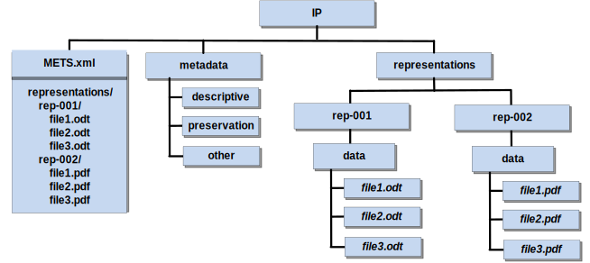

# Scope and purpose

To briefly recall the three types of information packages as defined by OAIS
[@OAIS2012], there is the Submission Information Package (SIP) which is used to
submit digital objects to a repository system; the Archival Information Package
(AIP) which allows the transmission of a package to the repository, and its
storage over the long-term; and the Dissemination Information Package (DIP)
which is used to disseminate digital objects to the requesting user.

This document is specification of the E-ARK Archival Information Package format
(E-ARK AIP, subsequently referred to as AIP). It defines requirements and
guidelines for creating AIPs which are adequate to store information packages
for the long term. The key objectives of this format are to:

- define the AIP format as an extension of the E-ARK CSIP so that it is suitable for
  the long-term storage of a wide variety of data types, such as document and image
  collections, archival records, databases or geographical data.
- recommend specific ways of using metadata standards to improve interoperability
  with regard to the use of long-term archiving standards.
- specify a form of packaging AIP container files while ensuring that the
  format is suitable for the storage of large quantities of data.

# Relation to other documents

This specification document originates from the document "D4.4 Final version of
SIP-AIP conversion component (Part A: AIP specification)" [@e-ark-d4.4] created
in the E-ARK project (European Archival Records and Knowledge Preservation)
which ran from 2014 to 2017 and was funded by the European Commission as part of
the Seventh Framework Programme for Research.

The common requirements for all types of E-ARK information packages are defined
by the “Common Specification for Information Packages (CSIP) [see
@csip-2.0.0-DRAFT]”.

Further documents which are related to the AIP specification in a general sense
are listed in the CSIP (section 1.4 "Relation to other documents").

# Introduction

The AIP format defines an information package for storing archival content that
is going to be transferred to a repository for long-term preservation purposes.
The AIP format allows keeping a record of changes that are applied to an AIP in
form of metadata edits, digital preservation measures (e.g. migration or adding
emulation information), or submission updates.[^1]

[^1]: A *submission update* is a re-submission of an SIP at a later point in time
      related to an AIP which contains a previous version of this SIP.
      Section [5.2.1](#aipcontsubm) explains this concept more in detail.

The purpose of defining a standard format for the archival information package
is to pave the way for simplified repository migration. Given the increasing
amount of digital content archives need to safeguard nowadays, changing the
repository solution should be based on a standard exchange format. This is to
say that a data repository solution provider does not necessarily have to
implement this format as the internal storage format, but it should at least
allow exporting AIPs. By this way, the costly procedure of exporting data,
producing SIPs, and ingesting them again in the new repository can be
simplified. Data repository solution providers know what kind of existing data
they can expect if they were chosen to replace an existing repository solution.
An E-ARK conformant digital archive/archival solution shall be able to immediately 
analyse and incorporate existing data in form of AIPs without the need of applying 
data transformation or having to fulfil varying SIP creation requirements.

# Definitions and remarks

## Version and generation of an AIP

Information packages are permanent: more precisely the information they contain
is assumed to be permanent and always describes the same unaltered conceptual
entity. Nevertheless, the way in which this information is represented may change.

For the purposes of the AIP format specification, the concept *AIP version* is
used as defined by OAIS:

> “AIP Version: An AIP whose Content Information or Preservation Description
> Information has undergone a Transformation on a source AIP and is a candidate
> to replace the source AIP. An AIP version is considered to be the result of a
> Digital Migration. [@OAIS2012, p. 1-9]”

A new version of an AIP can contain one or more new representations which can be
either the result of a digital migration or information that enables the creation
of an emulation environment to render a representation. Or representation could
be removed from the AIP. In both cases the result is the creation of a new version
of the AIP. Also changing metadata related to the logical AIP as a whole 
may lead to a new AIP version. The logical AIP represents the same intellectual 
entity in all these cases.

*Definition:* An *AIP version* is a new form of the logical AIP for which 
either the metadata of the logical AIP or the representation information was changed, 
i.e. one or more representations have been modified or removed or were added.

If the logical AIP is changed, the physical representation of the information
in a container may change as well. 

*Definition:* A *generation* is a manifestation of a logical AIP in form of
one ore several physical container files.

# AIP format

The AIP format consists of a set of recommendations and requirements regarding the 
use of structural and preservation metadata which are introduced in the following.

## AIP specific structural metadata (METS)

<a name="mets"></a>

METS (Metadata Encoding and Transmission Standard) is a standard for encoding descriptive, 
administrative, and structural metadata formalised using the XML Schema Language. The use 
of METS in the AIP is mandatory and it must comply with the specification rules set by the 
CSIP. See CSIP for the general use of METS in information packages.

The E-ARK AIP specification may contain one or many representations. Additional representations 
may be added during the life-cycle of the AIP when preservation actions are applied. 

In the following  requirements concerning the METS for an E-ARK AIP will be specified. 

**Node level: mets root**

|  ID     | Name, Location & Description | Card & Level |
| ------- | ---------------------------- | ------------ |
| <a name="AIPM1"></a>**AIPM1** | **Package Identifier** <br/> `mets/@OBJID` <br/> The value of the `mets/@OBJID attribute` for the AIP does not change during the life-cycle of the AIP. | **1..1** <br/> MUST |
| <a name="AIPM2"></a>**AIPM2** | **METS Profile** <br/> `mets/@PROFILE` <br/> The value is set to "https://earkdip.dilcis.eu/profile/E-ARK-AIP-v2-2-0.xml". | **1..1** <br/> MUST |

**Example:** METS root element showing use of `mets/@OBJID`, `mets/@PROFILE`.

```xml
<mets xmlns:xsi="http://www.w3.org/2001/XMLSchema-instance"
  xmlns:sip="https://DILCIS.eu/XML/METS/SIPExtensionMETS"
  xmlns="http://www.loc.gov/METS/"
  xmlns:csip="https://DILCIS.eu/XML/METS/CSIPExtensionMETS"
  xmlns:xlink="http://www.w3.org/1999/xlink"
  OBJID="urn:example:eark.examples.minimal.documents"
  LABEL="Set of documents"
  TYPE="Other"
  csip:OTHERTYPE="type"
  csip:CONTENTINFORMATIONTYPE="MIXED"
  PROFILE="https://earkcsip.dilcis.eu/profile/E-ARK-AIP-v2-2-0.xml"
  xsi:schemaLocation="http://www.loc.gov/METS/ schemas/mets1_12.xsd http://www.w3.org/1999/xlink schemas/xlink.xsd https://dilcis.eu/XML/METS/CSIPExtensionMETS schemas/DILCISExtensionMETS.xsd https://dilcis.eu/XML/METS/SIPExtensionMETS schemas/DILCISExtensionSIPMETS.xsd">
</mets>
```

Note that while it is possible to validate requirement `AIPM2` for an individual AIP, requirement 
`AIPM1` refers to different versions of the AIP which could be separate information packages, 
possibly packaged as different ZIP or TAR archive files.

The specification of a concrete version of the METS profile is especially important for the AIP due 
to the potentially long retention period.  

**Node level: metsHdr**

|  ID     | Name, Location & Description | Card & Level |
| ------- | ---------------------------- | ------------ |
| <a name="AIPM3"></a>**AIPM3** | **OAIS Package type information** <br/> `metsHdr[@csip:OAISPACKAGETYPE=`AIP`]` <br/> The CSIP attribute `@csip:OAISPACKAGETYPE` is used with the value "AIP". <br/> **See also:** [OAIS Package type](#VocabularyOAISPackageType) | **1..1** <br/> MUST |

**Example:** OAIS package type `AIP` defined in the `metsHdr` element using the `@csip:OAISPACKAGETYPE` attribute.

```xml
 <metsHdr CREATEDATE="2024-04-14T20:00:00" LASTMODDATE="2024-05-04T19:00:00" RECORDSTATUS="NEW" csip:OAISPACKAGETYPE="AIP">
    <agent ROLE="CREATOR" TYPE="OTHER" OTHERTYPE="SOFTWARE">
      <name>E-ARK</name>
      <note csip:NOTETYPE="SOFTWARE VERSION">1.0</note>
    </agent>
  </metsHdr>
```

**Node level: dmdSec**

The AIP may contain different versions of the metadata. Using the attribute `dmdSec/@STATUS` the current metadata should be indicated.

|  ID     | Name, Location & Description | Card & Level |
| ------- | ---------------------------- | ------------ |
| <a name="AIPM4"></a>**AIPM4** | **Status of the descriptive metadata** <br/> `dmdSec/@STATUS` <br/> Indicates the status of the descriptive metadata using a predefined vocabulary. One of the metadata elements in an AIP SHOULD be set to "CURRENT". <br/> **See also:** [dmdSec status](#VocabularyStatus) | **0..1** <br/> SHOULD |

**Example:** METS example of referencing the descriptive metadata which is described with an EAD document

```xml
<mets:dmdSec ID="uuid-308F4G12-GH43-4779-KJ2C-238F8506848S" CREATED="2024-05-24T10:51:34.602+01:00" STATUS="CURRENT">
  <mets:mdRef LOCTYPE="URL" MDTYPE="EAD" type="simple" href="metadata/descriptive/ead2002.xml" MIMETYPE="application/xml" SIZE="746" CREATED="2024-05-24T10:51:34.602+01:00" CHECKSUM="F24263BF09994749F335E1664DCE0086DB6DCA323FDB6996938BCD28EA9E8153" CHECKSUMTYPE="SHA-256">
  </mets:mdRef>
</mets:dmdSec>
```

### Compound vs. divided package structure

The ability to manage representations or representation parts
separately is required because the digital data submissions can be very
large. This is not only relevant for storing the AIP, it also concerns the SIP
which might need to be divided before the data is submitted to the repository.
In addition, it is important to find and identify AIP segments when creating a
DIP which relies on metadata or content of these segments.

In the following, two approaches for defining the structure of the IP will be
described with a focus on requirements of the AIP format: the *compound*
structure is represented by one single structural metadata file, and the
*divided* structure has one structural metadata file that references those of
individual representations. An example will help to describe the two
alternatives.

If the *compound* METS structure is used, as shown in Figure [3](#fig3), a
single METS file contains all references to metadata and data files contained in
the IP.

<a name="fig3"></a>


**Figure 3:**
One METS file in the root of the package references all metadata and data files

Even though the number suffix of the folders `rep-001` and `rep-002` of the
example shown in Figure [3](#fig3) suggests an order of representations, there
are no requirements regarding the naming of folders containing the
representations. The order of representations and the relations between them is
defined by the structural and preservation metadata.

If the *divided* METS structure is used, as shown in Figure [4](#fig4), then a
separate METS file for each representation exists which are referenced by the
root METS file. The example shown in Figure [4](#fig4) has a METS file in the
IP’s root which points to the METS files `Representations/Rep-001/METS.xml` and
`Representations/Rep-002/METS.xml`.

<a name="fig4"></a>


**Figure 4:**
Root METS file references METS files of the different representations

The reason why this alternative was introduced is that it makes it easier to
manage representations independently from each other. This can be desired for
very large representations, in terms of file size or the amount of files (making
the root METS difficult to work with).

As a corollary of this division method we define, a
representation-based division as the separation of representations in different
folders under the `representations` folder as shown in the example of Figure
[4](#fig4). We also define a size-based division as the
separation of representation parts. To illustrate this, Figure [5](#fig5) shows
an example where a set of files belongs to the same representation (here named
`binary`) and is referenced in two separate physical containers (here named {C1}
and {C2} respectively). A key requirement when using size-based division of a
representation is that there must not be any overlap in the structure of the
representations, and that each sub-folder path must be unique across the
containers where the representation parts together constitute a representation
entity. Note that for this reason a numerical suffix is added to the
representation METS files, to avoid overwriting representation METS files when
automatically merging the divided representation back into one single physical
representation.

<a name="aip-rep-div-name"></a>**AIP1**: If a representation is divided
into parts, the representation component MUST use the same name in the different
containers.

<a name="aip-rep-div-overlap"></a>**AIP2**: If a representation is
divided into parts, each the sub-paths of items (folders and files) MUST be
unique across the different containers. This allows aggregating representation
parts without accidentally overwriting folders or files.

<a name="fig5"></a>


**Figure 5:**
Example of an IP.

For example, let us assume an AIP with two representations, each of which
consists of a set of three files. In the first representation all data files
are in the Open Document Format (ODT) and in the second one - as a derivative
of the first representation - all files are in the Portable Document Format
(PDF).

Note that in Figure [4](#fig4) and Figure [5](#fig5) there is no folder for descriptive metadata on the representation level.
The reason for this is that new representations are added as a new form for persisting and visualising the content. 
Metadata specific to the representation are usually technical or preservation metadata. Descriptive metadata relate to the 
intellectual entity and should be maintained on the root level. 

<a name="parentchild"></a>aipstruct

### Life-cycle of information packages organised in parent-Child relationship

Assuming that a new AIP (e.g. containing an additional representation) needs to be added after parent- and child-AIPs have been stored, the recreation of the
whole logical AIP might be inefficient, especially if the AIPs are very large.

For this reason, existing child-AIPs remain unchanged in case a new version of the parent-AIP is created. Only the new version of the parent-AIP has references
to all child-AIPs as illustrated in Figure [7](#fig13). As a consequence, in order to find all siblings of a single child-AIP it is necessary to get the latest
version of the parent-AIP which implies the risk that the integrity of the logical AIP is in danger if the latest version of the parent-AIP is lost.

<a name="fig7"></a>
{ width=382px }

**Figure 7:**
New version of a parent-AIP

The result of this process is a sequence of physical containers of child-AIPs
plus one additional parent-AIP. The relation of the AIPs is expressed by means
of structural metadata in the METS files.

<a name="metsid"></a>

### METS identifier

Each AIP root METS document must be assigned a persistent and unique
identifier. Possible identifier schemes are amongst others: OCLC Purls[^4], CNRI
Handles[^5], DOI[^6]. Alternatively, it is possible to use a UUID as a locally
unique identifier.[^7]

[^4]: http://purl.org/docs/index.html
[^5]: http://www.handle.net
[^6]: https://www.doi.org
[^7]: Universally Unique Identifier according to RFC 4122, http://tools.ietf.org/html/rfc4122.html

Using this identifier, the system must be able to retrieve the corresponding
package from the repository.

According to the Common Specification, any ID element must start with a prefix
(also, the XML ID data type does not permit IDs that start with a number, so a
prefix solves this issue).

It is recommended to use an internationally recognized standard identifier for the
institution from which the SIP originates as a prefix. This may lead to problems
with smaller institutions, which do not have any such internationally recognized
standard identifier. We propose in that case, to start the prefix with the
internationally recognized standard identifier of the institution, where the
AIP is created, augmented by an identifier for the institution from which the
SIP originates.

An alternative to this is to use a UUID:

    https://tools.ietf.org/html/rfc4122

The prefix `urn:uuid:` would indicate the identifier type. For example, if the
package identifier value is
`"123e4567-e89b-12d3-a456-426655440000"` this would be the value of the METS root
element’s `OBJID` attribute:

    /mets/@OBJID="urn:uuid:123e4567-e89b-12d3-a456-426655440000"

The `OBJID` attribute of the root METS is the persistent unique identifier of
the AIP.

#### Structural map of a divided METS structure

<a name="aip-divided-mets"></a>**AIP3**: When an AIP uses the
divided METS structure, i.e. the different representations have their own
METS file, the mandatory `<structMap>` MUST organize those METS files
through `<mptr>` and `<fptr>` entries, for each representation. The `<mptr>`
node MUST reference the `/<representation>/METS.xml` and point at the
corresponding `<file>` entry in the `<fileSec>` using the `<fptr>` element.

```xml
<structMap ID="uuid-1465D250-0A24-4714-9555-5C1211722FB8" TYPE="PHYSICAL" LABEL="CSIP structMap">
   <div ID="uuid-638362BC-65D9-4DA7-9457-5156B3965A18" LABEL="uuid-4422c185-5407-4918-83b1-7abfa77de182">
     <div LABEL="representations/images_mig-1">
       <mptr xlink:href="./representations/images_mig-1/METS.xml" xlink:title="Mets file describing representation: images_mig-1 of AIP: urn:uuid:d7ef386d-275b-4a5d-9abf-48de9c390339." LOCTYPE="URL" ID="uuid-c063ebaf-e594-4996-9e2d-37bf91009155"/>
       <fptr FILEID="uuid-fb9c37e7-1c90-4849-a052-1875e67853d5"/>
     </div>
     <div LABEL="representations/docs_mig-1">
       <mptr xlink:href="./representations/docs_mig-1/METS.xml" xlink:title="Mets file describing representation: docs_mig-1 of AIP: urn:uuid:d7ef386d-275b-4a5d-9abf-48de9c390339." LOCTYPE="URL" ID="uuid-335f9e55-17b2-4cff-b62f-03fd6df4adbf"/>
       <fptr FILEID="uuid-3f2268cd-7da9-4ad8-909b-4f17730dacaf"/>
     </div>
   </div>
</structMap>
```

**Listing 1:**
Structural map referencing METS files of the different representations

### Metadata representation of the AIP structure

#### Child AIP references parent AIP

The optional reference to a parent AIP is expressed by a structural map with the
LABEL attribute value `Parent`. Listing 2 shows an example where a UUID is used
as the package identifier and the `xlink:href` attribute has the UUID identifier
value of the referenced parent AIP as value. This identifier implicitly
references the METS file of the corresponding package. If other locator
types, such as URN, URL, PURL, HANDLE, or DOI are used, the `LOCTYPE` attribute
can be set correspondingly.

```xml
<structMap ID="uuid-35CB3341-D731-4AC3-9622-DB8901CD6736" TYPE="PHYSICAL" LABEL="parent AIP">
    <div ID="uuid-35CB3341-D731-4AC3-9622-DB8901CD6738" LABEL="AIP parent identifier">
      <mptr xlink:href="urn:uuid:3a487ce5-63cf-4000-9522-7288e208e2bc"
            xlink:title="Referencing the parent AIP of this AIP
                         (URN:UUID:3218729b-c93c-4daa-ad3c-acb92ab59cee)."
            LOCTYPE="OTHER" OTHERLOCTYPE="UUID"
            ID="uuid-755d4d5f-5c5d-4751-9652-fcf839c7c6f2"/>
    </div>
</structMap>
```

**Listing 2:**
Using a structMap to reference the parent AIP

#### Parent AIP references child AIPs
The parent AIP which is referenced by child AIPs must have a structural map
listing all child AIPs. Listing 3 shows the structural map of a parent AIP
listing four child AIPs.

```xml
<structMap TYPE="PHYSICAL" LABEL="child AIPs">
    <div LABEL="child AIPs">
        <div LABEL="child AIP">
            <mptr xlink:href="urn:uuid:cea73348-741d-4594-ab8f-0b9e652c1099"
                  xlink:title="Referencing a child AIP."
                  LOCTYPE="OTHER" OTHERLOCTYPE="UUID"
                  ID="uuid-d98e416f-55a7-4237-8d45-59c22d221669"/>
        </div>
        <div LABEL="child AIP">
            <mptr xlink:href="urn:uuid:cea73348-741d-4594-ab8f-0b9e652c1099"
                  xlink:title="Referencing a child AIP."
                  LOCTYPE="OTHER" OTHERLOCTYPE="UUID"
                  ID="uuid-70f8ec28-23f1-4364-9163-b3e99165b6e6"/>
        </div>
        <div LABEL="child AIP">
            <mptr xlink:href="urn:uuid:3218729b-c93c-4daa-ad3c-acb92ab59cee"
                  xlink:title="Referencing a child AIP."
                  LOCTYPE="OTHER" OTHERLOCTYPE="UUID"
                  ID="uuid-77373d7f-e241-481b-bf89-675335beb049"/>
        </div>
        <div LABEL="child AIP">
            <mptr xlink:href="urn:uuid:cea73348-741d-4594-ab8f-0b9e652c1099"
                  xlink:title="Referencing a child AIP."
                  LOCTYPE="OTHER" OTHERLOCTYPE="UUID"
                  ID="uuid-3f0cc05c-f27d-499d-a6fd-63bdfed13cb0"/>
        </div>
    </div>
</structMap>
```

**Listing 3:**
Using a structMap to reference the parent AIP

## AIP preservation metadata

As already mentioned, PREMIS [@premis3.0-2017] is used to describe technical
metadata of digital objects, rights metadata to define the rights status in
relation to specific agents or for specific objects, and to record events that
are relevant regarding the digital provenance of digital objects.

Regarding general use of PREMIS, there is the E-ARK Content Information Type
Specification for Preservation Metadata using PREMIS [^8]

[^8]: https://citspremis.dilcis.eu/specification/CITS_Preservation_metadata_v1.0.pdf      

In the following, only the PREMIS elements which are relevant for the AIP
format are described. **NOTE:** in the listings showing PREMIS
code parts, the prefix "premis" is omitted (default namespace is the PREMIS
namespace[^9]) while the "mets" prefix is explicitly added if a relation to the
METS file is explained.

[^9]: Namespace: http://www.loc.gov/premis/v3, namespace schema location:
       http://www.loc.gov/standards/premis/premis.xsd

### PREMIS object

The PREMIS object contains technical information about a digital object.

#### File format

<a name="aip-premis-file-format"></a>**AIP7**: The format
element COULD be provided either using the formatRegistry or the
formatDesignation element sub-elements, or both.

<a name="aip-premis-file-format-puid"></a>**AIP8**:
Regarding the formatRegistry, the Persistent Unique Identifier (PUID)[^10]
based on the PRONOM technical registry[^11] COULD be used.

[^10]: http://www.nationalarchives.gov.uk/aboutapps/pronom/puid.htm
[^11]: http://www.nationalarchives.gov.uk/PRONOM

An example is shown in Listing 6.

```xml
<format>
    <formatDesignation>
        <formatName>XML</formatName>
        <formatVersion>1.0</formatVersion>
    </formatDesignation>
    <formatRegistry>
    	<formatRegistryName>PRONOM</formatRegistryName>
    	<formatRegistryKey>fmt/101</formatRegistryKey>
    	<formatRegistryRole>specification</formatRegistryRole>
    </formatRegistry>
</format>
```

**Listing 6:**
Optionally, the format version can be provided using the `formatDesignation` element.

#### Storage

<a name="aip-premis-storage"></a>**AIP11**: The storage element
COULD hold contain information about the physical location of the digital
object.

Ideally this is a resolvable URI, but it can also generally hold information
needed to retrieve the digital object from the storage system (e.g. access
control or for segmented AIPs).

An example is shown in Listing 9.

```xml
<storage>
    <contentLocation>
        <contentLocationType>URI</contentLocationType>
        <contentLocationValue>
          /path/to/file.txt
        </contentLocationValue>
    </contentLocation>
    <storageMedium>hard disk HD2253</storageMedium>
</storage>
```

**Listing 9:**
Storage description

#### Relationship

<a name="aip-premis-relationship"></a>**AIP12**: The
`relationship` element SHOULD be used to describe relationships of the digital
object.

<a name="aip-premis-aip-included"></a>**AIP13**: If an AIP is
part of another AIP, then the element `relationshipSubType` MUST reference the
super-ordinate AIP.

An example of the latter case is shown in Listing 10.

```xml
<relationship>
    <relationshipType>structural</relationshipType>
    <relationshipSubType>is included in</relationshipSubType>
	<relatedObjectIdentification>
    	    <relatedObjectIdentifierType>repository</relatedObjectIdentifierType>
    	    <relatedObjectIdentifierValue>
               ID123e4567-e89b-12d3-a456-426655440000
        </relatedObjectIdentifierValue>
    </relatedObjectIdentification>
</relationship>
```

**Listing 10:**
Relationship

### PREMIS event

#### Event identifier

<a name="aip-premis-event-id"></a>**AIP15**: The `eventIdentifier`
SHOULD be used to identify events, such as preservation actions, which were applied.
An example is shown in Listing 12.

```xml
<eventIdentifier>
	<eventIdentifierType>local</eventIdentifierType>
	<eventIdentifierValue>PDF to PDF/A</eventIdentifierValue>
</eventIdentifier>
```

**Listing 12:**
Event identifier

#### Link to agent/object

<a name="aip-premis-event-agent"></a>**AIP16**: If an event is described, the agent which caused
the event (e.g. person, software, hardware, etc.) MUST be related to the event by means of the `linkingAgentIdentifier` element.

In the example shown in listing 20 the SIP to AIP conversion software is linked as agent with identifier value
’Sip2Aip’ and the corresponding object is linked by the local UUID value. An
example is shown in Listing 13.

```xml
<linkingAgentIdentifier>
    <linkingAgentIdentifierType>local</linkingAgentIdentifierType>
        <linkingAgentIdentifierValue>
            IngestSoftware
        </linkingAgentIdentifierValue>
    </linkingAgentIdentifier>
    <linkingObjectIdentifier>
    <linkingObjectIdentifierType>local</linkingObjectIdentifierType>
        <linkingObjectIdentifierValue>
            metadata/file.xml
        </linkingObjectIdentifierValue>
</linkingObjectIdentifier>
```

**Listing 13:**
Link to agent/object

#### Migration event type

<a name="aip-premis-event-type"></a>**AIP17**: The event by which a
resource was created SHOULD to be recorded by means of the
`relatedEventIdentification` element.

An example is shown in Listing 14.

```xml
<event>
    <eventIdentifier>
        <eventIdentifierType>local</eventIdentifierType>
        <eventIdentifierValue>migration-001</eventIdentifierValue>
    </eventIdentifier>
    <eventType>MIGRATION</eventType>
    <eventDateTime>2015-09-01T01:00:00+01:00</eventDateTime>
    <eventOutcomeInformation>
        <eventOutcome>success</eventOutcome>
    </eventOutcomeInformation>
    <linkingAgentIdentifier>
        <linkingAgentIdentifierType>local</linkingAgentIdentifierType>
        <linkingAgentIdentifierValue>
            FileFormatConversion001
        </linkingAgentIdentifierValue>
    </linkingAgentIdentifier>
    <linkingObjectIdentifier>
        <linkingObjectIdentifierType>local</linkingObjectIdentifierType>
        <linkingObjectIdentifierValue>
            metadata/file.xml
        </linkingObjectIdentifierValue>
    </linkingObjectIdentifier>
    <relatedEventIdentification>
        <relatedEventIdentifierType>local</relatedEventIdentifierType>
        <relatedEventIdentifierValue>
            ingest-001
        </relatedEventIdentifierValue>
    </relatedEventIdentification>
</event>
```

**Listing 14:**
Migration event

The event shown in Listing 15 expresses the fact that the object
`metadata/file.xml` is the result of the migration event "migration-001" and the
event which created the source object is "ingest-001".

### PREMIS agent

<a name="aip-premis-agent"></a>**AIP18**: Agents which are referenced in
events must be described by means of the `agent` element.

Listing 15 shows a software for indexing named `IndexingSoftware` which supports
full text search of the items contained in a package.
In this case, the "discovery right" is assigned to this agent.

```xml
<agent>
    <agentIdentifier>
        <agentIdentifierType>local</agentIdentifierType>
        <agentIdentifierValue>Indexer</agentIdentifierValue>
    </agentIdentifier>
    <agentName>IndexingSoftware</agentName>
    <agentType>Software</agentType>
    <linkingRightsStatementIdentifier>
        <linkingRightsStatementIdentifierType>
            local
        </linkingRightsStatementIdentifierType>
        <linkingRightsStatementIdentifierValue>
            discovery-right-001
        </linkingRightsStatementIdentifierValue>
    </linkingRightsStatementIdentifier>
</agent>
```

**Listing 15:**
Software as an agent

## Physical Container Packaging

This part of the AIP format specification gives recommendations regarding the
creation of the physical packaging of the logical AIP into either one or
multiple transferable and storable entities.

### Naming of the AIP archive file

According to the requirement defined in section [5.3.1](#metsid)
("METS identifier"), every AIP bears an identifier which must be recorded
in the root METS file of the AIP. By definition, this identifier is the
identifier of the AIP itself.

<a name="aip-container-id"></a>**AIP20:**: The identifier of the AIP
-- defined by the attribute `OBJID` of the root METS file's root element SHOULD
be used to derive the beginning part of the file name of the physical storage
container.

The file name part which is derived from the AIP's identifier is called the
*AIP file name ID*.

<a name="aip-id-filename-mapping"></a>**AIP21**: A specified
policy SHOULD be defined which allows deriving a cross-platform, portable file
name part from the AIP's identifier and, vice versa, to infer the identifier
from the physical container's filename.

A first option to implement this requirement would be to limit the characters
used in the file name to the "Portable Filename Character Set"[^12] which
only allows the following character set for saving files:

[^12]: http://pubs.opengroup.org/onlinepubs/9699919799/basedefs/V1\_chap03.html#tag\_03\_282

* Uppercase A to Z
* Lowercase a to z
* Numbers 0 to 9
* Period (.)
* Underscore (\_)
* Hyphen (-)

If the identifier of the AIP had characters which do not fall into this
character set, then these would need to be mapped into specific ones of the
accepted character set.

One proposed way to achieve a bi-directional mapping between identifiers and file names
is the pairtree character mapping specification.[^13]

[^13]: https://tools.ietf.org/html/draft-kunze-pairtree-01 (see section 3: “Identifier string cleaning”)

<a name="aip-container-suffix"></a>**AIP22**: The file name of the
physical container file SHOULD start with a unique name of the AIP which is equal for to
all versions and parts that belong to the same logical AIP.

For example, let us assume the identifier of the AIP was:

    "urn:uuid:123e4567-e89b-12d3-a456-426655440000"

Then this identifier string would be converted to the folder name because
“: -> +” is defined as a single-character to single-character conversion:

    "urn+uuid+123e4567-e89b-12d3-a456-426655440000"

The packaged entity should also bear this name, e.g. packaged using TAR the
name would be:

    "urn+uuid+123e4567-e89b-12d3-a456-426655440000.tar"

In this example, the AIP's physical container file name only consists of the
AIP file name ID.

### Packaging

Recommended formats for packaging AIPs are TAR and ZIP which are both widely used archive formats.

For both formats there are software utilities that can be used to bundle up files into one file for being
able to transfer archival packages.

<a name="aip-package-singlefolder"></a>**AIP27**: The package
content MUST be contained in a single folder.

This means that if the packaged AIP is unpackaged, the content MUST be extracted into a single folder which
contains the individuals files and folders.

As an example, let's assume a TAR file with the following name:

    "urn+uuid+123e4567-e89b-12d3-a456-426655440000.tar"

If it is extracted, a folder `urn+uuid+123e4567-e89b-12d3-a456-426655440000`
with the actual AIP content is created.

<a name="aip-package-uncompressed"></a>**AIP28**: If TAR is
used as the packaging format, the content SHOULD be aggregated without using compression.

For example, to create a TAR archive without compression for the AIP folder
`"urn+uuid+123e4567-e89b-12d3-a456-426655440000"` using the `tar` utility:

    tar -cf "urn+uuid+123e4567-e89b-12d3-a456-426655440000.tar" "urn+uuid+123e4567-e89b-12d3-a456-426655440000"

#### BagIt

The BagIt[^14] format specifies a set of hierarchical file layout conventions
for storage and transfer of arbitrary digital content. It can be used for
packaging the AIP.

[^14]: https://tools.ietf.org/html/rfc8493

<a name="aip-package-bagit"></a>**AIP29**: As defined by the BagIt
specification, the `bagit.txt` file in the root folder MUST contain the BagIt
version and tag file character encoding.

    BagIt-Version: 0.97
    Tag-File-Character-Encoding: UTF-8

<a name="aip-package-bagit-profile"></a>**AIP30**: A
`bagit-info.txt` MUST be available and valid according to the E-ARK BagIt
profile (corresponding to the version of this specification).[^15]

[^15]: https://github.com/DILCISBoard/E-ARK-AIP/blob/{version-tag}/profiles/bagit/e-ark-bag-profile.json

Example of a `bagit-info` file:

    BagIt-Profile: https://github.com/DILCISBoard/E-ARK-AIP/blob/{version-tag}/profiles/bagit/e-ark-bag-profile.json
    Source-Organization: Example Organisation
    Organization-Address: {Street}, {City}, {Country}
    External-Identifier: urn:uuid:123e4567-e89b-12d3-a456-426655440000
    External-Description: Example container.
    Bagging-Date: 2018-12-18
    Bag-Size: 2.7 MB
    Payload-Oxum: 2791644.35
    E-ARK-Package-Type: AIP
    E-ARK-Specification-Version: 1.1

<a name="aip-package-bagit"></a>**AIP31**: The containing folder of
the AIP SHOULD be located in the `data` folder as shown Listing [17](#fig8).

```
urn+uuid+123e4567-e89b-12d3-a456-426655440000/
|- bagit.txt
|- data
|   |- urn+uuid+123e4567-e89b-12d3-a456-426655440000
|       |- metadata
|       |   |- preservation
|       |       |- premix.xml
|       |- METS.xml
|       |- representations
|           |- rep1
|               |- data
|               |   |- Example1.docx
|               |- METS.xml
|- manifest-md5.txt
```
**Listing 17:** AIP in the `data` folder of a BagIt container.

<a name="aip-package-bagit-fetch"></a>**AIP32**: If the AIP is
a parent-AIP with the content of the logical AIP distributed over multiple
child-AIPs, then the `fetch.txt` file[^16] SHOULD contain a list of URLs
referencing the child-AIP packages.

<a name="aip-package-bagit-fetch-manifest"></a>
**AIP33**: If a `fetch.txt` file with a list of
child-AIPs is used, then every child-AIP file listed in the fetch file SHOULD be
listed in every payload manifest.

[^16]: https://tools.ietf.org/id/draft-kunze-bagit-08.html#rfc.section.2.2.3

#### OCFL

The Oxford Common File Layout (OCFL) specification[^22] allows describing the storage structure of an AIP's physical container files.

It is an optional extension which can be used in addition to the packaging and file naming recommendations.

The purpose of the OCFL recommendation is to:

- define standards and conventions for storing and exporting versioned AIPs (AIP life-cycle).
- enable storing or exporting large amounts of archival content in form of AIP container files to file system storage
- support advanced use cases, such as splitting large information packages and differential AIPs (including removal of content using differential packages).

Listing 18 gives an example of an AIP (version 0) using OCFL. It is based on the OCFL Draft 2021[^23]
and the BagIt standard file system layout  for storage and transfer as defined by RFC8493[^24].

```xml
urn+uuid+1017cc9b-eaed-4064-947e-a07c752d3760
|- 0=ocfl_object_1.0
|- inventory.json
|- inventory.json.sha512
|- v0
    |- content
    |- urn+uuid+1017cc9b-eaed-4064-947e-a07c752d3760
      |- bag-info.txt
      |- bagit.txt
      |- data
      |   |- metadata
      |   |   |- descriptive
      |   |   |   |- ead.xml
      |   |   |   |- metadata.json
      |   |   |- preservation
      |   |       |- premis.xml
      |   |- METS.xml
      |   |- representations
      |       |- 9799fdd1-57b5-48e3-ba53-2705cc874a00
      |       |- data
      |       |   |- example.pdf
      |       |- metadata
      |       |   |- preservation
      |       |       |- premis.xml
      |       |- METS.xml
      |- manifest-sha256.txt
      |- manifest-sha512.txt
      |- tagmanifest-sha256.txt
      |- tagmanifest-sha512.txt
```

**Listing 18:**
OCFL file listing of an AIP (unpackaged container file)

Note that the OCFL Object includes all versions – v0, v1, … - of the AIP and that one bagit container
or several bagit containers (segmentation!) are managed as one OCFL object (See in OCFL 5.4 BagIt in an OCFL Object[^25]).
This is especially relevant for non-redundant storing of AIPs (the concept of a "differential AIP") and for package segmentation.

Also note that the exmaple in Listing 19 is the "unpackaged" version where the bagit container itself is not packaged.

The packaged version

```xml
urn+uuid+1017cc9b-eaed-4064-947e-a07c752d3760
|- 0=ocfl_object_1.0
|- inventory.json
|- inventory.json.sha512
|- v0
    |- content
      |- urn+uuid+1017cc9b-eaed-4064-947e-a07c752d3760.tar
```

**Listing 19:**
OCFL file listing of an AIP (packaged container file)

Note that serialization has been removed from the BagIt specification after version 14 (from 2017, current version is 17) to narrow the scope of the specification.
In BagIt Version 14 Section serialization was still included which defined the following requirements:

- The top-level directory of a serialization MUST contain only one bag.
- The serialization SHOULD have the same name as the bag's base directory, but MUST have an extension added to identify the format.
- A bag MUST NOT be serialized from within its base directory, but from the parent of the base directory.  
- The deserialization of a bag MUST produce a single base directory bag.

The content of the OCFL object file `0=ocfl_object_1.0` in the listing is shown in Listing 20.

```xml
ocfl_object_1.0
```

**Listing 20:**
OCFL file listing of an AIP (packaged container file)

And an example for the content of the `inventory.json` is is shown in Listing 21.

```json
{
    "digestAlgorithm": "sha512",
    "fixity": {
        "md5": {
            "e5ad509db4ddb4cef0de4c1c19c7988b": [
                "00000/content/urn+uuid+1017cc9b-eaed-4064-947e-a07c752d3760.tar"
            ]
        },
        "sha256": {
            "68a5b60ddef62758389f6894a1e7df28c1d228a5d56d2eec3ce2f74e80c27910": [
                "00000/content/urn+uuid+1017cc9b-eaed-4064-947e-a07c752d3760.tar"
            ]
        }
    },
    "head": "v0",
    "id": "urn:uuid:1017cc9b-eaed-4064-947e-a07c752d3760",
    "manifest": {
        "24db03a2a7d9c7e2e7ea533e2ac84b7274f937eaff31e95f508cd9c5418a902adf5c18d2f67fa80aa25b7d72ce829951e79ea66210959c86aab33b5ef0c8b8bc": [
            "00000/content/urn+uuid+1017cc9b-eaed-4064-947e-a07c752d3760.tar"
        ]
    },
    "type": "https://ocfl.io/1.0/spec/#inventory",
    "versions": {
        "v0": {
            "created": "2021-03-27T18:49:22Z",
            "message": "Original SIP",
            "state": {
                "24db03a2a7d9c7e2e7ea533e2ac84b7274f937eaff31e95f508cd9c5418a902adf5c18d2f67fa80aa25b7d72ce829951e79ea66210959c86aab33b5ef0c8b8bc": [
                    "00000/content/urn+uuid+1017cc9b-eaed-4064-947e-a07c752d3760.tar"
                ]
            }
        }
    }
}
```

**Listing 21:**
OCFL file listing of an AIP (packaged container file)

At the time of finalizing this specification, the OCFL standard does not support the listing of packaged container files in the inventory file.
This would allow using the inventory to document the actual content of physical container files and may follow in a future version of the AIP specification.

[^22]: https://ocfl.io
[^23]: https://ocfl.io/draft/spec/
[^24]: https://datatracker.ietf.org/doc/html/draft-kunze-bagit-17
[^25]: https://ocfl.io/draft/spec/#example-bagit-in-ocfl

# Appendices

## Appendix A - METS referencing representation METS files

```xml
<fileSec>
  <fileGrp USE="Common Specification root" ID="uuid-0d4f09a8-0734-49fb-9bea-dbf6a3f5a444">
    <file MIMETYPE="application/xml" USE="Datafile" CHECKSUMTYPE="SHA-256" CREATED="2016-12-14T09:15:24" CHECKSUM="8d3f057ac0e45ef173f9ecbfc432b994415c405259aff694632925faf108f541" ID="uuid-3af3e474-991a-4aad-b453-ed3f91d54280" SIZE="2855">
      <FLocat xlink:href="./representations/images_mig-1/METS.xml" xlink:type="simple" LOCTYPE="URL"/>
    </file>
    <file MIMETYPE="application/xml" USE="Datafile" CHECKSUMTYPE="SHA-256" CREATED="2016-12-14T09:15:24" CHECKSUM="81e028df7468ea611b0714148cb607ec74fe1e7914bd762605f38631d21281e9" ID="uuid-e1df6f8b-8cc0-442d-bc45-e61724c63372" SIZE="2873">
      <FLocat xlink:href="./representations/docs_mig-1/METS.xml" xlink:type="simple" LOCTYPE="URL"/>
    </file>
  </fileGrp>
</fileSec>
<structMap TYPE="physical" LABEL="CSIP structMap">
  <div LABEL="urn:uuid:7ff70669-73a0-4551-ad5b-12ed9b229e38">
    <div LABEL="submission">
      <!-- removed to improve readability -->
    </div>
    <div LABEL="metadata">
      <!-- removed to improve readability -->
    </div>
    <div LABEL="schemas">
      <!-- removed to improve readability -->
    </div>
    <div LABEL="representations"/>
    <div LABEL="representations/images_mig-1">
      <mptr xlink:href="./representations/images_mig-1/METS.xml" xlink:title="Mets file describing representation: images_mig-1 of AIP: urn:uuid:7ff70669-73a0-4551-ad5b-12ed9b229e38." LOCTYPE="URL" ID="uuid-0799bb22-b3b1-4661-b32d-5c2dae0341f9"/>
      <fptr FILEID="uuid-3af3e474-991a-4aad-b453-ed3f91d54280"/>
    </div>
    <div LABEL="representations/docs_mig-1">
      <mptr xlink:href="./representations/docs_mig-1/METS.xml" xlink:title="Mets file describing representation: docs_mig-1 of AIP: urn:uuid:7ff70669-73a0-4551-ad5b-12ed9b229e38." LOCTYPE="URL" ID="uuid-cc2c70c5-9712-4697-834c-5d5acad47f49"/>
      <fptr FILEID="uuid-e1df6f8b-8cc0-442d-bc45-e61724c63372"/>
    </div>
  </div>
</structMap>
```

## Appendix B – METS describing a representation

```xml
<mets xmlns:ext="ExtensionMETS" xmlns:xsi="http://www.w3.org/2001/XMLSchema-instance" xmlns:xlink="http://www.w3.org/1999/xlink" xmlns="http://www.loc.gov/METS/" PROFILE="http://www.ra.ee/METS/v01/IP.xml" TYPE="AIP" OBJID="urn:uuid:docs_mig-1" LABEL="METS file describing the AIP matching the OBJID." xsi:schemaLocation="http://www.loc.gov/METS/ ../../schemas/mets_1_11.xsd http://www.w3.org/1999/xlink ../../schemas/xlink.xsd">
  <metsHdr RECORDSTATUS="NEW" CREATEDATE="2016-12-14T09:15:24">
    <agent TYPE="OTHER" ROLE="CREATOR" OTHERTYPE="SOFTWARE">
      <name>E-ARK earkweb</name>
      <note>VERSION=0.0.1</note>
    </agent>
    <metsDocumentID>METS.xml</metsDocumentID>
  </metsHdr>
  <amdSec ID="uuid-facb861c-5f25-43f7-a1a4-86dfa345a119">
    <digiprovMD ID="uuid-c4113098-6eb5-43f5-9618-6f33ef442400">
      <mdRef MIMETYPE="application/xml" xlink:href="./metadata/preservation/premis.xml" LOCTYPE="URL" CREATED="2016-12-14T09:15:24" CHECKSUM="d9e3bdc2c2e1d1a07cd88585dfddad62cdf40ca060e09456efc68bd2dc88e3a9" xlink:type="simple" ID="uuid-2c990270-d140-4d92-8bca-629e21926535" MDTYPE="PREMIS" CHECKSUMTYPE="SHA-256"/>
    </digiprovMD>
  </amdSec>
  <fileSec>
    <fileGrp USE="Common Specification representation urn:uuid:docs_mig-1" ID="uuid-cee0bbc3-ac88-4f21-834e-2c06104141ac">
      <file MIMETYPE="application/pdf" USE="Datafile" CHECKSUMTYPE="SHA-256" CREATED="2016-12-14T09:15:05" CHECKSUM="d50fe727b6bed7b04569671a46d4d8a56b93c295afb69703b14c0544286ff86c" ID="uuid-cf9818bb-567b-44ee-88d8-60a1420feae3" SIZE="2530049">
        <FLocat xlink:href="./data/Suleiman the Magnificent.pdf" xlink:type="simple" LOCTYPE="URL"/>
      </file>
      <file MIMETYPE="application/pdf" USE="Datafile" CHECKSUMTYPE="SHA-256" CREATED="2016-12-14T09:15:12" CHECKSUM="3824fb493235e94bcca3baf33c93a9e4f62d4af387ce055560f01c274ef63da9" ID="uuid-3b0e4dcb-727a-44d1-af24-d35676b02bed" SIZE="7603618">
        <FLocat xlink:href="./data/Charlemagne.pdf" xlink:type="simple" LOCTYPE="URL"/>
      </file>
    </fileGrp>
  </fileSec>
  <structMap TYPE="physical" LABEL="CSIP structMap">
    <div LABEL="docs_mig-1">
      <div LABEL="metadata">
        <fptr FILEID="uuid-2c990270-d140-4d92-8bca-629e21926535"/>
      </div>
      <div LABEL="data">
        <fptr FILEID="uuid-cf9818bb-567b-44ee-88d8-60a1420feae3"/>
        <fptr FILEID="uuid-3b0e4dcb-727a-44d1-af24-d35676b02bed"/>
      </div>
    </div>
  </structMap>
  <structMap TYPE="logical" LABEL="Simple AIP structuring">
    <div LABEL="Package structure">
      <div LABEL="metadata files">
        <fptr FILEID="uuid-2c990270-d140-4d92-8bca-629e21926535"/>
      </div>
      <div LABEL="schema files"/>
      <div LABEL="content files">
        <fptr FILEID="uuid-cf9818bb-567b-44ee-88d8-60a1420feae3"/>
        <fptr FILEID="uuid-3b0e4dcb-727a-44d1-af24-d35676b02bed"/>
      </div>
    </div>
  </structMap>
</mets>
```

## Appendix C - PREMIS.xml describing events on package level

```xml
<premis xmlns="info:lc/xmlns/premis-v2" xmlns:xsi="http://www.w3.org/2001/XMLSchema-instance" version="2.0" xsi:schemaLocation="info:lc/xmlns/premis-v2 ../../schemas/premis-v2-2.xsd">
  <object xmlID="uuid-187f239d-c080-4a7f-936d-b35cec4e8ef7" xsi:type="representation">
    <objectIdentifier>
      <objectIdentifierType>repository</objectIdentifierType>
      <objectIdentifierValue>urn:uuid:7ff70669-73a0-4551-ad5b-12ed9b229e38</objectIdentifierValue>
    </objectIdentifier>
  </object>
  <event>
    <eventIdentifier>
      <eventIdentifierType>local</eventIdentifierType>
      <eventIdentifierValue>IDc5d159d7-2df0-4efe-b07b-559fac4bdc27</eventIdentifierValue>
    </eventIdentifier>
    <eventType>SIP Delivery Validation</eventType>
    <eventDateTime>2016-12-14T09:14:04</eventDateTime>
    <eventOutcomeInformation>
      <eventOutcome>success</eventOutcome>
    </eventOutcomeInformation>
    <linkingAgentIdentifier>
      <linkingAgentIdentifierType>software</linkingAgentIdentifierType>
      <linkingAgentIdentifierValue>E-ARK Web 0.9.4 (task: SIPDeliveryValidation)</linkingAgentIdentifierValue>
    </linkingAgentIdentifier>
    <linkingObjectIdentifier>
      <linkingObjectIdentifierType>repository</linkingObjectIdentifierType>
      <linkingObjectIdentifierValue>urn:uuid:7ff70669-73a0-4551-ad5b-12ed9b229e38</linkingObjectIdentifierValue>
    </linkingObjectIdentifier>
  </event>
  <agent>
    <agentIdentifier>
      <agentIdentifierType>LOCAL</agentIdentifierType>
      <agentIdentifierValue>E-ARK Web 0.9.4</agentIdentifierValue>
    </agentIdentifier>
    <agentName>E-ARK Web</agentName>
    <agentType>Software</agentType>
  </agent>
</premis>
```

## Appendix D - PREMIS.xml describing migration events (representation level)

```xml
<?xml version='1.0' encoding='UTF-8'?>
<premis xmlns="info:lc/xmlns/premis-v2" xmlns:xsi="http://www.w3.org/2001/XMLSchema-instance" version="2.0" xsi:schemaLocation="info:lc/xmlns/premis-v2 ../../schemas/premis-v2-2.xsd">
  <object xsi:type="representation" xmlID="IDd61654d8-44dd-4dee-872c-89cf1ad240bf">
    <objectIdentifier>
      <objectIdentifierType>repository</objectIdentifierType>
      <objectIdentifierValue>IDd61654d8-44dd-4dee-872c-89cf1ad240bf</objectIdentifierValue>
    </objectIdentifier>
  </object>
  <object xsi:type="file" xmlID="ID9f65a8bd-5128-4830-a28b-0acb4455e128">
    <objectIdentifier>
      <objectIdentifierType>filepath</objectIdentifierType>
      <objectIdentifierValue>./data/OAIS_Wikipedia_Article.pdf</objectIdentifierValue>
    </objectIdentifier>
    <objectCharacteristics>
      <compositionLevel>0</compositionLevel>
      <fixity>
        <messageDigestAlgorithm>SHA-256</messageDigestAlgorithm>
        <messageDigest>a0d26c309030408b2a6618805c3747d9d04599f70051be9630d948cecaed3a0e</messageDigest>
        <messageDigestOriginator>hashlib</messageDigestOriginator>
      </fixity>
      <size>4667731</size>
      <format>
        <formatRegistry>
          <formatRegistryName>PRONOM</formatRegistryName>
          <formatRegistryKey>fmt/276</formatRegistryKey>
          <formatRegistryRole>identification</formatRegistryRole>
        </formatRegistry>
      </format>
    </objectCharacteristics>
    <relationship>
      <relationshipType>derivation</relationshipType>
      <relationshipSubType>has source</relationshipSubType>
      <relatedObjectIdentification>
        <relatedObjectIdentifierType>filepath</relatedObjectIdentifierType>
        <relatedObjectIdentifierValue>./../0910ba24-f328-4083-a05f-cce0cb3eb49f/data/OAIS_Wikipedia_Article.pdf</relatedObjectIdentifierValue>
        <relatedObjectSequence>0</relatedObjectSequence>
      </relatedObjectIdentification>
      <relatedEventIdentification>
        <relatedEventIdentifierType>local</relatedEventIdentifierType>
        <relatedEventIdentifierValue>ID1656ae4a-9f1b-43a5-9e56-ddaef284ec71</relatedEventIdentifierValue>
        <relatedEventSequence>1</relatedEventSequence>
      </relatedEventIdentification>
    </relationship>
  </object>
  <event>
    <eventIdentifier>
      <eventIdentifierType>local</eventIdentifierType>
      <eventIdentifierValue>ID1656ae4a-9f1b-43a5-9e56-ddaef284ec71</eventIdentifierValue>
    </eventIdentifier>
    <eventType>migration</eventType>
    <eventDateTime>2021-03-15T16:33:17</eventDateTime>
    <eventOutcomeInformation>
      <eventOutcome>success</eventOutcome>
    </eventOutcomeInformation>
    <linkingAgentIdentifier>
      <linkingAgentIdentifierType>software</linkingAgentIdentifierType>
      <linkingAgentIdentifierValue>GPL Ghostscript 9.26 (2018-11-20)</linkingAgentIdentifierValue>
    </linkingAgentIdentifier>
    <linkingObjectIdentifier>
      <linkingObjectIdentifierType>filepath</linkingObjectIdentifierType>
      <linkingObjectIdentifierValue>./data/OAIS_Wikipedia_Article.pdf</linkingObjectIdentifierValue>
    </linkingObjectIdentifier>
  </event>
  <agent>
    <agentIdentifier>
      <agentIdentifierType>LOCAL</agentIdentifierType>
      <agentIdentifierValue>Premis Generator</agentIdentifierValue>
    </agentIdentifier>
    <agentName>Premis Generator</agentName>
    <agentType>Software</agentType>
  </agent>
  <agent>
    <agentIdentifier>
      <agentIdentifierType>LOCAL</agentIdentifierType>
      <agentIdentifierValue>GPL Ghostscript 9.26 (2018-11-20)
</agentIdentifierValue>
    </agentIdentifier>
    <agentName>GPL Ghostscript 9.26 (2018-11-20)
</agentName>
    <agentType>Software</agentType>
  </agent>
</premis>
```
