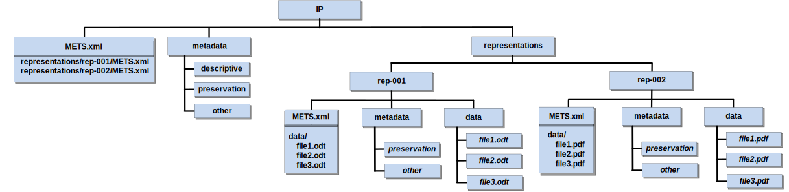

# Scope and purpose

To briefly recall the three types of information packages as defined by OAIS
[@OAIS2012], there is the Submission Information Package (SIP) which is used to
submit digital objects to a repository system; the Archival Information Package
(AIP) which allows the transmission of a package to the repository, and its
storage over the long-term; and the Dissemination Information Package (DIP)
which is used to disseminate digital objects to the requesting user.

This document is specification of the E-ARK Archival Information Package format
(E-ARK AIP, in the following named shortly AIP). It defines requirements and
guidelines for creating AIPs which are adequate to store information packages
for the long term. The key objectives of this format are to:

- define the AIP format as an extension of the E-ARK CSIP so that it is suitable for
  the long-term storage of a wide variety of data types, such as document and image
  collections, archival records, databases or geographical data.
- recommend specific ways of using metadata standards related to the
  preservation aspects of the AIP.
- specify a form of packaging AIP container files while ensuring that the
  format is suitable to store large quantities of data.

# Relation to other documents

This specification document originates from the document "D4.4 Final version of
SIP-AIP conversion component (Part A: AIP specification)" [@e-ark-d4.4] created
in the E-ARK project (European Archival Records and Knowledge Preservation)
which ran from 2014 to 2017 and was funded by the European Commission as part of
the Seventh Framework Programme for Research.

The common requirements for all types of E-ARK information packages are defined
by the “Common Specification for Information Packages (CSIP) [see
@csip-2.0.0-DRAFT]”.

Further documents which are related to the AIP specification in a general sense
are listed in the CSIP (section 1.4 "Relation to other documents").

# Introduction

The AIP format defines an information package for storing archival content that
is going to be transferred to a repository for long-term preservation purposes.
The AIP format allows keeping a record of changes that are applied to an AIP in
form of metadata edits, digital preservation measures (e.g. migration or adding
emulation information), or submission updates.[^1]

[^1]: A *submission update* is a re-submission of an SIP at a later point in time
      related to an AIP which contains a previous version of this SIP.
      Section [5.2.1](#aipcontsubm) explains this concept more in detail.

The purpose of defining a standard format for the archival information package
is to pave the way for simplified repository migration. Given the increasing
amount of digital content archives need to safeguard nowadays, changing the
repository solution should be based on a standard exchange format. This is to
say that a data repository solution provider does not necessarily have to
implement this format as the internal storage format, but it should at least
allow exporting AIPs. By this way, the costly procedure of exporting data,
producing SIPs, and ingesting them again in the new repository can be
simplified. Data repository solution providers know what kind of existing data
they can expect if they were chosen to replace an existing repository solution.
An E-ARK compliant repository solution should be able to immediately analyse and
incorporate existing data in form of AIPs without the need of applying data
transformation or having to fulfil varying SIP creation requirements.

Generally, a great variety of repository systems are being developed by
different providers, and the way how the AIP is stored depends on specific
requirements which have been addressed according to the needs of their
respective customers. For this reason, the purpose of this AIP format is not to
impose a common storage format that all repository systems need to implement.
While it can be used as an archival storage format, it can also be seen as a
format that makes system migration easier.

# Definitions and remarks

<a name="ip"></a>

## Information package

The CSIP defines the requirements for concrete information package format
specifications, such as the SIP, AIP, or DIP. In this sense, an
*information package* (IP) is an instance of a format that complies with the CSIP.

<a name="reps"></a>

## Representations

The concept of "representations" is used according to the definition given in
the PREMIS digital preservation metadata standard:

> "The set of files, including structural metadata, needed for a complete and
> reasonable rendition of an Intellectual Entity. For example, a journal
> article may be complete in one PDF file; this single file constitutes the
> representation. Another journal article may consist of one SGML file and two
> image files; these three files constitute the representation. A third article
> may be represented by one TIFF image for each of 12 pages plus an XML file of
> structural metadata showing the order of the pages; these 13 files constitute
> the representation. [@premis3.0-2017]"

According to the CSIP, representations are an important concept for all types of IPs.
Regarding the AIP format, in addition to the organization and storage of the 
representations, it is important that representations which are generated 
during the AIP's life cycle are managed and documented in such a way that 
changes can be tracked at any time.

## Logical and physical AIP

On the one hand, we call the logical AIP the set of digital objects and metadata 
representing the entire archival entity regardless of how the files are packaged. 
On the other hand, the physical AIP consists of one or several physical container 
files which contain all or parts of the logical AIP.

From the point of view of preserving the integrity of the AIP, the ideal case is
that the logical AIP is packaged as one single physical container, because all the
metadata and content required to interprete the information package is avialable if the 
container file is unpackaged. In reality, however, this is not always possible 
because the size of the physical container can become very large, and this is the 
reason for proposing the divided METS structure described more in detail in 
section [5.1](#compdiv). The divided structure makes it easier to manage 
representations or representation parts separately.

<a name="structdiv"></a>

## Structural division of the AIP

One of the basic requirements formulated by the CSIP is the use of METS as the
metadata standard to describe the structure of an IP.

Special attention was given to the fact that it might not be possible to store
all representations of an intellectual entity in one physical container, or that
even a single representation might have to be divided so that it can be stored
on long-term storage media. For this reason, the AIP format describes how
to manage representations or representation parts separately.

This structure lays the groundwork for addressing the practical requirement of
distributing parts of the intellectual entity over a sequence of physical
containers representing a logical AIP. Even though this puts the integrity of
the AIP at risk - because in case of disaster recovery the physical container
does not represent the complete intellectual entity and dependencies to another
(lost) physical container can potentially make it impossible to interpret,
understand, or render the content - it is a necessary measure if the amount of
data exceeds the capacity limitation of long-term storage media.

## Authenticity of the original submission

The AIP format recommends a method for storing the original submission
separately from any data that is created during SIP-to-AIP conversion and during
the life-cycle of the AIP. This allows safeguarding the authenticity of the
original submission.

However, it is an implementation decision if the original submission is kept “as
is” or if the SIP is adapted during SIP to AIP conversion. In line with
OAIS, the content of the original SIP does not have to be identical to the
version of the submitted data stored as part of the AIP:

> “An OAIS is not always required to retain the information submitted to it in
> precisely the same format as in the SIP. Indeed, preserving the original
> information exactly as submitted may not be desirable. [@OAIS2012, p. 4-52]”

The AIP format suggests a method for storing information packages so that 
both, the original submission, and a version in which perservation measures
have been applied, can be archived.

## Version and generation of an AIP

Information packages are permanent: more precisely the information they contain 
is assumed to be permanent and always describing the same unaltered conceptual 
entity. Nevertheless, the way in which this information is represented may change. 

For the purposes of the AIP format specification, the concept *AIP version* is 
used as defined by OAIS:

> “AIP Version: An AIP whose Content Information or Preservation Description
> Information has undergone a Transformation on a source AIP and is a candidate
> to replace the source AIP. An AIP version is considered to be the result of a
> Digital Migration. [@OAIS2012, p. 1-9]”

A new version of an AIP contains one or more new representations which can be
either the result of a digital migration or information that enables the creation
of an emulation environment to render a representation. The result of this
operation is the creation of a new version of the AIP.

Furthermore, the AIP format allows updating the AIP by adding a new version of
the submission. This allows supporting the AIP edition which is defined in OAIS
as follows:

> “AIP  Edition: An  AIP  whose  Content  Information  or Preservation
> Description  Information  has been upgraded or improved with the intent not to
> preserve information, but to increase or improve it. An AIP edition is not
> considered to be the result of a Migration. [@OAIS2012, p. 1-9]”

If the logical AIP is changed, the physical representation of the information 
in a container may change as well. We call an *AIP generation* a new 
manifestation of physical container files representing a new version of a 
logical AIP. The new generation of the AIP can be a single container file or a 
set of container files.


# AIP format

The AIP format consists of a set of recommendations and requirements[^2]
regarding the use of the metadata which go beyond the requirements defined by the
CSIP.

## AIP specific structural metadata

<a name="compdiv"></a>

### Compound vs. divided package structure

The ability to manage representations or representation parts
separately is required because the digital data submissions can be very
large. This is not only relevant for storing the AIP, it also concerns the SIP
which might need to be divided before the data is submitted to the repository.
And regarding the DIP, it requires the capability to reconstruct the DIP from an
AIP which is divided into multiple parts.

In the following, two approaches for describing the structure of the IP will be
described with a focus on requirements of the AIP format: the *compound*
structure is represented by one single structural metadata file, and the
*divided* structure has one structural metadata file that references those of
individual representations. An example will help to describe the two
alternatives.

If the *compound* METS structure is used, as shown in Figure [3](#fig3), a
single METS file contains all references to metadata and data files contained in
the IP.

<a name="fig3"></a>


**Figure 3:**
One METS file in the root of the package references all metadata and data files

Even though the number suffix of the folders `rep-001` and `rep-002` of the
example shown in Figure [3](#fig3) suggests an order of representations, there
are no requirements regarding the naming of folders containing the
representations.  The order of representations and the relations between them is
defined by the structural and preservation metadata. The `representations`
folder is mandatory, even for IPs which contain only one representation.

If the *divided* METS structure is used, as shown in Figure [4](#fig4), then a
separate METS file for each representation exists which are referenced by the
root METS file. The example shown in Figure [4](#fig4) has a METS file in the
IP’s root which points to the METS files `Representations/Rep-001/METS.xml` and
`Representations/Rep-002/METS.xml`.

<a name="fig4"></a>


**Figure 4:**
Root METS file references METS files of the different representations

The reason why this alternative was introduced is that it makes it easier to
manage representations independently from each other. This can be desired for
very large representations, in terms of file size or the amount of files (making
the root METS difficult to work with).

As a corollary of this division method we define, on the one hand, a
representation-based division as the separation of representations in different
folders under the `representations` folder as shown in the example of Figure
[4](#fig4). And, on the other hand, we define a size-based division as the
separation of representation parts. To illustrate this, Figure [5](#fig5) shows
an example where a set of files belongs to the same representation (here named
`binary`) and is referenced in two separate physical containers (here named {C1}
and {C2} respectively). A key requirement when using size-based division of a
representation is that there must not be any overlap in the structure of the
representations, and that each sub-folder path must be unique across the
containers where the representation parts together constitute a representation
entity. Note that for this reason a numerical suffix is added to the
representation METS files, to avoid overwriting representation METS files when
automatically merging the divided representation back into one single physical
representation.

<a name="aip-rep-div-name"></a>**AIP-REP-DIV-NAME**: If a representation is divided
into parts, the representation component MUST use the same name in the different
containers.

<a name="aip-rep-div-overlap"></a>**AIP-REP-DIV-OVERLAP**: If a representation is
divided into parts, any overlap MUST be avoided regarding the structure of the
representations and each sub-folder path MUST be unique across the
containers.

<a name="fig5"></a>


**Figure 5:**
Example of an IP.

For example, let us assume an IP with two representations, each of which
consists of a set of three files. In the first representation all data files
are in the Open Document Format (ODT) and in the second one - as a derivative
of the first representation - all files are in the Portable Document Format
(PDF).

<a name="parentchild"></a>aipstruct

### Parent-Child relationship

As already pointed out, the divided METS structure was introduced to make the
separation of representations or representation parts easier and allow the
distribution of these components over a sequence of AIPs.

As shown in Figure [12](#fig12) The composition of a logical AIP can be
expressed by a parent-child relationship between AIPs. It is a bidirectional
relationship where each child-AIP bears the information about the parent-AIP
to which they belong and, vice versa, the parent-AIP references the child-AIPs.

<a name="fig12"></a>
{ width=278px }

**Figure 12:**
Parent-child relationship between AIPs

Even though this parent-child relationship could be used to create a
hierarchical graph of AIPs, the scope of this specification is limited to
a flat list of AIPs which are subordinated to one parent-AIP.

Assuming that a new AIP (e.g. containing an additional representation) needs to
be added after parent- and child-AIPs have been stored, the recreation of the
whole logical AIP might be inefficient, especially if the AIPs are very large.
For this reason, existing child-AIPs remain unchanged in case a new version of
the parent-AIP is created. Only the new version of the parent-AIP has references
to all child-AIPs as illustrated in Figure [13](#fig13). As a consequence, in order to
find all siblings of a single child-AIP it is necessary to get the latest
version of the parent-AIP which implies the risk that the integrity of the
logical AIP is in danger if the latest version of the parent-AIP is lost.

<a name="fig13"></a>
{ width=382px }

**Figure 13:**
New version of a parent-AIP

The result of this process is a sequence of physical containers of child-AIPs
plus one additional parent-AIP. The relation of the AIPs is expressed by means
of structural metadata in the METS files.

<a name="metsid"></a>

### METS identifier

Each AIP root METS document must be assigned a persistent and unique
identifier. Possible identifier schemes are amongst others: OCLC Purls[^5], CNRI
Handles[^6], DOI[^7]. Alternatively, it is possible to use a UUID as a locally
unique identifier.[^8]

[^5]: http://purl.org/docs/index.html
[^6]: http://www.handle.net
[^7]: https://www.doi.org
[^8]: Universally Unique Identifier according to RFC 4122, http://tools.ietf.org/html/rfc4122.html

Using this identifier, the system must be able to retrieve the corresponding
package from the repository.

According to the Common Specification, any ID element must start with a prefix
(also, the XML ID data type does not permit IDs that start with a number, so a
prefix solves this issue).

We recommend to use as a prefix an internationally recognized standard identifier
for the institution from which the SIP originates. This may lead to problems
with smaller institutions, which do not have any such internationally recognized
standard identifier. We propose in that case, to start the prefix with the
internationally recognized standard identifier of the institution, where the
AIP is created, augmented by an identifier for the institution from which the
SIP originates.

An alternative to this is to use a UUID:

    https://tools.ietf.org/html/rfc4122

The prefix `urn:uuid:` would indicate the identifier type. For example, if the
package identifier value is
`"123e4567-e89b-12d3-a456-426655440000"` this would be the value of the METS root
element’s `OBJID` attribute:

    /mets/@OBJID="urn:uuid:123e4567-e89b-12d3-a456-426655440000"

The `OBJID` attribute of the root METS is the persistent unique identifier of
the AIP.

#### Structural map of a divided METS structure

<a name="aip-divided-mets"></a>**AIP-DIVIDED-METS**: When an AIP uses the
divided METS structure, i.e. the different representations have their own
METS file, the mandatory `<structMap>` MUST organize those METS files
through `<mptr>` and `<fptr>` entries, for each representation. The `<mptr>`
node MUST reference the `/<representation>/METS.xml` and point at the
corresponding `<file>` entry in the `<fileSec>` using the `<fptr>` element.

```xml
<structMap ID="uuid-1465D250-0A24-4714-9555-5C1211722FB8" TYPE="PHYSICAL" LABEL="CSIP structMap">
   <div ID="uuid-638362BC-65D9-4DA7-9457-5156B3965A18" LABEL="uuid-4422c185-5407-4918-83b1-7abfa77de182">
     <div LABEL="representations/images_mig-1">
       <mptr xlink:href="./representations/images_mig-1/METS.xml" xlink:title="Mets file describing representation: images_mig-1 of AIP: urn:uuid:d7ef386d-275b-4a5d-9abf-48de9c390339." LOCTYPE="URL" ID="uuid-c063ebaf-e594-4996-9e2d-37bf91009155"/>
       <fptr FILEID="uuid-fb9c37e7-1c90-4849-a052-1875e67853d5"/>
     </div>
     <div LABEL="representations/docs_mig-1">
       <mptr xlink:href="./representations/docs_mig-1/METS.xml" xlink:title="Mets file describing representation: docs_mig-1 of AIP: urn:uuid:d7ef386d-275b-4a5d-9abf-48de9c390339." LOCTYPE="URL" ID="uuid-335f9e55-17b2-4cff-b62f-03fd6df4adbf"/>
       <fptr FILEID="uuid-3f2268cd-7da9-4ad8-909b-4f17730dacaf"/>
     </div>
   </div>
</structMap>
```

**Listing 7:**
Structural map referencing METS files of the different representations

### Metadata representation of the AIP structure

#### Child AIP references parent AIP

The optional reference to a parent AIP is expressed by a structural map with the
LABEL attribute value `Parent`. Listing 8 shows an example where a UUID is used
as the package identifier and the `xlink:href` attribute has the UUID identifier
value of the referenced parent AIP as value. This identifier implicitly
references the METS file of the corresponding package. If other locator
types, such as URN, URL, PURL, HANDLE, or DOI are used, the `LOCTYPE` attribute
can be set correspondingly.

```xml
<structMap ID="uuid-35CB3341-D731-4AC3-9622-DB8901CD6736" TYPE="PHYSICAL" LABEL="parent AIP">
    <div ID="uuid-35CB3341-D731-4AC3-9622-DB8901CD6738" LABEL="AIP parent identifier">
      <mptr xlink:href="urn:uuid:3a487ce5-63cf-4000-9522-7288e208e2bc"
            xlink:title="Referencing the parent AIP of this AIP
                         (URN:UUID:3218729b-c93c-4daa-ad3c-acb92ab59cee)."
            LOCTYPE="OTHER" OTHERLOCTYPE="UUID"
            ID="uuid-755d4d5f-5c5d-4751-9652-fcf839c7c6f2"/>
    </div>
</structMap>
```

**Listing 8:**
Using a structMap to reference the parent AIP

#### Parent AIP references child AIPs
The parent AIP which is referenced by child AIPs must have a structural map
listing all child AIPs. Listing 9 shows the structural map of a parent AIP
listing four child AIPs.

```xml
<structMap TYPE="PHYSICAL" LABEL="child AIPs">
    <div LABEL="child AIPs">
        <div LABEL="child AIP">
            <mptr xlink:href="urn:uuid:cea73348-741d-4594-ab8f-0b9e652c1099"
                  xlink:title="Referencing a child AIP."
                  LOCTYPE="OTHER" OTHERLOCTYPE="UUID"
                  ID="uuid-d98e416f-55a7-4237-8d45-59c22d221669"/>
        </div>
        <div LABEL="child AIP">
            <mptr xlink:href="urn:uuid:cea73348-741d-4594-ab8f-0b9e652c1099"
                  xlink:title="Referencing a child AIP."
                  LOCTYPE="OTHER" OTHERLOCTYPE="UUID"
                  ID="uuid-70f8ec28-23f1-4364-9163-b3e99165b6e6"/>
        </div>
        <div LABEL="child AIP">
            <mptr xlink:href="urn:uuid:3218729b-c93c-4daa-ad3c-acb92ab59cee"
                  xlink:title="Referencing a child AIP."
                  LOCTYPE="OTHER" OTHERLOCTYPE="UUID"
                  ID="uuid-77373d7f-e241-481b-bf89-675335beb049"/>
        </div>
        <div LABEL="child AIP">
            <mptr xlink:href="urn:uuid:cea73348-741d-4594-ab8f-0b9e652c1099"
                  xlink:title="Referencing a child AIP."
                  LOCTYPE="OTHER" OTHERLOCTYPE="UUID"
                  ID="uuid-3f0cc05c-f27d-499d-a6fd-63bdfed13cb0"/>
        </div>
    </div>
</structMap>
```

**Listing 9:**
Using a structMap to reference the parent AIP

## AIP specific preservation metadata

As already mentioned, PREMIS [@premis3.0-2017] is used to describe technical
metadata of digital objects, rights metadata to define the rights status in
relation to specific agents or for specific objects, and to record events that
are relevant regarding the digital provenance of digital objects.

In the following sections, the PREMIS format and the way that it relates to the
METS elements is described in detail. **NOTE:** in the listings showing PREMIS
code parts, the prefix "premis" is omitted (default namespace is the PREMIS
namespace[^10]) while the "mets" prefix is explicitly added if a relation to the
METS file is explained.

[^10]: Namespace: http://www.loc.gov/premis/v3, namespace schema location:
       http://www.loc.gov/standards/premis/premis.xsd

### Vocabulary

The definition of a vocabulary for PREMIS is an ongoing process, therefore
there is no exhaustive list of vocabularies that are to be used exclusively.

The basis of the preservation vocabulary is the preservation
schemes provided by the Library of Congress (LoC).[^11] Additionally, recent
contributions by the PREMIS Implementers Group (which are still “work in
progress”) are taken into consideration.[^12]

[^11]: http://id.loc.gov/vocabulary/preservation.html
[^12]: http://premisimplementers.pbworks.com/w/page/102413902/Preservation%20Events%20Controlled%20Vocabulary

### PREMIS object

The PREMIS object contains technical information about a digital object.

#### Object identifier

<a name="aip-id-local"></a>**AIP-ID-LOCAL**: If an identifier of type `local` is
used, this identifier SHOULD be unique in the scope of the PREMIS document.

<a name="aip-id-other"></a>**AIP-ID-OTHER**: Other object identifiers of the
allowed types COULD be used additionally to the identifier of type `local`.

Listing 10 shows an example of an identifier of type `local`.

```xml
<objectIdentifier>
	<objectIdentifierType>local</objectIdentifierType>
	<objectIdentifierValue>fileId001</objectIdentifierValue>
</objectIdentifier>
```

**Listing 10:**
Object identifier

#### Checksums

<a name="aip-premis-checksums"></a>**AIP-PREMIS-CHECKSUMS**: Checksums COULD be
provided as a descendant of the `objectCharacteristics` element information in
form of a SHA-256 checksum, a fixed size 256-bit value.

An example is shown in Listing 11.

```xml
<fixity>
	<messageDigestAlgorithm>SHA-256</messageDigestAlgorithm>
	<messageDigest>3b1d00f7871d9102001c77f...</messageDigest>
	<messageDigestOriginator>/usr/bin/sha256sum</messageDigestOriginator>
</fixity>
```

**Listing 11:**
Hashsum (value shortened)

#### File format

<a name="aip-premis-file-format"></a>**AIP-PREMIS-FILE-FORMAT**: The format
element COULD be provided either using the formatRegistry or the
formatDesignation element sub-elements, or both.

<a name="aip-premis-file-format-puid"></a>**AIP-PREMIS-FILE-FORMAT-PUID**:
Regarding the formatRegistry, the Persistent Unique Identifier (PUID)[^14]
based on the PRONOM technical registry[^15] COULD be used.

[^14]: http://www.nationalarchives.gov.uk/aboutapps/pronom/puid.htm
[^15]: http://www.nationalarchives.gov.uk/PRONOM

An example is shown in Listing 12.

```xml
<format>
    <formatDesignation>
        <formatName>XML</formatName>
        <formatVersion>1.0</formatVersion>
    </formatDesignation>
    <formatRegistry>
    	<formatRegistryName>PRONOM</formatRegistryName>
    	<formatRegistryKey>fmt/101</formatRegistryKey>
    	<formatRegistryRole>specification</formatRegistryRole>
    </formatRegistry>
</format>
```

**Listing 12:**
Optionally, the format version can be provided using the `formatDesignation` element.

#### Object characterisation

<a name="aip-premis-characterisation"></a>**AIP-PREMIS-CHARACTERISATION**: The
JHOVE[^16] technical characterisation result (XML format) COULD be embedded as
a descendant of the `objectCharacteristicsExtension` element. An example is
shown in Listing 13.

[^16]: http://sourceforge.net/projects/jhove/

```xml
<objectCharacteristicsExtension>
    <jhove>
      	...
    </jhove>
</objectCharacteristicsExtension>
```

**Listing 13:**
JHove digital object characterisation

#### Original name

<a name="aip-premis-original-name"></a>**AIP-PREMIS-ORIGINAL-NAME**: The
`originalName` element COULD be used to record the name of an original file.

An example is shown in Listing 14.

```xml
<originalName>originalfilename.ext</originalName>
```

**Listing 14:**
Original name

#### Storage

<a name="aip-premis-storage"></a>**AIP-PREMIS-STORAGE**: The storage element
COULD hold contain information about the physical location of the digital
object.

Ideally this is a resolvable URI, but it can also generally hold information
needed to retrieve the digital object from the storage system (e.g. access
control or for segmented AIPs).

An example is shown in Listing 15.

```xml
<storage>
    <contentLocation>
        <contentLocationType>URI</contentLocationType>
        <contentLocationValue>
          /path/to/file.txt
        </contentLocationValue>
    </contentLocation>
    <storageMedium>hard disk HD2253</storageMedium>
</storage>
```

**Listing 15:**
Storage description

#### Relationship

<a name="aip-premis-relationship"></a>**AIP-PREMIS-RELATIONSHIP**: The
`relationship` element SHOULD be used to describe relationships of the digital
object.

<a name="aip-premis-aip-included"></a>**AIP-PREMIS-AIP-INCLUDED**: If an AIP is
part of another AIP, then the element `relationshipSubType` MUST reference the
super-ordinate AIP.

An example of the latter case is shown in Listing 16.

```xml
<relationship>
    <relationshipType>structural</relationshipType>
    <relationshipSubType>is included in</relationshipSubType>
	<relatedObjectIdentification>
    	    <relatedObjectIdentifierType>repository</relatedObjectIdentifierType>
    	    <relatedObjectIdentifierValue>
               ID123e4567-e89b-12d3-a456-426655440000
        </relatedObjectIdentifierValue>
    </relatedObjectIdentification>
</relationship>
```

**Listing 16:**
Relationship

#### Linking rights statement

<a name="aip-premis-rights"></a>**AIP-PREMIS-RIGHTS**: The a
`linkingRightsStatementIdentifier` element COULD be used to describe rights
statement attached to the object.

For example, only files which have the "discovery right" are being indexed in
order to allow these files to be retrievable by the full-text search.

An example of the latter case is shown in Listing 17.

```xml
<linkingRightsStatementIdentifier>
    <linkingRightsStatementIdentifierType>
        filepath
    </linkingRightsStatementIdentifierType>
    <linkingRightsStatementIdentifierValue>
        metadata/file.xml
    </linkingRightsStatementIdentifierValue>
</linkingRightsStatementIdentifier>
```

**Listing 17:**
Rights statement

### PREMIS event

#### Event identifier

<a name="aip-premis-event-id"></a>**AIP-PREMIS-EVENT-ID**: The `eventIdentifier`
SHOULD be used to identify events, such as preservation actions, which were applied.
An example is shown in Listing 18.

```xml
<eventIdentifier>
	<eventIdentifierType>local</eventIdentifierType>
	<eventIdentifierValue>PDF to PDF/A</eventIdentifierValue>
</eventIdentifier>
```

**Listing 18:**
Event identifier

#### Link to agent/object

<a name="aip-premis-event-agent"></a>**AIP-PREMIS-EVENT-AGENT**: If an event is described, the agent which caused
the event (e.g. person, software, hardware, etc.) MUST be related to the event by means of the `linkingAgentIdentifier` element.

In the example shown in listing 20 the SIP to AIP conversion software is linked as agent with identifier value
’Sip2Aip’ and the corresponding object is linked by the local UUID value. An
example is shown in Listing 20.

```xml
<linkingAgentIdentifier>
    <linkingAgentIdentifierType>local</linkingAgentIdentifierType>
        <linkingAgentIdentifierValue>
            IngestSoftware
        </linkingAgentIdentifierValue>
    </linkingAgentIdentifier>
    <linkingObjectIdentifier>
    <linkingObjectIdentifierType>local</linkingObjectIdentifierType>
        <linkingObjectIdentifierValue>
            metadata/file.xml
        </linkingObjectIdentifierValue>
</linkingObjectIdentifier>
```

**Listing 20:**
Link to agent/object

#### Migration event type

<a name="aip-premis-event-type"></a>**AIP-PREMIS-EVENT-AGENT**: The event by which a
resource was created SHOULD to be recorded by means of the
`relatedEventIdentification` element.

An example is shown in Listing 21.

```xml
<event>
    <eventIdentifier>
        <eventIdentifierType>local</eventIdentifierType>
        <eventIdentifierValue>migration-001</eventIdentifierValue>
    </eventIdentifier>
    <eventType>MIGRATION</eventType>
    <eventDateTime>2015-09-01T01:00:00+01:00</eventDateTime>
    <eventOutcomeInformation>
        <eventOutcome>success</eventOutcome>
    </eventOutcomeInformation>
    <linkingAgentIdentifier>
        <linkingAgentIdentifierType>local</linkingAgentIdentifierType>
        <linkingAgentIdentifierValue>
            FileFormatConversion001
        </linkingAgentIdentifierValue>
    </linkingAgentIdentifier>
    <linkingObjectIdentifier>
        <linkingObjectIdentifierType>local</linkingObjectIdentifierType>
        <linkingObjectIdentifierValue>
            metadata/file.xml
        </linkingObjectIdentifierValue>
    </linkingObjectIdentifier>
    <relatedEventIdentification>
        <relatedEventIdentifierType>local</relatedEventIdentifierType>
        <relatedEventIdentifierValue>
            ingest-001
        </relatedEventIdentifierValue>
    </relatedEventIdentification>
</event>
```

**Listing 21:**
Migration event

The event shown in Listing 21 expresses the fact that the object
`metadata/file.xml` is the result of the migration event "migration-001" and the
event which created the source object is "ingest-001".

### PREMIS agent

<a name="aip-premis-agent"></a>**AIP-PREMIS-AGENT**: Agents which are referenced in
events must be described by means of the `agent` element.

Listing 22 shows a software for indexing named `IndexingSoftware` which supports
full text search of the items contained in a package.
In this case, the "discovery right" is assigned to this agent.

```xml
<agent>
    <agentIdentifier>
        <agentIdentifierType>local</agentIdentifierType>
        <agentIdentifierValue>Indexer</agentIdentifierValue>
    </agentIdentifier>
    <agentName>IndexingSoftware</agentName>
    <agentType>Software</agentType>
    <linkingRightsStatementIdentifier>
        <linkingRightsStatementIdentifierType>
            local
        </linkingRightsStatementIdentifierType>
        <linkingRightsStatementIdentifierValue>
            discovery-right-001
        </linkingRightsStatementIdentifierValue>
    </linkingRightsStatementIdentifier>
</agent>
```

**Listing 22:**
Software as an agent

### PREMIS rights

<a name="aip-premis-rights"></a>**AIP-PREMIS-RIGHTS**: Rights which are referenced
in rights statements MUST be described by means of the `rights` element.

The `rights` element holds information about the rights status of individual
digital objects or about agents. An example is shown in Listing 23.

```xml
<rights>
	<rightsStatement>
    	<rightsStatementIdentifier>
        	<rightsStatementIdentifierType>
            	local
        	</rightsStatementIdentifierType>
        	<rightsStatementIdentifierValue>
            	discovery-right-001
        	</rightsStatementIdentifierValue>
    	</rightsStatementIdentifier>
    	<rightsBasis>Statute</rightsBasis>
    	<rightsGranted>
        	<act>Discovery</act>
        	<restriction></restriction>
    	</rightsGranted>
	</rightsStatement>
</rights>
```

**Listing 23:**
Discovery right statement

## Physical Container Packaging

This part of the AIP format specification gives recommendations regarding the
creation of the physical packaging of the logical AIP into either one or
multiple transferable and storable entities.

### Naming of the packaged entity

According to the requirement defined in section [5.3.1](#metsid)
("METS identifier"), every AIP bears an identifier which must be recorded
in the root METS file of the AIP. By definition, this identifier is the
identifier of the AIP itself.

<a name="aip-container-id"></a>**AIP-CONTAINER-ID:**: The identifier of the AIP
-- defined by the attribute `OBJID` of the root METS file's root element SHOULD
be used to derive the beginning part of the file name of the physical storage
container.

The file name part which is derived from the AIP's identifier is called the
*AIP file name ID*.

<a name="aip-id-filename-mapping"></a>**AIP-ID-FILENAME-MAPPING**: A specified
policy SHOULD be defined which allows deriving a cross-platform, portable file
name part from the AIP's identifier and, vice versa, to infer the identifier
from the physical container's filename.

A first option to implement this requirement would be to limit the characters
used in the file name to the "Portable Filename Character Set"[^17] which
only allows the following character set for saving files:

[^17]: http://pubs.opengroup.org/onlinepubs/9699919799/basedefs/V1\_chap03.html#tag\_03\_282

* Uppercase A to Z
* Lowercase a to z
* Numbers 0 to 9
* Period (.)
* Underscore (\_)
* Hyphen (-)

If the identifier of the AIP had characters which do not fall into this
character set, then these would need to be mapped into specific ones of the
accepted character set.

One proposed way to achieve a bi-directional mapping between identifiers and file names
is the pairtree character mapping specification.[^18]

[^18]: https://tools.ietf.org/html/draft-kunze-pairtree-01 (see section 3: “Identifier string cleaning”)

For example, let us assume the identifier of the AIP was:

    "urn:uuid:123e4567-e89b-12d3-a456-426655440000"

Then this identifier string would be converted to the folder name because
“: -> +” is defined as a single-character to single-character conversion:

    "urn+uuid+123e4567-e89b-12d3-a456-426655440000"

The packaged entity should also bear this name, e.g. packaged using TAR the
name would be:

    "urn+uuid+123e4567-e89b-12d3-a456-426655440000.tar"

In this example, the AIP's physical container file name only consists of the
AIP file name ID.

<a name="aip-container-suffix"></a>**AIP-CONTAINER-SUFFIX**: Any suffix COULD be
added to the physical container file that bears additional information, such as
the version, date, sequence number, or the like.

For example, a version number could be added as a suffix to the AIP file name ID as
follows:

    "urn+uuid+123e4567-e89b-12d3-a456-426655440000_v00001.tar"

<a name="aip-container-part"></a>**AIP-CONTAINER-PART**: If a physical container
contains a part of a superordinate AIP, a suffix COULD be added to the AIP file
name ID.

For example, a number for the corresponding part could be added as a suffix to the
AIP file name ID as follows:

    "urn+uuid+123e4567-e89b-12d3-a456-426655440000_part00001.tar"

### Packaging

#### TAR packaging

TAR is an archive file format and also refers to the software `tar` which is
a software utility that can be used to bundle up files into one file for being
able to transfer archival packages.

<a name="aip-package-singlefolder"></a>**AIP-PACKAGE-SINGLEFOLDER**: The package
content SHOULD be contained in a single folder.

This means that if a TAR packaged AIP is unpackaged, the content is
extracted into a single folder which includes the AIP content.

As an example, let's assume a TAR file with the following name:

    "urn+uuid+123e4567-e89b-12d3-a456-426655440000.tar"

If it is extracted, a folder `urn:uuid:123e4567-e89b-12d3-a456-426655440000` is
created which includes the AIP content, as shown in Figure [14](#fig14).

<a name="fig14"></a>


**Figure 14:**
AIP content extracted from a TAR package.


<a name="aip-tarpackage-manifest"></a>**AIP-TARPACKAGE-MANIFEST**: In addition
to fixity information recorded in the METS file, the AIP COULD include a
manifest file (manifest.txt) listing files with MD5 and SHA-256 checksum.

The manifest file is a text file containing a list of records separated by two
line breaks (two carriage return characters (hexadecimal 0D0D) or two times
carriage return/line feed (hexadecimal 0D0A0D0A). A record is a list of named
fields, the minimum fields being:

- Name := File path relative to the AIP root
- Size := Size in bytes
- SHA256 := SHA-256 Checksum
- MD5 := MD5 Checksum

An example is shown in Listing 24.

```xml
Name: METS.xml
Size: 12135
SHA256: d7dec534d2ba5f455391e2ed0cb89db89a2780e0531c83def79b0b0abcb38679
MD5: e94dd23e792bd7e49721a863ad8ed769
Name: metadata/PREMIS.xml
Size: 53719
SHA256: ef01bc59a21f6e99ad3d87b0d25b89d6e8b4915c63dadb8791d9490739fe26d4
MD5: 96b85205a9b4b0b5d3c88e2e51b0dc4c
```

**Listing 25:**
Manifest file

<a name="aip-package-uncompressed"></a>**AIP-PACKAGE-UNCOMPRESSED**: If TAR is
used as the packaging format, the content SHOULD be aggregated without
compression.

For example, to create a TAR archive without compression for the AIP folder
`"urn+uuid+123e4567-e89b-12d3-a456-426655440000"` using the `tar` utility:

    tar -cf "urn+uuid+123e4567-e89b-12d3-a456-426655440000.tar" "urn+uuid+123e4567-e89b-12d3-a456-426655440000"

#### BagIt

The BagIt[^19] format specifies a set of hierarchical file layout conventions
for storage and transfer of arbitrary digital content. It can be used for
packaging the AIP.

[^19]: https://tools.ietf.org/html/rfc8493

<a name="aip-package-bagit"></a>**AIP-PACKAGE-BAGIT**: As defined by the BagIt
specification, the `bagit.txt` file in the root folder MUST contain the BagIt
version and tag file character encoding.

    BagIt-Version: 0.97
    Tag-File-Character-Encoding: UTF-8

<a name="aip-package-bagit-profile"></a>**AIP-PACKAGE-BAGIT-PROFILE**: A
`bagit-info.txt` MUST be available and valid according to the E-ARK BagIt
profile (corresponding to the version of this specification).[^20]

[^20]: https://github.com/DILCISBoard/E-ARK-AIP/blob/{version-tag}/profiles/bagit/e-ark-bag-profile.json

Example of a `bagit-info` file:

    BagIt-Profile: https://github.com/DILCISBoard/E-ARK-AIP/blob/{version-tag}/profiles/bagit/e-ark-bag-profile.json
    Source-Organization: Example Organisation
    Organization-Address: {Street}, {City}, {Country}
    External-Identifier: urn:uuid:123e4567-e89b-12d3-a456-426655440000
    External-Description: Example container.
    Bagging-Date: 2018-12-18
    Bag-Size: 2.7 MB
    Payload-Oxum: 2791644.35
    E-ARK-Package-Type: AIP
    E-ARK-Specification-Version: 1.1

<a name="aip-package-bagit"></a>**AIP-PACKAGE-BAGIT**: The containing folder of
the AIP SHOULD be located in the `data` folder as shown Figure [15](#fig15).

<a name="fig15"></a> 

**Figure 15:** AIP in the `data` folder of a BagIt container.

<a name="aip-package-bagit-fetch"></a>**AIP-PACKAGE-BAGIT-FETCH**: If the AIP is
a parent-AIP with the content of the logical AIP distributed over multiple
child-AIPs, then the `fetch.txt` file[^21] SHOULD contain a list of URLs
referencing the child-AIP packages.

<a name="aip-package-bagit-fetch-manifest"></a>
**AIP-PACKAGE-BAGIT-FETCH-MANIFEST**: If a `fetch.txt` file with a list of
child-AIPs is used, then every child-AIP file listed in the fetch file SHOULD be
listed in every payload manifest.

[^21]: https://tools.ietf.org/id/draft-kunze-bagit-08.html#rfc.section.2.2.3


# Appendices

## Appendix A - METS referencing representation METS files

```xml
<fileSec>
  <fileGrp USE="Common Specification root" ID="uuid-0d4f09a8-0734-49fb-9bea-dbf6a3f5a444">
    <file MIMETYPE="application/xml" USE="Datafile" CHECKSUMTYPE="SHA-256" CREATED="2016-12-14T09:15:24" CHECKSUM="8d3f057ac0e45ef173f9ecbfc432b994415c405259aff694632925faf108f541" ID="uuid-3af3e474-991a-4aad-b453-ed3f91d54280" SIZE="2855">
      <FLocat xlink:href="./representations/images_mig-1/METS.xml" xlink:type="simple" LOCTYPE="URL"/>
    </file>
    <file MIMETYPE="application/xml" USE="Datafile" CHECKSUMTYPE="SHA-256" CREATED="2016-12-14T09:15:24" CHECKSUM="81e028df7468ea611b0714148cb607ec74fe1e7914bd762605f38631d21281e9" ID="uuid-e1df6f8b-8cc0-442d-bc45-e61724c63372" SIZE="2873">
      <FLocat xlink:href="./representations/docs_mig-1/METS.xml" xlink:type="simple" LOCTYPE="URL"/>
    </file>
  </fileGrp>
</fileSec>
<structMap TYPE="physical" LABEL="CSIP structMap">
  <div LABEL="urn:uuid:7ff70669-73a0-4551-ad5b-12ed9b229e38">
    <div LABEL="submission">
      <!-- removed to improve readability -->
    </div>
    <div LABEL="metadata">
      <!-- removed to improve readability -->
    </div>
    <div LABEL="schemas">
      <!-- removed to improve readability -->
    </div>
    <div LABEL="representations"/>
    <div LABEL="representations/images_mig-1">
      <mptr xlink:href="./representations/images_mig-1/METS.xml" xlink:title="Mets file describing representation: images_mig-1 of AIP: urn:uuid:7ff70669-73a0-4551-ad5b-12ed9b229e38." LOCTYPE="URL" ID="uuid-0799bb22-b3b1-4661-b32d-5c2dae0341f9"/>
      <fptr FILEID="uuid-3af3e474-991a-4aad-b453-ed3f91d54280"/>
    </div>
    <div LABEL="representations/docs_mig-1">
      <mptr xlink:href="./representations/docs_mig-1/METS.xml" xlink:title="Mets file describing representation: docs_mig-1 of AIP: urn:uuid:7ff70669-73a0-4551-ad5b-12ed9b229e38." LOCTYPE="URL" ID="uuid-cc2c70c5-9712-4697-834c-5d5acad47f49"/>
      <fptr FILEID="uuid-e1df6f8b-8cc0-442d-bc45-e61724c63372"/>
    </div>
  </div>
</structMap>
```

## Appendix B – METS describing a representation

```xml
<mets xmlns:ext="ExtensionMETS" xmlns:xsi="http://www.w3.org/2001/XMLSchema-instance" xmlns:xlink="http://www.w3.org/1999/xlink" xmlns="http://www.loc.gov/METS/" PROFILE="http://www.ra.ee/METS/v01/IP.xml" TYPE="AIP" OBJID="urn:uuid:docs_mig-1" LABEL="METS file describing the AIP matching the OBJID." xsi:schemaLocation="http://www.loc.gov/METS/ ../../schemas/mets_1_11.xsd http://www.w3.org/1999/xlink ../../schemas/xlink.xsd">
  <metsHdr RECORDSTATUS="NEW" CREATEDATE="2016-12-14T09:15:24">
    <agent TYPE="OTHER" ROLE="CREATOR" OTHERTYPE="SOFTWARE">
      <name>E-ARK earkweb</name>
      <note>VERSION=0.0.1</note>
    </agent>
    <metsDocumentID>METS.xml</metsDocumentID>
  </metsHdr>
  <amdSec ID="uuid-facb861c-5f25-43f7-a1a4-86dfa345a119">
    <digiprovMD ID="uuid-c4113098-6eb5-43f5-9618-6f33ef442400">
      <mdRef MIMETYPE="application/xml" xlink:href="./metadata/preservation/premis.xml" LOCTYPE="URL" CREATED="2016-12-14T09:15:24" CHECKSUM="d9e3bdc2c2e1d1a07cd88585dfddad62cdf40ca060e09456efc68bd2dc88e3a9" xlink:type="simple" ID="uuid-2c990270-d140-4d92-8bca-629e21926535" MDTYPE="PREMIS" CHECKSUMTYPE="SHA-256"/>
    </digiprovMD>
  </amdSec>
  <fileSec>
    <fileGrp USE="Common Specification representation urn:uuid:docs_mig-1" ID="uuid-cee0bbc3-ac88-4f21-834e-2c06104141ac">
      <file MIMETYPE="application/pdf" USE="Datafile" CHECKSUMTYPE="SHA-256" CREATED="2016-12-14T09:15:05" CHECKSUM="d50fe727b6bed7b04569671a46d4d8a56b93c295afb69703b14c0544286ff86c" ID="uuid-cf9818bb-567b-44ee-88d8-60a1420feae3" SIZE="2530049">
        <FLocat xlink:href="./data/Suleiman the Magnificent.pdf" xlink:type="simple" LOCTYPE="URL"/>
      </file>
      <file MIMETYPE="application/pdf" USE="Datafile" CHECKSUMTYPE="SHA-256" CREATED="2016-12-14T09:15:12" CHECKSUM="3824fb493235e94bcca3baf33c93a9e4f62d4af387ce055560f01c274ef63da9" ID="uuid-3b0e4dcb-727a-44d1-af24-d35676b02bed" SIZE="7603618">
        <FLocat xlink:href="./data/Charlemagne.pdf" xlink:type="simple" LOCTYPE="URL"/>
      </file>
    </fileGrp>
  </fileSec>
  <structMap TYPE="physical" LABEL="CSIP structMap">
    <div LABEL="docs_mig-1">
      <div LABEL="metadata">
        <fptr FILEID="uuid-2c990270-d140-4d92-8bca-629e21926535"/>
      </div>
      <div LABEL="data">
        <fptr FILEID="uuid-cf9818bb-567b-44ee-88d8-60a1420feae3"/>
        <fptr FILEID="uuid-3b0e4dcb-727a-44d1-af24-d35676b02bed"/>
      </div>
    </div>
  </structMap>
  <structMap TYPE="logical" LABEL="Simple AIP structuring">
    <div LABEL="Package structure">
      <div LABEL="metadata files">
        <fptr FILEID="uuid-2c990270-d140-4d92-8bca-629e21926535"/>
      </div>
      <div LABEL="schema files"/>
      <div LABEL="content files">
        <fptr FILEID="uuid-cf9818bb-567b-44ee-88d8-60a1420feae3"/>
        <fptr FILEID="uuid-3b0e4dcb-727a-44d1-af24-d35676b02bed"/>
      </div>
    </div>
  </structMap>
</mets>
```

## Appendix C - PREMIS.xml describing events on package level

```xml
<premis xmlns="info:lc/xmlns/premis-v2" xmlns:xsi="http://www.w3.org/2001/XMLSchema-instance" version="2.0" xsi:schemaLocation="info:lc/xmlns/premis-v2 ../../schemas/premis-v2-2.xsd">
  <object xmlID="uuid-187f239d-c080-4a7f-936d-b35cec4e8ef7" xsi:type="representation">
    <objectIdentifier>
      <objectIdentifierType>repository</objectIdentifierType>
      <objectIdentifierValue>urn:uuid:7ff70669-73a0-4551-ad5b-12ed9b229e38</objectIdentifierValue>
    </objectIdentifier>
  </object>
  <event>
    <eventIdentifier>
      <eventIdentifierType>local</eventIdentifierType>
      <eventIdentifierValue>IDc5d159d7-2df0-4efe-b07b-559fac4bdc27</eventIdentifierValue>
    </eventIdentifier>
    <eventType>SIP Delivery Validation</eventType>
    <eventDateTime>2016-12-14T09:14:04</eventDateTime>
    <eventOutcomeInformation>
      <eventOutcome>success</eventOutcome>
    </eventOutcomeInformation>
    <linkingAgentIdentifier>
      <linkingAgentIdentifierType>software</linkingAgentIdentifierType>
      <linkingAgentIdentifierValue>E-ARK Web 0.9.4 (task: SIPDeliveryValidation)</linkingAgentIdentifierValue>
    </linkingAgentIdentifier>
    <linkingObjectIdentifier>
      <linkingObjectIdentifierType>repository</linkingObjectIdentifierType>
      <linkingObjectIdentifierValue>urn:uuid:7ff70669-73a0-4551-ad5b-12ed9b229e38</linkingObjectIdentifierValue>
    </linkingObjectIdentifier>
  </event>
  <agent>
    <agentIdentifier>
      <agentIdentifierType>LOCAL</agentIdentifierType>
      <agentIdentifierValue>E-ARK Web 0.9.4</agentIdentifierValue>
    </agentIdentifier>
    <agentName>E-ARK Web</agentName>
    <agentType>Software</agentType>
  </agent>
</premis>
```

## Appendix D - PREMIS.xml describing migration events (representation level)

```xml
<?xml version='1.0' encoding='UTF-8'?>
<premis xmlns="info:lc/xmlns/premis-v2" xmlns:xsi="http://www.w3.org/2001/XMLSchema-instance" version="2.0" xsi:schemaLocation="info:lc/xmlns/premis-v2 ../../schemas/premis-v2-2.xsd">
  <object xsi:type="representation" xmlID="IDd61654d8-44dd-4dee-872c-89cf1ad240bf">
    <objectIdentifier>
      <objectIdentifierType>repository</objectIdentifierType>
      <objectIdentifierValue>IDd61654d8-44dd-4dee-872c-89cf1ad240bf</objectIdentifierValue>
    </objectIdentifier>
  </object>
  <object xsi:type="file" xmlID="ID9f65a8bd-5128-4830-a28b-0acb4455e128">
    <objectIdentifier>
      <objectIdentifierType>filepath</objectIdentifierType>
      <objectIdentifierValue>./data/OAIS_Wikipedia_Article.pdf</objectIdentifierValue>
    </objectIdentifier>
    <objectCharacteristics>
      <compositionLevel>0</compositionLevel>
      <fixity>
        <messageDigestAlgorithm>SHA-256</messageDigestAlgorithm>
        <messageDigest>a0d26c309030408b2a6618805c3747d9d04599f70051be9630d948cecaed3a0e</messageDigest>
        <messageDigestOriginator>hashlib</messageDigestOriginator>
      </fixity>
      <size>4667731</size>
      <format>
        <formatRegistry>
          <formatRegistryName>PRONOM</formatRegistryName>
          <formatRegistryKey>fmt/276</formatRegistryKey>
          <formatRegistryRole>identification</formatRegistryRole>
        </formatRegistry>
      </format>
    </objectCharacteristics>
    <relationship>
      <relationshipType>derivation</relationshipType>
      <relationshipSubType>has source</relationshipSubType>
      <relatedObjectIdentification>
        <relatedObjectIdentifierType>filepath</relatedObjectIdentifierType>
        <relatedObjectIdentifierValue>./../0910ba24-f328-4083-a05f-cce0cb3eb49f/data/OAIS_Wikipedia_Article.pdf</relatedObjectIdentifierValue>
        <relatedObjectSequence>0</relatedObjectSequence>
      </relatedObjectIdentification>
      <relatedEventIdentification>
        <relatedEventIdentifierType>local</relatedEventIdentifierType>
        <relatedEventIdentifierValue>ID1656ae4a-9f1b-43a5-9e56-ddaef284ec71</relatedEventIdentifierValue>
        <relatedEventSequence>1</relatedEventSequence>
      </relatedEventIdentification>
    </relationship>
  </object>
  <event>
    <eventIdentifier>
      <eventIdentifierType>local</eventIdentifierType>
      <eventIdentifierValue>ID1656ae4a-9f1b-43a5-9e56-ddaef284ec71</eventIdentifierValue>
    </eventIdentifier>
    <eventType>migration</eventType>
    <eventDateTime>2021-03-15T16:33:17</eventDateTime>
    <eventOutcomeInformation>
      <eventOutcome>success</eventOutcome>
    </eventOutcomeInformation>
    <linkingAgentIdentifier>
      <linkingAgentIdentifierType>software</linkingAgentIdentifierType>
      <linkingAgentIdentifierValue>GPL Ghostscript 9.26 (2018-11-20)</linkingAgentIdentifierValue>
    </linkingAgentIdentifier>
    <linkingObjectIdentifier>
      <linkingObjectIdentifierType>filepath</linkingObjectIdentifierType>
      <linkingObjectIdentifierValue>./data/OAIS_Wikipedia_Article.pdf</linkingObjectIdentifierValue>
    </linkingObjectIdentifier>
  </event>
  <agent>
    <agentIdentifier>
      <agentIdentifierType>LOCAL</agentIdentifierType>
      <agentIdentifierValue>Premis Generator</agentIdentifierValue>
    </agentIdentifier>
    <agentName>Premis Generator</agentName>
    <agentType>Software</agentType>
  </agent>
  <agent>
    <agentIdentifier>
      <agentIdentifierType>LOCAL</agentIdentifierType>
      <agentIdentifierValue>GPL Ghostscript 9.26 (2018-11-20)
</agentIdentifierValue>
    </agentIdentifier>
    <agentName>GPL Ghostscript 9.26 (2018-11-20)
</agentName>
    <agentType>Software</agentType>
  </agent>
</premis>
```

